```{r setup, include=FALSE}
knitr::opts_chunk$set(warning = FALSE, message = FALSE)
options(scipen = 999)
```

# Intro to R

## General information on the course

**Dear participants,**

This tutorial accompanies the GESIS Training course **"Introduction to R"**, which takes place **online via Zoom from 24 to 27 August 2026**. Each workshop day runs from **09:00 to 14:30 (CEST/UTC+2)** and includes a **60-minute lunch break**.

The course is designed as a **beginner-level, practice-oriented workshop** for researchers who are new to R, have only limited experience with script-based analysis, or would like to move from point-and-click software to a more transparent and reproducible workflow. We will combine short conceptual introductions with guided live demonstrations, hands-on coding, independent exercises, troubleshooting, and discussion of alternative solutions.

The focus is a complete quantitative workflow in R: starting with R and RStudio, objects, vectors, and data frames; moving on to importing, organizing, transforming, and summarizing data; and then using `ggplot2` for visualization and `tidycomm` for recoding, descriptive analysis, and common inferential statistics.

This tutorial is designed both as a workbook during the course and as a reference guide that you can return to when working on your own research projects.

Best,  
**Lara Kobilke**

## What can I learn from this tutorial?

After working through the core tutorial, you will be able to:

- **understand the basic logic of R and RStudio** and work in a reproducible, script-based workflow;
- **create, store, and manipulate objects, vectors, and data frames** in Base R;
- **import data, organize an R Project, and subset rows, columns, and cells** efficiently;
- **transform and summarize data with `dplyr`**, including tidy workflows and pipes;
- **create and refine visualizations with `ggplot2`** for exploratory data analysis;
- **use `tidycomm` for scaling, recoding, and descriptive analysis**;
- **use `tidycomm` for common inferential analyses**, including chi-squared tests, t-tests, ANOVA, correlations, and linear regression;
- use the optional advanced chapters as a reference for **reading multiple files, joining and reshaping datasets, advanced selections, and string manipulation**;
- and finally: develop a genuine **P A S S I O N** for working with R! :)

## How this tutorial supports the four-day workshop

The following is a suggested teaching map for working through this tutorial. The exact pacing can be adapted to exercise time and your questions during the workshop.

- **Day 1:** R and RStudio, reproducible script-based work, objects, vectors, Base R, data files, subsetting, and R Projects.
- **Day 2:** Data management with `dplyr`, tidy data, pipes, transformations, summaries, and hands-on exercises. The advanced data-management chapter will be used as an optional extension.
- **Day 3:** Data visualization with `ggplot2`, followed by scaling, recoding, and descriptive analysis with `tidycomm`.
- **Day 4:** Inferential statistics with `tidycomm`, cumulative practice, and optional string manipulation with `stringr` if time allows.

Exercises are placed directly after major teaching units. Some reproduce demonstrated workflows, while others ask you to adapt code to a new question or dataset. During the course, you should run the code yourself, inspect the output, and use errors as an opportunity to practice debugging.

## Prerequisites and software

No prior knowledge of R is required. Basic familiarity with working with
files and folders on your computer is helpful, as is basic knowledge of
descriptive and inferential statistics (for example chi-squared tests,
t-tests, ANOVA, and multiple linear regression). You should also be
willing to write and test code during the workshop.

Before the first session, please install the **current releases of R and
RStudio Desktop** and make sure that you have permission to install
software and R packages on your computer.

You can download the current versions here:

- **R:** <https://cran.r-project.org/>
- **RStudio Desktop:** <https://posit.co/download/rstudio-desktop/>

During the workshop, we will mainly use packages from the `tidyverse`
(especially `dplyr`, `ggplot2`, `readr`, and `tibble`) as well as the
`tidycomm` package.

### Install the required R packages

After installing R and RStudio, open **RStudio** and enter the following
command in the Console:

```{r, eval = FALSE, echo = TRUE}
install.packages(c("tidyverse", "tidycomm", "ggplot2", "ggrepel", "labelled"))
```

R will now download and install the packages and their required
dependencies.

**You only need to install a package once.** After a package has been
installed on your computer, you do not need to run `install.packages()`
again every time you use R. Instead, you activate the package in each new
R session using `library()`.

### Windows users: Install Rtools

If you are using **Windows**, I also recommend installing **Rtools**
before the course.

Rtools provides additional tools that R can use to **compile packages
from source**. Most R packages are available as precompiled binaries on
Windows and can therefore be installed without Rtools. However, some
packages or package dependencies may occasionally need to be compiled
during installation.

Having Rtools installed beforehand can therefore help us avoid package
installation problems during the workshop.

You can download Rtools from the official CRAN website:

<https://cran.r-project.org/bin/windows/Rtools/>

Please choose the **Rtools version that corresponds to your installed
version of R** and follow the installation instructions provided on the
CRAN website.

After installing Rtools, restart RStudio.

**Note:** Rtools is only required for Windows. If you are using macOS,
you do not need to install Rtools.

### Test your installation before the course

Please test your setup **before the first session**. Restart RStudio and
run the following commands in the Console:

```{r, eval = FALSE, echo = TRUE}
library(tidyverse)
library(tidycomm)
```

If both packages load without an error message, your basic R setup is
ready for the workshop.

You can also check which versions of R and RStudio you are currently
using:

```{r, eval = FALSE, echo = TRUE}
R.version.string
RStudio.Version()$version
```

If you encounter an error while installing or loading the packages,
please make a note of the complete error message and send me an email at
[lara.kobilke@uzh.ch](mailto:lara.kobilke@uzh.ch). This will make it much
easier for us to identify and solve the problem.

## What can I do if I have problems with my R code?

Besides asking me during the course ( :) ), there are several good places to look when you encounter problems. Here is a quick rundown of three useful starting points:

1. **R's integrated help:** Use `?function_name` or `help()` whenever possible. For example, if you struggle with creating a histogram with `hist()`, open the documentation with:

```{r, results='hide', message=FALSE, eval = FALSE}
?hist
```

2. **Search engines and community forums:** R users look things up all the time. Stack Overflow, Cross Validated / StatsExchange, and R-focused tutorials often contain answers to common coding problems.
3. **Package reference manuals and vignettes:** Package documentation on CRAN or the package website is especially useful when you want to understand available arguments, examples, or related functions. For example, the `dplyr` reference material is available via CRAN.

The goal is not to memorize every function. The goal is to understand the workflow well enough to find, evaluate, and adapt the code you need.

Let's begin with the first tutorial: [Tutorial: Installing & Understanding R/R Studio](#tutorial-installing-understanding-rr-studio).

# Tutorial: Installing & Understanding R/R Studio {#tutorial-installing-understanding-rr-studio}

**After working through Tutorial 2, you'll... **

- know how to install R and RStudio 
- know how to update R and RStudio
- understand the layout of RStudio

## What is R?

R is the programming language we'll use to import, edit, and analyze
data. Its original form is called Base R. A more recent and streamlined
syntax for R is called the tidyverse. Base R and the tidyverse are both
popular approaches to data manipulation and analysis in R, but they
differ in their philosophies and syntax.

Base R is the set of core functions that come with the R programming
language without any additional installations. These functions allow you
to perform a wide range of data manipulation and analysis tasks,
including reading and writing data, transforming and summarizing data,
and creating visualizations. Base R is designed to be efficient and
flexible, and it provides a lot of low-level functionality for working
with data.

The tidyverse, on the other hand, is a collection of R packages (thus
called a "meta-package") developed by Hadley Wickham and his team at
RStudio. The tidyverse is very readable code: You can usually read the
code out loud and understand what it is doing. Moreover, the tidyverse
is built around a set of principles and syntax that emphasize the
importance of tidy data, i.e. data that is organized into rows and
columns, where each column represents a variable and each row represents
an observation. As you can see: tidy data looks just like your typical
SPSS data window!

In this tutorial, we will mainly work in the tidyverse style and complement it with the `tidycomm` package. `tidycomm` follows tidyverse conventions and provides convenient functions for common social-science workflows, including scaling, recoding, descriptive statistics, significance tests, and visualizations. This makes it particularly useful for moving from point-and-click software to a transparent script-based workflow.

A hint for best practice: Usually, R users decide to use either Base R
or the tidyverse at some point. When writing code, it's a good practice
to stick two one of the two approaches, Base R or tidyverse, and not mix
them up because that makes the code less readable (just like writing in
German dialect, Bavarian and East Frisian are both German, but a
Bavarian will struggle more when reading a text that is partly written
in East Frisian).

The approach of this tutorial is to use the first lesson to teach you a
little bit of Base R -- just enough that you are able to identify code
as being written in Base. This way, you can distinguish helpful answers
in online forums that are written in "your dialect" (i.e. tidyverse R)
from those that are not written in your dialect (i.e., Base R). After
that first lesson, we will stick to the tidyverse approach because it is
so much more similar to SPSS and much more readable and easy-to-learn
for beginners.

|                                                                                                    |
|:---------------------------------------------------------------------------------------------------|
| *R and (meta-)packages covered in this course:*                                                    |
| 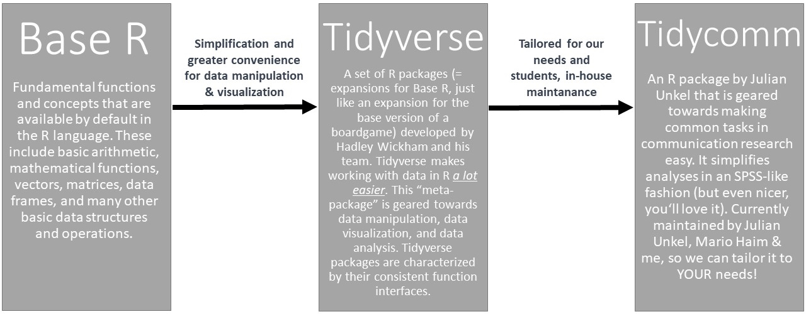 |


## Installing R

Before the workshop, please install the **current release of R** from [CRAN](https://cran.r-project.org/). Choose the installer for your operating system and follow the installation instructions.

- **Windows:** [CRAN for Windows](https://cran.r-project.org/bin/windows/base/)
- **macOS:** [CRAN for macOS](https://cran.r-project.org/bin/macosx/)

**Mac users:** Please read the notes on the CRAN macOS page carefully, because additional system requirements can depend on your hardware and macOS version.

## Installing RStudio

Next, install the **current release of RStudio Desktop** from the [Posit download page](https://posit.co/download/rstudio-desktop/). R is the programming language; RStudio is the desktop application that provides the interface in which we will write, run, inspect, and save our code.

## Updating R and RStudio

If you already have R and RStudio installed, check your current versions in the Console:

```{r, results='hide', message=FALSE, eval = FALSE}
R.version.string
RStudio.Version()$version
```

If either installation is outdated, download the current release from CRAN (R) or Posit (RStudio Desktop) and install it before the first session. Restart RStudio afterwards. If RStudio does not automatically use the newly installed R version, you can select it via **Tools → Global Options → General → R version**.

## How does R work?

R is an object- and function-oriented programming language. Chambers
[(2014, p. 4)](https://arxiv.org/pdf/1409.3531.pdf) explains "object-
and function-oriented" like this:

-   Everything that exists is an object.
-   Everything that happens is a function call.

In R, you will assign values (for instance, single numbers/letters,
several numbers/letters, or whole data files) to objects in R to work
with them. For example, this command will assign the letters "hello" to
an object called *word* by using the *assign operator* *\<-* (a function
used to assign values to objects):

```{r,hello-0, eval = TRUE, echo = TRUE}
word <- "hello"
```

The type of each object will dictate what sorts of computations you may
perform with this object. The object *word*, for example, is
distinguished by the fact that it is made up of characters (i.e., it is
a word) - which may make it impossible to compute the object's mean
value, for example (which is possible only for objects consisting of
numerical data).

## Why should I use R?

There are several reasons why I'm an advocate of R (or similar
programming languages such as Python) over programs such as SPSS.

(1) R is **free.** Other than most (statistical) programs, you do
    not need to buy it (or rely on an university license, that is likely
    to run out once you leave your department).

(2) R is an **open source** program. Other than most programs, the
    source code - i.e., the basis of the program - is freely available.
    So are the hundred of packages (we'll get to those later -- these
    are basically additional functions you may need for more specific
    analyses) on CRAN that you can use to extend R's base functions.

(3) R offers you **flexibility**. You can work with almost any type of
    data and rely on a large (!) set of functions to import, edit, or
    analyze such data. You can perform "complex" statistical modeling
    like SEM, panel analysis, multilevel analysis, and computational
    methods in R. And if the function you need to do so hasn't been
    implemented (or simply does not exist yet), you can write it
    yourself! R supports package development!

(4) Learning R can also increase your opportunities on the **job market**. For many
    jobs (e.g., market research, data science, data journalism),
    applicants are required to know at least one programming language.

(5) You can even write entire papers / theses in R (using `RMarkdown`). This
    allows for the complete reproducibility of your analysis and report.
    All of the code, data, and visualizations can be easily shared and
    reproduced, ensuring **transparency and enhancing the credibility**
    of your work. Conveniently, documents can **automatically update
    tables and graphs** when changes are made to the underlying data or
    analysis. This saves time and reduces the likelihood of errors when
    updating results.

## How does R Studio work?

As mentioned before, R Studio is a graphical interface which facilitates
programming with R. It contains up to four main windows, which allow for
different things:

-   Writing your own code (Window 1: Source). *Important*: When first
    installing R/R Studio and opening R Studio, you may not see this
    window right away. In this case, simply open it by clicking on
    *File/New File/R Script*.
-   Executing your own code (Window 2: Console)
-   Inspecting objects (Window 3: Environment)
-   Visualizing data, searching for help, updating packages etc. (Window
    4: Files/Plots/Packages etc.)

|                                                                                             |
|:--------------------------------------------------------------------------------------------|
| *Image: Four main windows in R*                                                             |
| 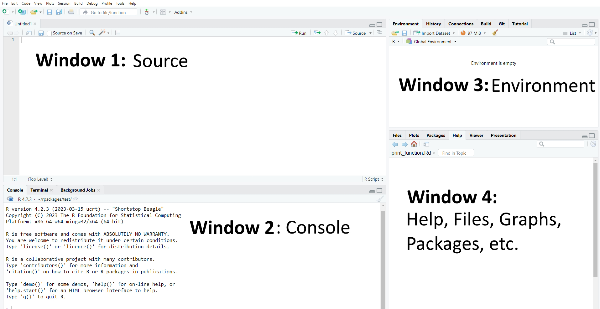 |

Please note that the specific set-up of your R Studio may look different
(the order of windows may vary and so may the windows' names). I have
made the experience that having these four windows open works best for
me. This may be different for you. If you want to modify the appearance
of your R Studio, simply choose *"Tools/Global Options/Pane Layout"*. In
the options menu, you can perform various cool customizations, such as
enabling rainbow parentheses (highly recommended). With this feature, a
starting parenthesis will be displayed in the same color as its
corresponding closing parenthesis.

|                                                                                           |
|:------------------------------------------------------------------------------------------|
| *Image: Changing the Layout*                                                              |
| 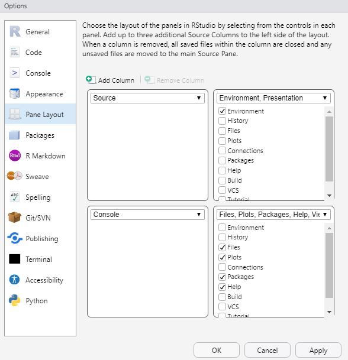 |

|                                                                                                   |
|:--------------------------------------------------------------------------------------------------|
| *Image: Activating rainbow parantheses*                                                           |
| 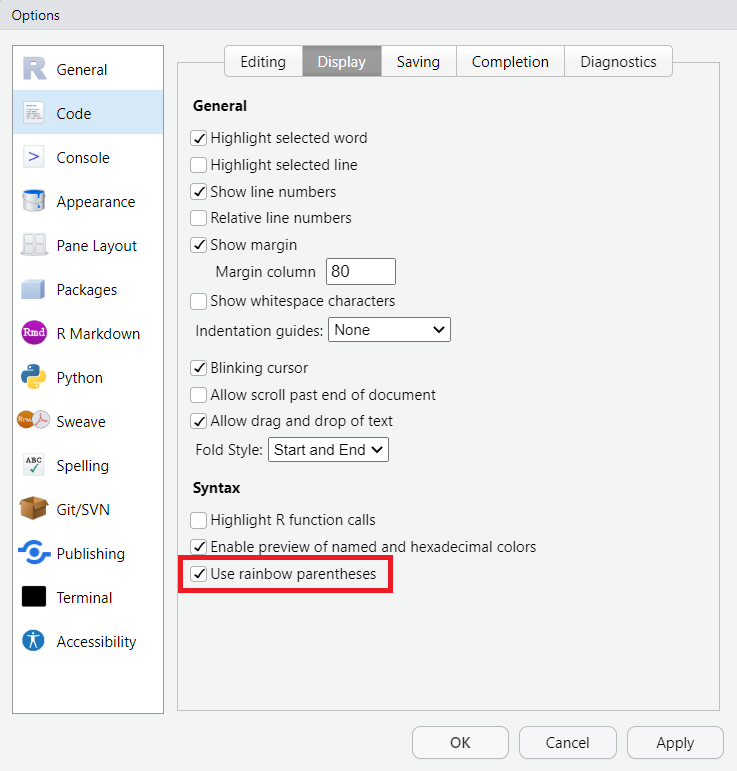 |

### Source: Writing your own code

Using the window "Source", you'll write your own code to execute
whichever task you want R to fulfill.

#### Writing Code

Let's start with an easy example: Assume you simply want R to print the
word "hello". In this case, you would first write a simple command that
assigns the word "hello" to an object called *word*. The assignment of
values to named objects is done via either the operator "\<-" or the
operator "=". The left side of that command contains the object that
should be created; its right side the values that should be assigned to
this object.

In short, this command tells R to assign the world "hello" to an object
called *word*.

```{r,hello-1, eval = TRUE, echo = TRUE}
word <- "hello"
```

|                                                                                                   |
|:--------------------------------------------------------------------------------------------------|
| *Image: "Source"*                                                                                 |
| 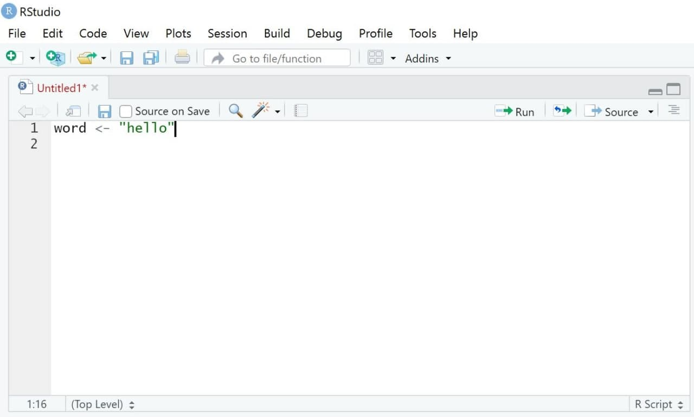 |

#### Annotating Code

Another helpful aspect of R is that you can comment your own code.
Often, this is very helpful for understanding your code later (if you
write several hundred lines of codes, you may not remember their exact
meaning months later).

Comments or notes can be made via hashtags `#`. Anything following a
hashtag will not be considered code by R but be ignored instead.

```{r,notes, eval = FALSE, echo = TRUE}
word <- "hello" # this line of code assigns the word "hello" to an object called word
```

#### Executing Code

We now want to execute our code. Doing so is simple:

-   Mark the parts of the code you want to run (for instance, single
    rows of code or blocks of code across several rows)
-   Either press *Run* (see upper right side of the same window) or
    press **Ctrl / Command + Enter** (On Mac OS X, hold the command key
    and press return instead).

R should now execute exactly those lines of codes that you marked
(hereby creating the object *word*). If you haven't marked any specific
code, all lines of code will be executed.

|                                                                                            |
|:-------------------------------------------------------------------------------------------|
| *Image: Executing Code*                                                                    |
| 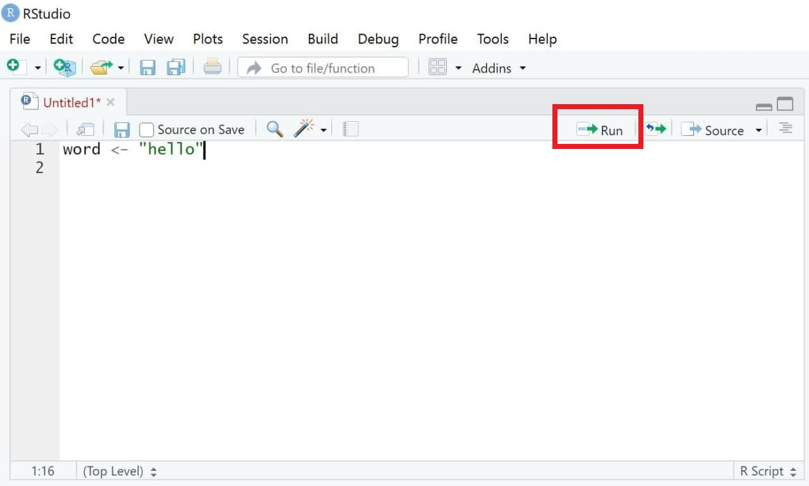 |

#### Saving Code

A great feature of R is that it makes analyses easily reproducible -
given that you save your code. When reopening R Studio and your script,
you can simply "rerun" the code with one click and your analysis will be
reproduced.

To save code, you have two options:

-   Choose the menu option *File/Save as*. **Important**: Code needs to
    be saved with the ending **".R"**.
-   Chose the *Save*-button in the *source* window and save your code in
    the correct format, for instance as "MyCode.R" (some advice: try to
    avoid numbers or dates as file names because this can break the
    saving process).

|                                                                                         |
|:----------------------------------------------------------------------------------------|
| *Image: Saving code*                                                                    |
| 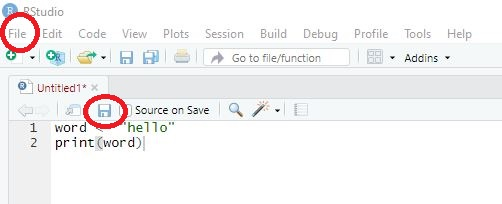 |

### Console: Printing results

Results of executing code are printed in a second window called
"Console", which includes the code you ran and the object you may have
called when doing so.

Previously, we defined an object called word, which consists of the
single word "hello". Thus, R prints our code as well as objects called
when running this code (here, the object word) in the console.

```{r,hello-3, eval = TRUE, echo = TRUE}
word <- "hello"
word
```

|                                                                                                    |
|:---------------------------------------------------------------------------------------------------|
| *Image: Window "Console"*                                                                          |
|  |

### Environment: Overview of objects

The third window is called "Environment"[^1]. This window displays all
the objects currently existing - in our case, only the object "word". As
soon as you start creating more objects, this environment will fill up.

[^1]: again, this only applies for the way I set up my R Studio. You can
    change this via *"Tools/Global Options/Pane Layout"*

If you are an SPSS user, you may find this window very similar to what
is referred to as the *Datenansicht / Data overview* in SPSS. However,
the R version of this view is much more flexible as it can contain
multiple datasets simultaneously in one environment.

|                                                                                                        |
|:-------------------------------------------------------------------------------------------------------|
| *Image: Window "Environment"*                                                                          |
| 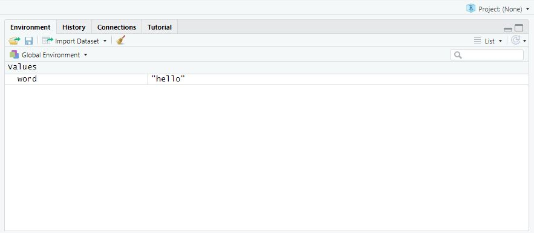 |

It is important to note that we can visually examine any object in R by
using the *View()* command. Upon running this command, a new tab will
open in the "Source" window. While this may not seem particularly useful
at the moment, it becomes immensely helpful when working with larger
datasets that have multiple observations and variables.

```{r, eval = FALSE, echo = TRUE}
View(word)
```

|                                                                                         |
|:----------------------------------------------------------------------------------------|
| *Image: Window "View"*                                                                  |
| 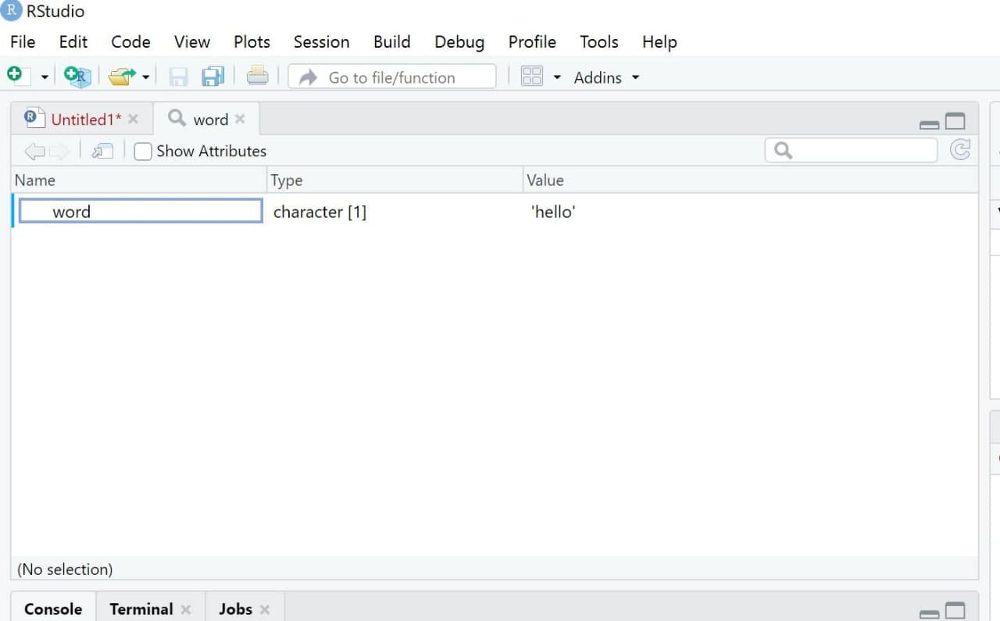 |

### Plots/Help/Packages: Do everything else

The fourth window in the standard R Studio interface, which contains
several sub-sections like "Files", "Plots", or "Packages", has specific
functions that you will understand later. For example, it can be used to
plot and visualize results or to see which packages are currently
loaded.

|                                                                                                             |
|:------------------------------------------------------------------------------------------------------------|
| *Image: Window "Files/Plots/Packages"*                                                                      |
| 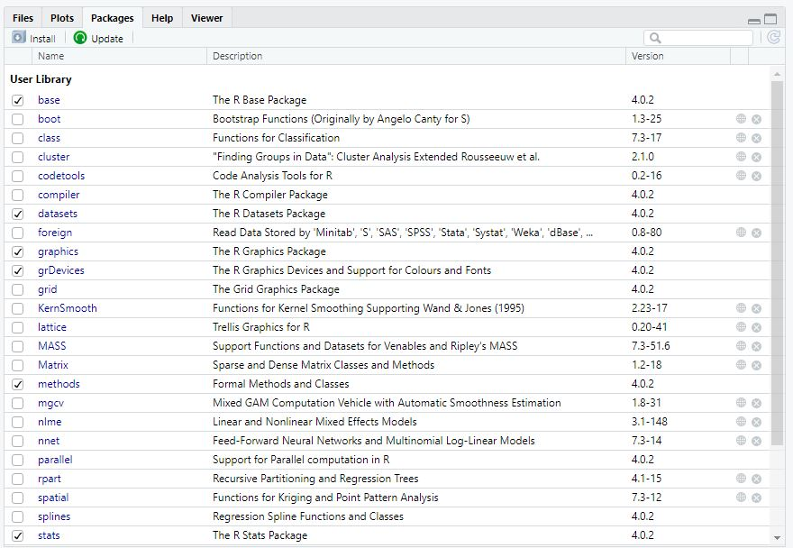 |

## Why aren't we using a GUI for point-and-click analyses?

If you know SPSS, you might miss having a graphical user interface (GUI)
in RStudio for point-and-click analyses. For those who prefer such a
GUI, they can install `jamovi`, which is a GUI for R. However, I'd
recommend against using `jamovi`.

The reason for this is that coding skills allow for faster adaptation of
the written syntax to fit individual needs. Those who first learn to
handle a statistics program through point-and-click may have a weaker
understanding of the resulting code. If adjustments to the code need to
be made later on, you may not be able to do so, and analyses may need to
be redone completely by clicking instead of quickly adapting them
throughout the script (e.g., with`Search + Replace`).

Thus, starting to code early helps with understanding and efficiency.

## Packages {#packages}

While `Base R`, i.e., the standard version of R, already includes many
helpful functions, you may at times need other, additional functions.
For instance, if we want to manage, visualize, or analyze data more efficiently, we may need packages that provide additional functions.

**Packages are collections of task-specific functions that extend the
functions implemented in Base R**.

In the spirit of "open science", anyone can write and publish these
additional functions and related packages and anyone can also access the
code used to do so.

You'll find a list of all of R packages
[here](https://cran.r-project.org/web/packages/). In this workshop, we will
for instance use packages like
[dplyr](https://cran.r-project.org/web/packages/dplyr/index.html) for
advanced data management.

### Installing packages

To use a package, you have to install it first. Let's say you're
interested in using the package
[dplyr](https://cran.r-project.org/web/packages/dplyr/index.html). Using
the command `install.packages()`, you can install the package on your
computer. You'll have to give the function the name of the package you
are interested in installing.

```{r,install,eval = FALSE, echo = TRUE}
install.packages("dplyr")
```

After the installation, the package is now available locally on your
computer. It is important to note that the `install.packages()` command
only needs to be executed **once** for each package. In subsequent R
sessions (e.g., after closing RSTudio and reopening it the next day),
you only need to activate the installed package, which we will learn in
the following section.

### Activating packages

Before we are able to use a package, we need to activate it **in each
session**. Thus, you should not only define a working directory at the
beginning of each session but also activate the packages you want to use
via the *library*()\_ command. Again, you'll have to give R the name of
the package you want to activate:

```{r, activate, eval = FALSE, echo = TRUE}
library(dplyr)
```

You can also use the name of the package followed by two colons *::* to
activate a package directly before calling one of its functions. For
instance, I do not need use to activate the `dplyr` package (by using
the *library()* function) to use the function `summarize()` if I use the
following code:

```{r, activatediff, eval = FALSE, echo = TRUE}
dplyr::summarize()
```

### Getting information about packages

The package is installed and activated - but how can we use it? To get
an overview of functions included in a given package, you can consult
its corresponding "reference manual" (overview document containing all
of a package's functions) or, if available, its "vignette" (tutorials on
how to use selected functions for the corresponding package) provided by
a package's author on a website called "CRAN".

The easiest way to finding these manuals/vignettes is Google: Simply
google *CRAN dplyr*, for instance, and you'll be guided to the following
[website](https://cran.r-project.org/web/packages/dplyr/index.html):

|                                                                                             |
|:--------------------------------------------------------------------------------------------|
| *Image: Cran Overview dplyr package*                                                        |
| 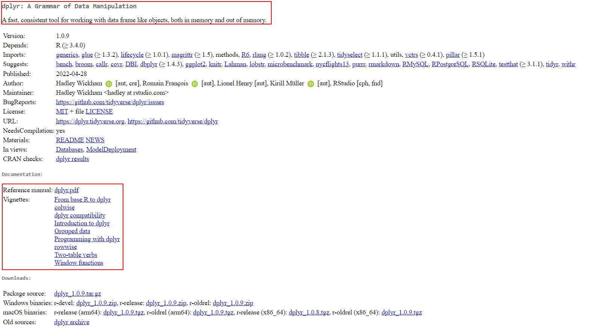 |

The first paragraph (circled in red) gives you an overview of aspects
for which this package may be useful. The second red-circled area links
to the reference manual and the vignette. You can, for instance, check
out the reference manual to get an idea of the many functions the
`dplyr` package contains.

## Optional: Setting global options in R for a customized workflow
Now that you've set up `R` + `RStudio` and are eager to dive into data management, it's essential to understand that R provides a way to modify its default settings to cater to your specific requirements. By setting global options at the beginning of your R script, you can customize how R behaves throughout **your active session** (this means that this customization needs to be reactivated whenever you close & restart RStudio). This tutorial will guide you through adjusting some of these global settings to enhance your R experience.

### Understanding `options()`
R has a function called `options()` that allows you to query or set a list of global options. These options influence the behavior of the base and many other R packages. You can see the current settings by simply calling the function without any arguments:

```{r, eval = FALSE, echo = TRUE}
options()
```

This will give a list of all the current settings. If you're curious about a particular option, you can retrieve its value by:

```{r, eval = FALSE, echo = TRUE}
options("option_name") # insert the option name here that you'd like to learn about
```

For example, to see the current setting for "scipen" (i.e., the scientific notation option in `R`):

```{r, eval = TRUE, echo = TRUE}
options("scipen")
```

### Turn off scientific notation

By default, R might show large or small numbers in scientific notation (e.g., 1.23e+4). If you prefer to see the full number:

```{r, eval = FALSE, echo = TRUE}
options(scipen=999)
```

### Customizing tibble display

Later in this course, when you've learned how to work with tibbles (a modern reimagining of the data from the `tidyverse`), you can adjust their display.

By default, tibbles display 10 rows of your data. If you want to see 20:

```{r, eval = FALSE, echo = TRUE}
options(tibble.print_max = 20)
```

In addition, when a tibble is printed to the console, it might display fewer significant digits by default, providing a general sense of the data instead of precise values. To modify this behavior, use `pillar.sigfig` and set its value to the desired number of decimal points (e.g., 2 decimal points):

```{r, eval = FALSE, echo = TRUE}
options(pillar.sigfig = 2)
```

### Resetting to default
If at any point you feel like you've tinkered too much and want to revert to the default settings, you can restart your `R` session. In `RStudio`, you can do this via the menu Session > Restart R or by pressing Ctrl+Shift+F10.

## Take-Aways

-   **Window "Source"**: used to write/execute code in R
-   **Window "Console"**: used to return results of executed code
-   **Window "Environment"**: used to inspect objects on which to use
    functions
-   **Window "Files/Plots/Packages etc."**: used for additional
    functions, for instance visualizations/searching for help/activating
    or updating packages

## Additional tutorials

You still have questions? The following tutorials & papers can help you
with that:

-   [YaRrr! The Pirate's Guide to R by N.D.Phillips, Tutorial
    2](https://bookdown.org/ndphillips/YaRrr/started.html)
-   [Computational Methods in der politischen Kommunikationsforschung
    by J. Unkel, Tutorial
    1](https://bookdown.org/joone/ComputationalMethods/firststeps.html)
-   [SICSS Boot Camp by C. Bail, Video
    1](https://sicss.io/boot_camp#install)
-   [wegweisR by M. Haim, Video 1](https://youtu.be/p6f4oq08z48)
-   [R Cookbook by Long et al., Tutorial
    1](https://rc2e.com/gettingstarted#recipe-id001)

Now that you know the layout of R, we can get started with some real
action: [Tutorial: Using R as a calculator]

# Tutorial: Using R as a calculator

**After working through Tutorial 3, you'll...**

-   be able to work with mathematical operators in R
-   be able to use mathematical operators on variables and vectors
-   subset values from vectors

One of the first things everyone learns in R is to use R as a
calculator. You have access to many mathematical operators in R (e.g. +,
-, \*, /, \^). Let's try some of them.

1.  Addition:

```{r,calculator1, eval = TRUE, echo = TRUE}
5 + 7
```

2.  Subtraction:

```{r,calculator2, eval = TRUE, echo = TRUE}
12 - 7
```

3.  Exponentiation:

```{r,calculator3, eval = TRUE, echo = TRUE}
3^3
```

## Using variables for calculation

You can also assign numbers to variables with the assign operator "\<-".
We have already talked about assigning word or numbers to variables in
the chapter [Writing Code]. Please remember that a variable name in R
can include numeric and alphabets along with special characters like dot
(.) and underline (\_).'

Therefore, these are good options to name your variables:

```{r,my_1st_number, eval = TRUE, echo = TRUE}
my_1st_number <- 3
my.1st.numer <- 3
```

Do **! N O T !** use these variable names because they will cause errors
and throw warning messages. I have therefore put the code as annotation
to avoid the warning messages (with \#):

```{r,my_2nd_number, eval = TRUE, echo = TRUE}
#  _number <- 3
#  .number <- 3
#  my-1st-number <- 3
```

You can use variables in your calculations by assigning the numbers to
variables (i.e. store the numerical value in the variable).'

```{r,calculator4, eval = TRUE, echo = TRUE}
five <- 5
seven <- 7
twelve <- five + seven # here you add the two variables in which the numbers are stored. The result of the addition is stored in the variable "twelve"
twelve # now you have to retrieve the content of the variable, so that the result is printed to the console
```

The names of the variables are freely selectable. For example, you can
also proceed like this:

```{r,calculator5, eval = TRUE, echo = TRUE}
three <- 5
three # print the content of the variable to the console
```

## Using vectors for calculation

You can also store more than one number in a variable. We call this
process "creating vectors" because variables that contain more than one
number are called *"vectors"* in R. Vectors are created using the
combine function `c()` in R.

```{r,calculator6, eval = TRUE, echo = TRUE}
twelve <- c(1, 2, 3, 4, 5, 6, 7, 8, 9, 10, 11, 12)
twelve # print the content of the variable to the console
```

Again, the variable name is chosen arbitrarily. You can also do this:

```{r,calculator7, eval = TRUE, echo = TRUE}
twelve <- c(4, 10, 15, 21, 33)
twelve # print the content of the variable to the console
```

You can use mathematical operations on vectors (e.g., +, -, \* and /).
Let's create two vectors "weight" and "height" that contain the weight
and height measures of 6 individuals. For example, the first individual
weighs 60 kg and is 1.75 m tall:

```{r,vector-calculation1, eval = TRUE, echo = TRUE}
weight <- c(60, 72, 57, 90, 95, 72)
height <- c(1.75, 1.80, 1.65, 1.90, 1.74, 1.91)
```

Now we can calculate the Body Mass Index (BMI) using the BMI formula:

```{r,vector-calculation2, eval = TRUE, echo = TRUE}
BMI <- weight / height^2
BMI # print the content of the BMI variable to the console
```

Now we know that the first person has a BMI of 19.59, which is within
the range of normality (18.5 and 24.9).

## Selecting values from a vector

**We still see the BMI of all the other five people, i.e. the entire
vector. How can we select only the first person?**

You can select values from a vector by using square brackets `[ ]` and
enter the number of the entry that you want to print to your console.

```{r, eval = TRUE, echo = TRUE}
BMI[1]
```

Again, you can see that the first person has a BMI of 19.59. You could
also decide to look at all values *except* the first one:

```{r, eval = TRUE, echo = TRUE}
BMI[-1]
```

You can even use the `[ ]` selector on vectors that consist of words
instead of numbers. These vectors are called *"character vectors"*,
while vectors that contain numbers are called *"numeric vectors"*. Let's
create a character vector that contains the BMIs of the six individuals
as words. We'll need to put quotation marks around your entries so that
R knows that those values are words not numbers.

```{r, eval = TRUE, echo = TRUE}
BMI_word <- c("nineteen", "twenty-two", "twenty", "twenty-four", "thirty-one", "nineteen")
BMI_word
```

We'll now select only the first value of of this BMI_word character
vector:

```{r, eval = TRUE, echo = TRUE}
BMI_word[1]
```

If you want to select multiple values, you can index them. Let's select
the BMI of the third, fourth and fifth individual:

```{r, eval = TRUE, echo = TRUE}
BMI_word[3:5]
```

## Take-Aways

-   **Mathematical operators**: use +, -, \*, /, \^
-   **Use case**: use these operators on numbers, variables, and vectors
-   **Create vectors**: use the combine function `c()`
-   **Select values from vectors**: use square brackets `[ ]`

## Additional tutorials

You still have questions? The following online guides can help you with
that:

-   [Using R as a
    Calculator](http://statseducation.com/Introduction-to-R/modules/getting%20started/calculator/)
-   [R Vector](https://www.datamentor.io/r-programming/vector/)

Now it's your time to get into coding: Try [Exercise 1: Base R].

# Exercise 1: Base R {.unnumbered}

**After working through Exercise 1, you'll...**

-   have assessed how well you know R and RStudio
-   know what chapters and concepts you might want to repeat again
-   have managed to apply the basic concepts of R to data

## Task 1 {.unnumbered}

Below you will see multiple choice questions. Please try to identify the
correct answers. 1, 2, 3 and 4 correct answers are possible for each
question.

**1. What panels are part of RStudio?**

-   source
-   console
-   input
-   packages, files & plots

**2. How do you activate R packages after you have installed them?**

-   import.packages()
-   install.packages()
-   package()
-   library()

**3. How do you create a vector in R with elements 1, 2, 3?**

-   cbind(1,2,3)
-   cb(1,2,3)
-   c(1,2,3)
-   cmb(1,2,3)

**4. Imagine you have a vector called 'vector' with 10 numeric elements.
How do you retrieve the 8th element?**

-   vector[-2]
-   vector[„-2"]
-   vector[8]
-   vector[„8"]

**5. Imagine you have a vector called 'hair' with 5 elements: brown,
black, red, blond, other. How do you retrieve the color 'blond'?**

-   hair[4]
-   hair[„4"]
-   hair[blond]
-   hair[„blond"]

## Task 2 {.unnumbered}

Create a numeric vector with 8 values and assign the name *age* to the
vector. First, display all elements of the vector. Then print only the
5th element. After that, display all elements except the 5th. Finally,
display the elements at the positions 6 to 8.

## Task 3 {.unnumbered}

Create a non-numeric, i.e. character, vector with 4 elements and assign
the name *eye_color* to the vector. First, print all elements of this
vector to the console. Then have only the value in the 2nd element
displayed, then all values except the 2nd element. At the end, display
the elements at the positions 2 to 4.

When you're ready to look at the solutions, you can find them
here:[Solutions for Exercise 1].

# Tutorial: Working with data (files) {#tutorial-working-with-data-files}

**After working through Tutorial 4, you'll...**

-   understand how to import data
-   know how to select variables in data frames
-   know how to access values in data frames

## Defining your working directory

In most cases, you don't want to manually enter all your values into R
and combine them with the `c()` function. Instead, you'll likely want to
import data files that you already have on your personal computer or
drive. Therefore, the first step to importing your data into R is
usually to define your *working directory*.

**Your working directory is the folder from which data can be imported
into R or to which you can export and save data created with R**.

Create a folder that you want to use as your working directory for this
tutorial (or use an existing one). For this example, I'll create a
folder called *"IPR"* here in the screenshots, but you could use a different name, most likely "GESIS_R". 

|                                                                                        |
|:---------------------------------------------------------------------------------------|
| *Image: Working Directory on Windows*                                                  |
| 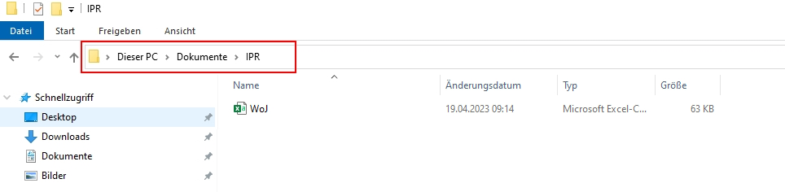 |


Go to that folder and copy the folder path to it:

|                                                                                        |
|:---------------------------------------------------------------------------------------|
| *Image: Copy Working Directory on Windows*                                             |
| 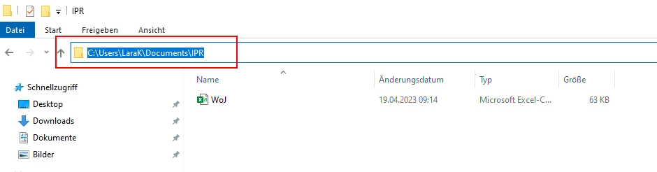 |

On Mac, you go to **a document in your folder** and right click on it.
An options menu opens and you can copy the folder path:

|                                                                                        |
|:---------------------------------------------------------------------------------------|
| *Image: Copy Working Directory on MAC*                                                 |
| 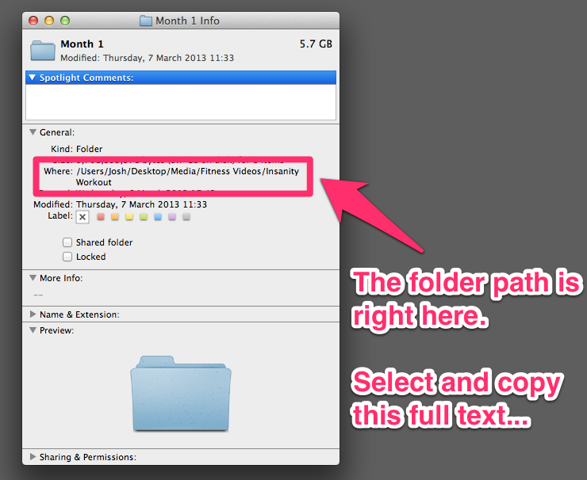 |

**NOTE:** On MAC, your folder path might be too long to display the full name. In this case, I'd recommend to move your files a few levels up. E.g., from "GESIS_R" to "Documents". In addition, white spaces might occur in the folder path. In this case, you might need to replace them with underscores.

Now *you* know where this working directory is located - but R should
know too! Telling R from which folder to import data or where to export
data is called *setting your working directory*. We use a function
called `setwd()` (you guessed it right: short for "set working
directory") which allows us to do exactly that.

**Important**: The way this working directory is set differs between
Windows- and Mac-Operating Systems.

**Windows:** The dashes need to be pointing towards the right direction
(if you simply copy the path to the folder, you may need to replace
these signs "\\" with "/")

```{r,setwd, eval = FALSE, echo = TRUE}
# Example Working Directory:
setwd("C:/Users/YourName/Documents/GESIS_R")
```

**Mac:** You may need to add a "/" at the beginning:

```{r,setwd2, eval = FALSE, echo = TRUE}
# Example Working Directory:
setwd("/Users/YourName/Documents/GESIS_R")
```

**NOTE:** Setting your entire desktop as the working directory rarely
works. It's better to create a new folder on your desktop and set that
folder as your working directory.

If you have forgotten where you set your current working directory, you
can also ask R about the path of your current working directory with
*getwd()*:

```{r,gettwd, eval = FALSE, echo = TRUE}
getwd()
```

```{r,gettwdb, eval = TRUE, echo = FALSE}
paste0("C:/Users/YourName/Documents/GESIS_R")
```

## Import data from your working directory

After setting the working directory, you need to transfer the data file
that you want to work with to that folder (here: the "*GESIS_R*" folder). To
do this, download the *"WoJ.csv"* file from LRZ Sync & Share using this
[link](https://syncandshare.lrz.de/getlink/fiHRaY9p84sCnCTLQWsnU4/WoJ.csv). The
dataset is a subset of the *Worlds of Journalism 2012-16* study
containing survey data from 40 journalists from five European countries. Put the downloaded data file in the folder that you just set up as your working directory (here: the "*GESIS_R*" folder).

The data file *WoJ.csv* is structured as follows:

-   Each row contains the survey answers of a single journalist.
-   Each column contains the values given by all journalists for a
    single variable.

The variables included here are:

-   **country**: the home country of the journalist (e.g. Germany,
    Switzerland)
-   **reach**: the reach of the outlet that the journalist is working
    for (Transnational, National, Regional, Local)
-   **employment**: the journalist's current employment status
    (Full-time, Part-time, Freelancer)
-   **temp_contract**: the journalist's type of contract (Permenent,
    Temporary)
-   **autonomy_selection**: how much autonomy the journalist indicates
    to have in his/her daily work (from 1 = none at all to 5 = very
    much)
-   **work_experience**: in years
-   **trust_parliament** & **trust_government**: how much trust the
    journalist indicates to have (from 1 = none at all to 5 = very much)

We will read in the file using `read.csv()`. We specify the *file path
in quotation marks* to indicate where to find the data file. However, if
you have already set your working directory to the folder where the file
is located, you don't need to specify the path. Additionally, we use the
argument *header = TRUE* to let R know that the first row contains
variable names. Finally, we assign the data file to a *source object*
named *survey* (but you could choose a different name for your source
object like *WoJ* or *data*). The data is now stored in this object.

```{r,eval = TRUE, echo = FALSE}
survey <- read.csv("data/WoJ.csv", header = TRUE)
```

```{r, eval = FALSE, echo = TRUE}
survey <- read.csv("WoJ.csv", header = TRUE)
```

```{r, eval = TRUE, echo = FALSE}
survey[1:20, ]
```

**NOTE:** While *read.csv()* reads in comma-separated values,
*read.csv2()* reads in values that are separated by semicolons.

To make the dataset a little more tangible, we will give the journalists
40 different fictitious names. The names will be saved into a new column
in the dataset, which we will call *name*. Please run this code to add
names to your data:

```{r, eval = TRUE, echo = TRUE}
survey$name <- c(
  "Rosalie", "Laurens", "Florian", "Chantal", "Cynthia", "Paul", "Jonas",
  "Tanja", "David", "Ferdinand", "Caroline", "Charline", "Sev", "Theodor",
  "Helke", "Joshua", "Jona", "Konrad", "Lennart", "Luise", "Wiebke", "Marie", "Rosa",
  "Alma", "Ida", "Jean", "Leonie", "Tom", "Maximilian", "Viktor", "Marianne", "Velma", "Carl",
  "Wolf", "Merten", "Tong-Tong", "Sal", "Joe", "Alex", "Robin"
)
```

## Subsetting variables / columns in data frames

In the [Tutorial: Using R as a calculator], your *variables* were
"floating" in your workspace or environment. They were not stored in a
container, so you could call them by simply writing their name in the
console. When you import data files into R, all variables in that
dataset are stored in a "container," which is your *source object*.
These containers for variables are called *data frames* in R.

Variables that are part of a data frame can be accessed by their name,
but we need to specify the data frame *AND* the variable name and
combine them with the access operator: *\$*. This takes the form of:

```{r, eval = FALSE}
dataframe$variablename
# the first part is the container name, i.e. data frame
# this is followed by the access operator $
# finally, you call the variable by name
```

For instance, we could retrieve the variable / column *"name"* in our
*survey* data frame by simply using its variable name: We specify the
object we want to access, the data frame *survey* and then retrieve the
column *name* via the operator *\$*:

```{r, eval = TRUE, echo = TRUE}
survey$name
```

You know that the name variable is the *ninth* column of you data frame.
Therefore, you can also access this column / variable by calling it by
its index number (*column index*, here: 9). Just like you've learned in
the [Tutorial: Using R as a calculator], you can access sub-elements of
a greater object with square brackets `[ ]`:

```{r, eval = TRUE, echo = TRUE}
survey[9]
```

**Note:** While the first command gives you the names as a vector, the
second one gives you the names as a data frame object with only one
column. This keeps the column header "*name*" intact. However, if you
want to retrieve a vector using the *column index*, you need to provide
two indices: one for the row that you want to select, followed by a
comma, and one for the column. Since we want to select *all* rows, but
only column No. 9, we need leave the row No. blank:

```{r, eval = TRUE, echo = TRUE}
survey[, 9] # column index = 9
```

## Subsetting observations / rows in data frames

Using the same indexing technique, you can also select an entire row
(i.e., journalist) by providing a *row index* and leaving the column
index blank:

```{r, eval = TRUE, echo = TRUE}
survey[1, ] # row index = 1
```

## Subsetting values / cells in data frames

To subset values of a data set, you can call a variable / column by its
name. You just have to specify the data frame, the variable name, *AND*
the row index. For example, to look only at the first name entry in the
data, which is *Rosalie*, you can use the following code:

```{r, eval = TRUE, echo = TRUE}
survey$name[1]
```

Now, can you guess how to access the exact same value using the column
index instead of the column name?

You can enter the row index first, followed by a comma, and then finish
with the column index, like this:

```{r, eval = TRUE, echo = TRUE}
survey[1, 9] # row index = 1, column index = 9
```

Of course, you can use complex indexing on data frames. Let's look at
the first ten rows of the eighth (*trust_government*) and ninth (*name*)
column:

```{r, eval = TRUE, echo = TRUE}
survey[1:10, 8:9]
```

Or select the second ten rows of the sixth (*work_experience*) and ninth
(*name*) column:

```{r, eval = TRUE, echo = TRUE}
survey[10:20, c(6, 9)]
```

## Subsetting data with conditions

Let's say we want to select all names of journalists who have a work
experience of at least 25 years. This time, we'll need to use a
*condition* to select our rows:

```{r, eval = TRUE, echo = TRUE}
survey[survey$work_experience >= 25, 9]
# Read: I want to select column 9 (name) from the survey data frame
# and display all rows in which the work experience column of the survey data frame has a value greater than or equal to 25
```

Alternatively, if you want to show *all* columns that belong to
journalists who have a work experience of at least 25 years, you would
do it like that:

```{r, eval = TRUE, echo = TRUE}
survey[survey$work_experience >= 25, ]
```

Of course, you can index more than one column:

```{r, eval = TRUE, echo = TRUE}
survey[survey$work_experience >= 25, 8:9]
```

Finally, you can use multiple conditions:

```{r, eval = TRUE, echo = TRUE}
survey[survey$work_experience >= 25 & survey$trust_government < 2, ]
```

## Eliminate the need to manually set working directories by using R Projects

This part of the tutorial teaches you how to **create and use R Projects** in RStudio. You’ll learn why projects simplify file paths and eliminate the need for `setwd()`.

An **R Project** is a self-contained folder where your code, data, and outputs (e.g., analysis results) live together. When you open the project’s `.Rproj` file, RStudio automatically sets the **working directory** to the project folder.

### Creating a new R Project

1. In RStudio, click **File → New Project…**
2. Choose **New Directory → New Project**
3. Pick a folder name (e.g., `GESIS_R`) and a location
4. Click **Create Project**

RStudio will create:
- a new folder,
- an `.Rproj` file,
- and will set your working directory to this project whenever you open it.

**Tip**: You can also convert an existing folder into a project via **File → New Project… → Existing Directory**. 

### Checking your working directory

Let’s confirm where R thinks you are working. It should be your project folder.

```{r,gettwd2, eval = FALSE, echo = TRUE}
getwd()
```

### A recommendation for designing a good R Project structure

You can now create a new layout for your R project folder. Here is an example for a simple, organized layout for an R project folder called “Forschungsbericht”, which contains all your materials for preparing a Forschungsbericht (= research report). "├──" marks subfolders and data stored in folders:

```
Forschungsbericht/
├── data/
│   └── mydata.csv
├── figures/
│   └── plot1.png
├── code/
│   └── data_preprocessing.R
│   └── data_analysis.R
├── Mein_Forschungsbericht.Rmd
└── Forschungsbericht.Rproj
```

**Why this helps**: Keeping all inputs and outputs in one place makes it much easier to share your work with colleagues or other participants and to reproduce results later. Other people can open your data and R scripts (code) without changing the working directory on their machines. They can start working with your materials right away.

### Navigating your working directory like a pro: The concept of relative paths

If you have subfolders in your working directory, you can navigate them with relative paths. A relative path is like giving directions from your current location: "go into the data folder" or "go one folder up." An absolute path, in contrast, gives the entire address from the root of your computer. Relative paths are usually preferable in reproducible projects because they can keep working when the complete project folder is moved to another computer.

In R, a relative path specifies the path to a folder or file **relative to your current working directory** in RStudio. It doesn't include the complete path from the root of your file system. Instead, it describes how to navigate through the folders and subfolders starting from your current location. Relative paths are flexible and can adapt to different working directories.

#### Moving up and down folders by using relative paths

To move down a folder, you can use the `./` notation. The `./`
represents the child directory of the current working directory that you
want to navigate to. For example, if you're in the folder
`"C:/Users/YourName/Documents/GESIS_R/"` and you want to move your working
directory down to the `"data"` subfolder, you can use the
following code:

```{r, eval = FALSE, include=TRUE}
setwd("./data")
```

To move up one level in the folder hierarchy again, you can use the
`../` notation. The `../` represents the parent directory of the current
working directory. You can use this notation with the `setwd()` function
to navigate up the folder again:

```{r, eval = FALSE, include=TRUE}
setwd("../")
```

## Optional: Import data from various file formats

R provides a wide range of functions and packages to import data from
various file formats such as Excel, SPSS, SAS, Stata, JSON and others.
Here, we will focus on some commonly used file formats and the R
functions to import them.

### Importing data from Excel

We will use the `readxl` package to import data from Excel files. First,
we need to install and load the `readxl` package:

```{r, eval = TRUE, echo = FALSE}
r <- getOption("repos")
r["CRAN"] <- "http://cran.us.r-project.org"
options(repos = r)

if (!require(readxl)) {
  install.packages("readxl")
  require(readxl)
}
```

```{r, eval = FALSE, echo = TRUE}
# Install and load the 'readxl' package
install.packages("readxl") # run only the first time
library(readxl)
```

To import Excel data from your working directory into R, you can now use
the `read_excel()` function:

```{r, eval = FALSE, echo = TRUE}
data <- read_excel("WoJ.xlsx")
```

This will create a data frame named *"data"* containing the Excel data.
By default, the first row of the Excel file is assumed to contain column
names.

### Importing data from JSON

JSON files are a popular file format for storing structured data, such
as data collected from Social Networking Sites. To import data from a
JSON file into R, you can use the `jsonlite` package:

```{r, eval = FALSE, echo = TRUE}
# Install and load the 'jsonlite' package
install.packages("jsonlite") # run only the first time
library(jsonlite)
```

And import your data:

```{r, eval = FALSE, echo = TRUE}
data <- fromJSON("WoJ.json")
```

### Importing data from SPSS

SPSS files are still commonly used in social science research and you
might want to import your current SPSS projects to R. In R, we can
import SPSS files using the `haven` package.

```{r, eval = TRUE, echo = FALSE}
if (!require(haven)) {
  install.packages("haven")
  require(haven)
}
```

```{r, eval = FALSE, echo = TRUE}
# Install and load the 'haven' package
install.packages("haven") # run only the first time
library(haven)
```

To import your data into R, use the `read_spss()` function (here I
repeated the entire working directory, but you could only write
`read_spss("WoJ.sav")`):

```{r, eval = TRUE, echo = FALSE}
data <- read_spss("data/WoJ.sav")
```

```{r, eval = FALSE, echo = TRUE}
data <- read_spss("C:/Users/YourName/Documents/GESIS_R/WoJ.sav")
```

By default, the `read_spss()` function will convert user-defined
missings to `NA` (i.e., missings in R). If you want to read variables
with user defined missings into R (e.g., keep -9 instead of turning it
into `NA`), you can use the `user_na` argument:

```{r, eval = FALSE, echo = TRUE}
data <- read_spss("C:/Users/YourName/Documents/GESIS_R/WoJ.sav", user_na = TRUE)
```

`read_spss` reads all your labelled variables in as an object type
(i.e., `class`) called `haven_labelled` that stores your label
information. You can check your label information by inspecting your
data in your environment (by default: right-hand side of RStudio). Just
click on the blue error next to your source object:

|                                                                                              |
|:---------------------------------------------------------------------------------------------|
| *Image: Inspecting your labelled data frame*                                                 |
| 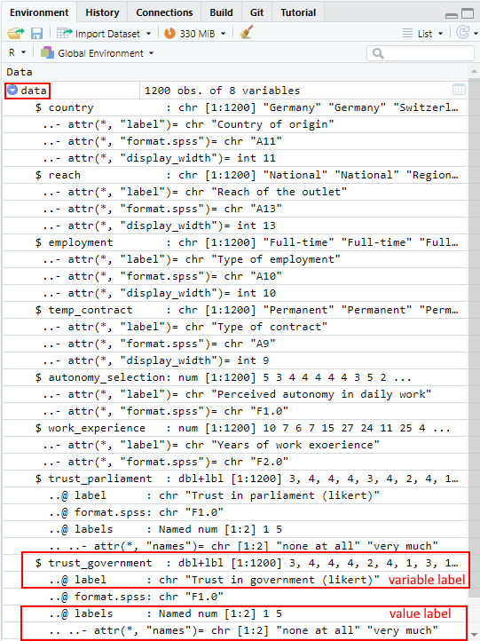 |

**NOTE FOR ADVANCED USERS**: If you want to add, change, or remove any
kind of labels in R, you can use the `labelled` package:

```{r, eval = TRUE, echo = FALSE}
if (!require(labelled)) {
  install.packages("labelled")
  require(labelled)
}
```

```{r, eval = FALSE, echo = TRUE}
# Install and load the 'labelled' package
install.packages("labelled")
library(labelled)
```

To add a label to a variable, use the `var_label()` function:

```{r, eval = TRUE, echo = TRUE}
var_labels <- c(
  country = "The journalist's country of origin",
  reach = "The reach of the journalist's outlet",
  employment = "The journalist's employment status",
  temp_contract = "The journalist's type of contract",
  autonomy_selection = "The journalist's perceived autonomy",
  work_experience = "The journalist's work experience in years",
  trust_parliament = "The journalist's trust in the current parliament",
  trust_government = "The journalist's trust in the current government",
  name = "Name of journalist"
) # Creates a vector with your variable labels
var_label(survey) <- var_labels # Applies the labels to your column variables of the unlabeled "survey" data set (you could also apply it to the SPSS-labelled "data" data set)
```

To add value labels to a variable, use the `set_value_labels` function:

```{r, eval = TRUE, echo = TRUE}
trust_labels <- c("none at all" = 1, "a little" = 2, "partly" = 3, "a lot" = 4, "very much" = 5)
data$trust_parliament <- set_value_labels(data$trust_parliament, .labels = trust_labels)
data$trust_government <- set_value_labels(data$trust_government, .labels = trust_labels)
```

To remove a variable label from a variable, use the `remove_var_label`
function:

```{r, eval = TRUE, echo = TRUE}
data$trust_parliament <- remove_var_label(data$trust_parliament)
```

And to remove a value label from a variable, use the `remove_val_labels`
function:

```{r, eval = TRUE, echo = TRUE}
data$trust_parliament <- remove_val_labels(data$trust_parliament)
```

For a full documentation and a helpful cheat sheet of the `labelled`
package, click this
[link](http://larmarange.github.io/labelled/index.html). It also
contains information on how to use the `labelled` package in combination
with the `tidyverse`. I've used `Base R` in this tutorial.

## Take-Aways

-   **Setting the working directory:** tells R where your folder with
    the data is located on your drive, `setwd(your_filepath)`
-   **Import data**: after setting the working directory, with
    `read.csv()` (comma-separated) or `read.csv2()`
    (semicolon-separated) or the package of your choice (e.g., `haven`)
-   **Access variables**: either by the access operator \$
    (`dataframe&variablename`) or by the column index `[,columnNo.]`
-   **Access values**: by indexing, i.e. using `[ ]` and row + column
    indices
-   **Conditions**: you can select rows based on conditions, e.g.:
    greater `>`, greater or equal `>=`, equal `==`, and not equal `!=`

## Additional tutorials

You still have questions? The following online guides can help you with
that:

-   [Import CSV Files into R Step-by-Step
    Guide](https://www.r-bloggers.com/2021/12/import-csv-files-into-r-step-by-step-guide/)
-   [Subsetting
    data](https://stats.oarc.ucla.edu/r/modules/subsetting-data/)
-   [Indexing into a data
    structure](http://www.cookbook-r.com/Basics/Indexing_into_a_data_structure/)

Now it's your time to get into coding: Try [Exercise 2: Base R].

# Exercise 2: Base R {.unnumbered}

**After working through Exercise 2, you'll...**

-   have double-checked whether you understand how to import data
-   have learned to subset variables in data frames
-   have learned to subset observations and values in data frames

## Task 1 {.unnumbered}

Download the *"WoJ_names.csv"* from LRZ Sync & Share ([click here](https://syncandshare.lrz.de/getlink/fiwoSeB27JvNosTM6e6xp/WoJ_names.csv)) and
put it into the folder that you want to use as working directory.

Set your working directory and load the data into R by saving it into a
source object called *data*. Use `setwd()`. 

**Note:** This time, it's a csv that is separated by semicolons, not by
commas.

## Task 2 {.unnumbered}

Now, print only the column to the console that shows the *trust in the
government*. Use the `$` operator first. Then try to achieve the same
result using the subsetting operators, i.e. `[]`.

## Task 3 {.unnumbered}

Print only the first 6 *trust in the government* numbers to the console.
Use the `$` operator first. Then try to achieve the same result using
the subsetting operators, i.e. `[]`.

## Task 4 {.unnumbered}

Repeat Task 1, but use an R project this time to set your working directory.

When you're ready to look at the solutions, you can find them
here: [Solutions for Exercise 2].

# Tutorial: Data management with dplyr

**After working through Tutorial 5, you'll...**

-   know the advantages of the `tidyverse` vs. `Base R`
-   know about different formats of tabular data
-   understand what packages are included in the `tidyverse`
    meta-package
-   know how to do data modifications and transformations with `dplyr`

## Why not stick with Base R?

You might wonder why we've spent so much time exploring functions in
`Base R` to now learn data management with `tidyverse`. After all, data
management can also be done in `Base R`, can't it? I personally
recommend that all R beginners should work with the `tidyverse` as early
as possible. There are three reasons supporting my argument:

1.  **Ease of use:** The `tidyverse` is very accessible for R
    "beginners", i.e. its syntax is very easy to understand. It allows
    you to set goals (i.e. what you want to do with your data) and get
    you working on these goals very quickly. Definitely more quickly
    than in `Base R`!
2.  **Standard for data management:** A few years ago, the `tidyverse`
    has become the de facto standard for data management in R. It is a
    meta-package, which means that it is a collection of distinct
    packages that all follow the same design principles to make code
    reading and writing as simple as possible. For example, all
    functions are named after verbs that indicate exactly what they
    perform (e.g. filter or summarize).
3.  **Beautiful graphs:** With the `tidyverse`, all data management
    steps can be swiftly transferred into beautiful graphs. This is
    because the most popular graph package in R, `ggplot2`, is part of
    the `tidyverse`.

Are you excited now? Then let's get started!

## Tidyverse packages

The `tidyverse` comes with a great arsenal of task-specific packages
and their respective functions. It includes packages for:

-   `tibble`: creating data structures like tibbles, which is an
    enhanced type of data frame
-   `readr, haven, readxl`: reading data (e.g. readr for CSV, haven for
    SPSS, Stata and SAS, readxl for Excel)
-   `tidyr, dplyr`: data transformation, modification, and summary
    statistics
-   `stringr, forcats, lubridate`: create special, powerful object types
    (e.g. stringr for working with text objects, forcats for factors,
    lubridate for time data)
-   `purrr`: programming with R
-   `ggplot2`: graphing/charting

The most frequently used packages of the `tidyverse` can be installed
and activated in one go (less frequently used packages like `haven`
might still need to be installed and activated separately):

```{r,install_tidyverse, eval = FALSE, echo = TRUE}
install.packages("tidyverse") # install the package (only on the first time)
library(tidyverse) # active the package
```

## Tidy data

Dataframes are tabular data. However, data can also have other formats,
for example as nested, i.e. hierarchical, lists. In communication
research, these other data formats are mainly used by social media and
their respective APIs (e.g., "JSON" format).

In our course, however, we'll focus on tabular data. The same data can
be represented differently in tables. We perceive some of these
representations as tidy, others as messy. While tidy data principles
establish a standard for organizing data values inside a data frame and
thus all tidy data look the same, every messy dataset is messy in its
own way.

**Take a look at the table below. It shows a Starwars data set that
comes pre-installed with the dplyr package. Do you feel the tabled data
is messy? Why (not)?**

```{r, eval = TRUE, include=FALSE}
if (!require(dplyr)) {
  install.packages("dplyr")
  require(dplyr)
} # load / install+load dplyr

if (!require(tidyr)) {
  install.packages("tidyr")
  require(tidyr)
} # load / install+load tidyr
```

```{r, eval = TRUE, include=FALSE}
starwars_data <- starwars %>%
  select(name, height, mass) %>%
  filter(name == "Chewbacca" | name == "Jabba Desilijic Tiure" | name == "Anakin Skywalker" | name == "Darth Vader" | name == "Leia Organa") %>%
  pivot_longer(height:mass, names_to = "body_feature", values_to = "value") %>%
  arrange(name) %>%
  top_n(10)
```

```{r, eval = TRUE, echo=FALSE}
starwars_data
```

Overall, this data is messy. It comes with three messy problems:

1.  This *body_feature* column comprises information relating to both
    height and weight, i.e. both variables are stored in a single
    column.
2.  As a result, the *value* column is reliant on the *body_feature*
    column; we can't tell the stored values apart by merely looking at
    the value column. We always need to check the *body_feature* column.
3.  Consequently, we have issues with vectorized functions (remember, in
    R, columns in data sets are vectors): We can't, for example, use the
    mean() function on the *value* column to determine the average
    weight of the Star Wars characters since the height values are also
    stored there.

**What do you think of this table? Is it messy?**

```{r, eval = TRUE, include=FALSE}
starwars_data <- starwars %>%
  select(name, height, mass) %>%
  filter(name == "Chewbacca" | name == "Jabba Desilijic Tiure" | name == "Anakin Skywalker" | name == "Darth Vader" | name == "Leia Organa") %>%
  arrange(name) %>%
  top_n(10)
```

```{r, eval = TRUE, echo=FALSE}
starwars_data
```

This table looks tidy! Tidy data is a standard way of mapping the
meaning of a dataset to its structure. We determine whether a dataset is
messy or tidy depending on how rows, columns and tables are matched up
with observations, variables and types. We consider a table tidy when it
follows the following **golden rules**:

1.  **Columns:** Every column is one variable.
2.  **Rows**: Every row is one observation.
3.  **Cells:** Every cell contains one single value.

|                                                                                                        |
|--------------------------------------------------------------------------------------------------------|
| *Image: The tidy data principle [(Source: R for Data Science)](https://r4ds.had.co.nz/tidy-data.html)* |
|             |

In messy data sets, on the other hand...

1.  Column headers are values, not variable names.
2.  Multiple variables are stored in one column.
3.  Variables are stored in both rows and columns.
4.  Multiple types of observational units are stored in the same table.
5.  A single observational unit is stored in multiple tables.

**Why should you be concerned about tidy data organization?**

There are two major advantages:

1.  When you have a consistent data structure, it is easier to learn the
    respective tools that work well with this data structure. `dplyr`,
    `ggplot2`, and all the other `tidyverse` packages are designed for
    working with tidy data.
2.  Putting variables in columns makes R's vectorized nature shine. The
    majority of built-in R-functions (like the mean() function) works
    with vectors of values. As a result, the tidy reorganization of data
    seems only natural for a good work flow in R.

If you have been working mainly with survey data, then you will already
be familiar with these basic rules, as data export from survey software
usually follows these principles. However, "real-world" data from
databases or social media often does not follow these principles. That's
why it's sometimes true to say that 80% of data analysis is spent on
cleaning and transforming data.

## The pipe operator

Truly, `dplyr` is my favorite `tidyverse` package (even more so than
`ggplot2`, which we'll cover later!). It allows you to perform powerful
data transformations in just a few simple steps.

To this end, `dplyr` relies on the pipe operator (*%\>%*).[^2] The
*%\>%* operator allows functions to be applied sequentially to the same
source object in a concise manner, so that step-by-step transformations
can be applied to the data. Therefore, we always call the source object
first and then add each transformation step separated by the *%\>%*
operator. Let's illustrate this concept with an example. We'll use the
Starwars data set that you are already familiar with.

[^2]: To be precise, the pipe operator was introduced to R with the
    package magrittr, not with `dplyr`. Nowadays, the *%\>%* operator
    can be used outside the tidyverse package if magrittr is installed
    and loaded: library(magrittr).

```{r, eval = TRUE, include=FALSE}
starwars_data <- starwars %>%
  select(name, height, mass) %>%
  filter(name == "Chewbacca" | name == "Jabba Desilijic Tiure" | name == "Anakin Skywalker" | name == "Darth Vader" | name == "Leia Organa") %>%
  arrange(name) %>%
  top_n(10)
```

```{r, eval = TRUE, echo=TRUE}
starwars_data %>% # First, we define the source object, i.e. the data frame that we want to transform, followed by the pipe operator
  plot() # Second, we specify which function should be performed on the source object, here: scatterplot
```

Now, that's not very impressive. We could do the same in `Base R` like
this:

```{r, eval = TRUE, echo=TRUE}
plot(starwars_data)
```

However, `dplyr` gets really impressive when you chain functions
sequentially. You can apply certain selection criteria to your data and
plot it in one go. For example, we might exclude the variable *name*
from our scatter plot, since it's not a metric variable anyway. Also, we
might want to look only at those Star Wars characters taller than 170
cm. Let's try it in a single run!

```{r, eval = TRUE, echo=TRUE}
starwars_data %>% # Define the source object
  select(height, mass) %>% # Keep only the height and mass column
  filter(height > 170) %>% # Filter all observations that are taller than 170cm
  plot() # Plot!
```

Now try to do the same in `Base R`:

```{r, eval = TRUE, echo=TRUE}
plot(starwars_data[starwars_data$height > 170, ]$mass ~ starwars_data[starwars_data$height > 170, ]$height, xlab = "height", ylab = "mass")
```

The `Base R` code is longer, more nested, and not as readable as the
code written in `dplyr`. And the more selection criteria and functions
you need to implement, the worse it gets. For example, imagine you would
also want to exclude Star Wars characters with a mass bigger than
1200kg. Piece of cake with `dplyr`:

```{r, eval = TRUE, echo=TRUE}
starwars_data %>%
  select(height, mass) %>%
  filter(height > 170) %>%
  filter(mass < 1200) %>%
  plot()
```

But hard with `Base R`:

```{r, eval = TRUE, echo=TRUE}
plot(starwars_data[starwars_data$height > 170 & starwars_data$mass < 1200, ]$mass ~ starwars_data[starwars_data$height > 170 & starwars_data$mass < 1200, ]$height, xlab = "height", ylab = "mass")
```

## Helpful shortcuts in R

It's helpful to memorize some shortcuts and symbols, e.g., for the pipe operator. 

On Mac: 

|                                                                                        |
|:---------------------------------------------------------------------------------------|
| *Image: Shortcuts for Mac:*                                                     |
| 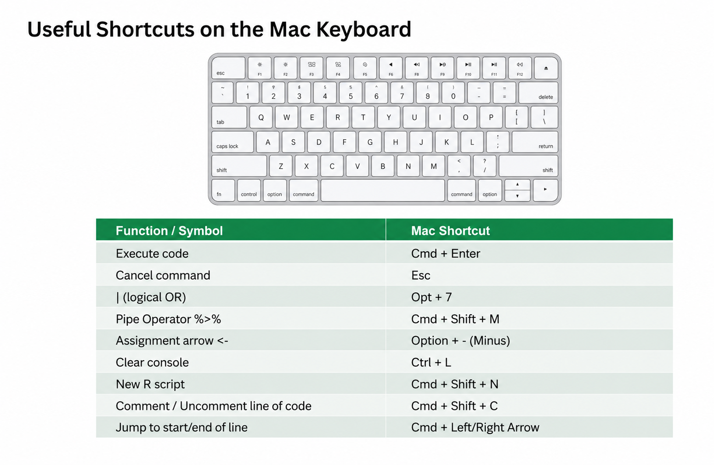{width="80%"} |

On Windows: 

|                                                                                        |
|:---------------------------------------------------------------------------------------|
| *Image: Shortcuts for Windows:*                                                     |
| 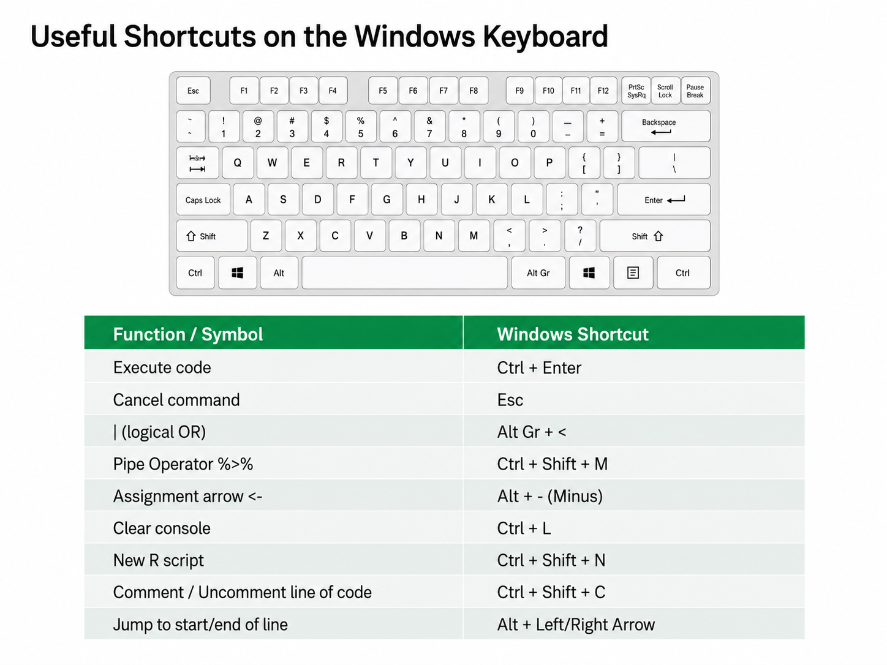{width="80%"} |


## Data transformation with dplyr

`dplyr`comes with five main functions:

1.  `select()`: select variables column by column, i.e. pick columns /
    variables by their names
2.  `filter()`: filter observations row by row, i.e. pick observations
    by their values
3.  `arrange()`: sort / reorder data in ascending or descending order
4.  `mutate()`: calculate new variables or transform existing ones
5.  `summarize()`: summarize variables (e.g. mean, standard deviation,
    etc.), best combined with `group_by()`
    
If you'd like to get a short introduction, here is a video that I recorded for my students. It covers the basics of `dplyr` in under 15 minutes!

```{r, eval=TRUE,echo=FALSE}
knitr::include_url("https://www.youtube.com/embed/qj7poscNpis")
```

### select()

You will frequently encounter large data sets including hundreds of
variables. The first problem in this scenario is narrowing down the
variables you are truly interested in. `select()` helps you to easily
choose a suitable subset of variables. In this selection process, the
name of the data frame is the source object, followed by the pipe *%\>%*
operator. The expression that selects the columns that you are
interested in comes after that.

Take the Star Wars data, for example. The original data set has 87
observations (Star Wars characters) and 14 columns / variables (traits
of these characters, e.g., *birth_year*, *gender*, and *species*). Yes,
14 columns is not a lot and you could get an overview of this data
without subsetting columns. Let's take a look at the original data
frame:

```{r, eval=TRUE, echo=TRUE}
library(dplyr) # load dplyr
starwars_data <- starwars # assign the pre-installed starwars data from dplyr to a source object / variable

starwars_data # print the content of the data frame to the console
```

For the sake of practice, let's say we only want to analyze the
*species*, *birth_year*, *mass*, and *height* of these characters. To
simplify data handling, we want to keep only the respective columns.

```{r, eval=TRUE, echo=TRUE}
starwars_data %>% # define the source object
  select(name, species, birth_year, mass, height) # keep only the name, species, birth_year, mass and height column
```

At the moment you have only printed the transformed data to the console.
However, most of the time we want to keep the transformed data ready for
further calculations. In this case we should assign the transformed data
into a new source object, which we can access later.

```{r, eval=TRUE, echo=TRUE}
starwars_short <- starwars_data %>% # assign a new source object and define the old source object
  select(name, species, birth_year, mass, height) # keep only the name, species, birth_year, mass and height column
```

Let's print the new source object, *starwars_short*, to the console.

```{r, eval=TRUE, echo=TRUE}
starwars_short
```

You can also delete columns by making a reverse selection with the *-
symbol*. This means that you select all columns except the one whose
name you specify.

```{r, eval=TRUE, echo=TRUE}
starwars_short %>%
  select(-name) # keep all columns except the name column (i.e. delete name column)
```

You can delete more than one column in one go:

```{r, eval=TRUE, echo=TRUE}
starwars_short %>%
  select(-c(name, species)) # keep all columns except the name & species column (i.e. delete these columns)
```

**Tip for advanced users:** You can select columns and rename them at
the same time.

```{r, eval=TRUE, echo=TRUE}
starwars_short %>%
  select("character" = name, "age" = birth_year) # select columns that you want to keep & rename them
```

### filter()

`filter()` divides observations into groups depending on their values.
The name of the data frame is the source object, followed by the pipe
*%\>%* operator. Then follow the expressions that filter the data.

Let's only select human Star Wars characters in our transformed data set
*starwars_short*:

```{r, eval=TRUE, echo=TRUE}
starwars_short %>%
  filter(species == "Human")
```

And now let's only select Star Wars characters who are younger than 24
or exactly 24 years old.

```{r, eval=TRUE, echo=TRUE}
starwars_short %>%
  filter(birth_year <= 24)
```

Chaining some functions, let's look at Star Wars character who are a
*Droid* and older than 24.

```{r, eval=TRUE, echo=TRUE}
starwars_short %>%
  filter(species == "Droid" & birth_year > 24) # & --> filter all observations to which both logical statements apply
```

Alternatively, you can also write these filters like this:

```{r, eval=TRUE, echo=TRUE}
starwars_short %>%
  filter(species == "Droid") %>%
  filter(birth_year > 24)
```

Besides the *&* operator, there are many more logical operators that you
can choose from to optimize your filter choices. Here is an overview:

|                                                                                                                                            |
|--------------------------------------------------------------------------------------------------------------------------------------------|
| *Image: Logical, i.e. boolean, operators (Source: [R for Data Science](https://r4ds.had.co.nz/transform.html?q=filter#logical-operators)*) |
| 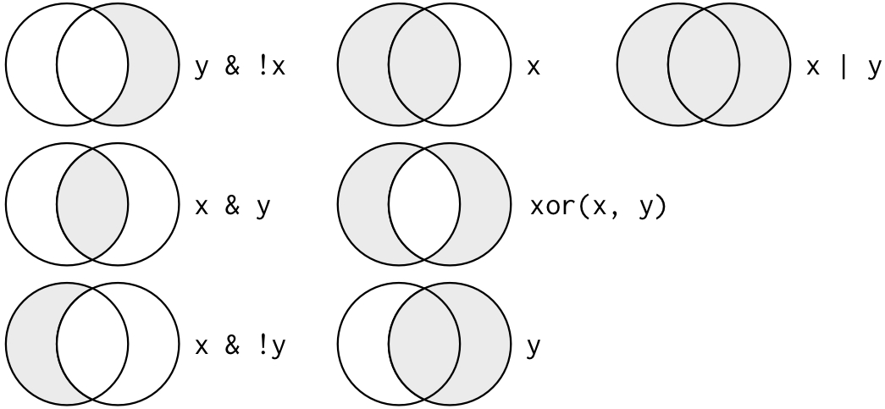                                       |

**Tip for advanced users 1:** You can negate filters. This means that
you keep all observations except the one that you have specified with
the *!=* operator (read *!=* as: *is not* or *is unequal to*). For
example, you can choose to include only non-human Star Wars characters.

```{r, eval=TRUE, echo=TRUE}
starwars_short %>%
  filter(species != "Human")
```

Alternatively, you achieve the same goal by negating the entire function
call. Negating the entire function call can be handy at times.

```{r, eval=TRUE, echo=TRUE}
starwars_short %>%
  filter(!(species == "Human"))
```

**Tip for advanced users 2:** You can filter for missing values (NAs)
with the `is.na()` function.

```{r, eval=TRUE, echo=TRUE}
starwars_short %>%
  filter(is.na(birth_year))
```

And you can negate that filter to get rid of all observation that have
missing values (NAs).

```{r, eval=TRUE, echo=TRUE}
starwars_short %>%
  filter(!is.na(birth_year))
```

**Tip for advanced users 3:** Watch out for the *\| operator* (read:
*or*). This one can be tricky to negate!

For example, with this code you get all characters that are NEITHER
human NOR older than 33 years. I.e. you get all non-human characters who
are younger than 33 or exactly 33 years old.

```{r, eval=TRUE, echo=TRUE}
starwars_short %>%
  filter(!((species == "Human") | (birth_year > 33)))
```

But with this code, you'll get all observations that are either
non-human (regardless of their age) OR humans who are older than 33
years old.

```{r, eval=TRUE, echo=TRUE}
starwars_short %>%
  filter((species != "Human") | (birth_year > 33))
```

### arrange()

`arrange()` and `filter()` are like two brothers: both look similar, but
they also differ in at least one essential aspect. Both functions change
the rows of the data frame, but unlike `filter()`, `arrange()` does not
select or delete rows, it only changes their order (either ascending or
descending). By default, `arrange()` will sort in ascending order, i.e.
from 1:100 (numeric vector) and from A:Z (character vector). `arrange()`
must always be applied to at least one column that is to be sorted.

```{r, eval=TRUE, echo=TRUE}
starwars_short %>%
  arrange(birth_year)
```

To get a descending order:

```{r, eval=TRUE, echo=TRUE}
starwars_short %>%
  arrange(desc(birth_year))
```

If you specify more than one column, then subsequent columns are used to
break ties. Also note that missing values are always displayed last:

```{r, eval=TRUE, echo=TRUE}
starwars_short %>%
  arrange(species, birth_year)
```

### mutate()

Often you want to add new columns to a data set, e.g. when you calculate
new variables or when you want to store re-coded values of other
variables. With `mutate()`, new columns will be added to the end of you
data frame.

For example, we can resize the height column to provide the body height
in m instead of cm. Let's call that variable *m_height*. We'll assign
our transformed data (with the newly created *m_height* column) back
into our source object (*starwars_short*) to keep the changes for the
future (and not just print it to the console).

```{r, eval=TRUE, echo=TRUE}
starwars_short <- starwars_short %>% # assigns your source object, i.e. data, back to itself to save changes
  mutate(m_height = height / 100) # creates the new variable "m_height" and adds it to the end of the data frame

starwars_short # print the data to your console to inspect the new column
```

Let's calculate the BMI of the Star Wars characters with the BMI formula
and the newly created *m_height* variable. Save the changes to your data
frame by assigning the source object back to itself.

```{r, eval=TRUE, echo=TRUE}
starwars_short <- starwars_short %>% # assigns your source object, i.e. data, back to itself to save changes
  mutate(BMI = mass / m_height^2) # creates the new variable "BMI" and adds it to the end of the data frame

starwars_short # print the data to your console to inspect the new column
```

`mutate()` does not merely work with mathematical operators. You can
also categorize numeric variables with the `case_when` function, which
is part of the `mutate()` function.

```{r, eval=TRUE, echo=TRUE}
starwars_short <- starwars_short %>%
  mutate(age_cat = case_when( # "cat" is short for "categorized"
    birth_year < 20 ~ "very young",
    birth_year < 40 ~ "young",
    birth_year < 70 ~ "mid-aged",
    birth_year <= 100 ~ "old",
    birth_year > 100 ~ "very old"
  ))

starwars_short
```

Finally, you can recode variables by using the `recode()` function,
which is part of the `mutate()` function. Let's be crazy and recode all
droids as robots[^3] and save the result in a new variable called
*crazy_species*! Please note that `recode()` has an unusual syntax
because it follows the order of `old_var = new_var` instead of the usual
order: `new_var = old_var`. Therefore, `recode()` is likely to be
retired in the future (use `case_when` instead).

[^3]: Please, don't hate me for this.

```{r, eval=TRUE, echo=TRUE}
starwars_short <- starwars_short %>%
  mutate(crazy_species = recode( # alternatively, you could also recode directly back into the species variable
    species,
    "Droid" = "Robot"
  ))

starwars_short
```

**Tip for advanced users 1:** There is a special case of recoding:
Sometimes you will receive data (e.g. through an import from SPSS) in which missings are not marked as NA, but with -9 (or any other number). Unfortunately, you will have to tell R that these are missing values and
should be set to NA. In this case, use the `na_if()` function, which is
also part of the `mutate()` function.

Luke Skywalker, the first observation in our data frame, is 172cm tall.
For the sake of practice, let's set all heights that are equal to 172cm
to NA. This time, we won't save this transformation for later use (by
reassigning the source object back to itself) since this transformation
does not make a lot of sense.

```{r, eval=TRUE, echo=TRUE}
starwars_short %>%
  mutate(height = na_if(height, 172))
```

**Tip for advanced users 2:** If you'd like to apply the `na_if()` function to all of your columns at once, e.g., to change all -9 missings from SPSS to `NA`, you can use the `mutate` function in combination with the `across` function. The `across` function allows you perform the same operation on multiple columns. In our case, it's the `na_if` function that we apply on multiple (i.e., all) columns.
You'll learn more about the `everything()` inthe Tutorial [Reorder your columns with everything()].

```{r, eval=TRUE, echo=TRUE}
starwars_short %>%
  select(height, mass, birth_year) %>% # keep only numeric columns, so that the numeric missing "172" won't raise an error
  mutate(across(everything(), ~na_if(., 172))) # across(everything(), ~na_if(., 172)): This command replaces the value 172 with NA in all columns. everything() ensures that all columns are selected, and na_if(., 172) replaces the specified value (172) with NA.
```

If you only wanted to replace the SPSS missings with `NA` in specific columns, you could use this code:

```{r, eval=TRUE, echo=TRUE}
starwars_short %>%
  mutate(across(c(mass, height), ~na_if(., 172)))
# Instead of using everything(), this code specifies columns mass and height using c(mass, height). The na_if(., 172) function is then applied only to these columns.
```

### summarize() [+ group_by()] {#summarize-group_by}

Instead of using `summarize()`, you could omit the American English and
write `summarise()`. This function collapses a data frame into a single
row that shows you summary statistics about your variables. Be careful
not to overwrite your source object with the collapsed data frame, i.e.
do not reassign the source object to itself when you use `summarize()`
(unless you have a really good reason to do so).

```{r, eval=TRUE, echo=TRUE}
starwars_short %>%
  summarize(mean_height = mean(height, na.rm = TRUE)) # collapses the data frame into one variable called "mean_height"
# na.rm = TRUE -> removes the missing values prior to the computation of the summary
```

We now know that the average Star Wars character is 174cm tall. But the
`summarize()`function grows especially powerful when it is combined with
\``group_by` to display summary statistics for groups.

```{r, eval=TRUE, echo=TRUE}
starwars_short %>%
  group_by(species) %>% # every unique species becomes its own group
  summarize(
    mean_height = mean(height, na.rm = TRUE), # collapses the data frame into one row with one variable called "mean_height"...
    count = n() # and a second variable that shows the group size (i.e. count)
  )
```

We learn from the 6 droids in our data set that droids are small, 131cm
on average. But Ewoks are even smaller (88cm on average). *Pro tip:* you
can even group by two groups at the same time with the method
`group_by(x1, x2, .add=TRUE)` or `group_by(x1, x2)`.

Finally, we can also retrieve all relevant summary statistics of a
classic [box plot](https://www.simplypsychology.org/boxplots.html):

```{r, eval=TRUE, echo=TRUE}
starwars_short %>%
  group_by(species) %>% # every unique species becomes its own group
  summarize(
    MAX = max(height, na.rm = TRUE),
    UQ = quantile(height, 0.75, na.rm = TRUE),
    Med = median(height, na.rm = TRUE),
    M = mean(height, na.rm = TRUE),
    # SD = sd(height, na.rm = TRUE),             # calculating the standard deviation is useless here because we often have only 1 observation per species
    LQ = quantile(height, 0.25, na.rm = TRUE),
    MIN = min(height, na.rm = TRUE),
    count = n() # shows the group_size (i.e. count)
  )
```

**Tip for advances users 2:** If you want to count the unique values of
variables, then `data %>% group_by(a, b) %>% summarize(n = n())` might
not be the best solution (it's a lot of code, isn't it?).

```{r, eval=TRUE, echo=TRUE}
starwars_short %>%
  group_by(species, age_cat) %>%
  summarize(count = n())
```

For more efficient code, you can use the `count()` function instead:
`data %>% count(a, b)`.

```{r, eval=TRUE, echo=TRUE}
starwars_short %>%
  count(species, age_cat)
```

### Chaining functions in a pipe

All of the `dplyr` functions can be chained in one single pipe. Using
the original starwars_data, we'll only analyze Star Wars characters who
are older than 25 years (`filter()`), calculate the BMI (`mutate()`),
group them by their species (`group_by()`) and summarize the average BMI
(`summarize()`). We'll display the final result in an ascending order
(`arrange()`).

```{r, eval=TRUE, echo=TRUE}
starwars_data %>%
  mutate(BMI = mass / (height / 100)^2) %>%
  filter(birth_year > 25) %>%
  group_by(species) %>%
  summarize(mean_BMI = mean(BMI, na.rm = TRUE)) %>%
  arrange(mean_BMI)
```

## Printing more rows in the console using `dplyr`
By default, when working with tidyverse in `R`, only 10 rows of your data will be printed to the console. However, sometimes you might want to inspect more rows to get a better understanding of your dataset. You can achieve this with the `print()` function:

```{r, eval=TRUE, echo=TRUE}
starwars_data %>% 
  print(n = 20)
```

Alternatively, you can set the number of displayed rows by adjusting your global options at the beginning of your R script (see our tutorial on [Optional: Setting global options in R for a customized workflow]).


## Take-Aways

-   **Tidy data**: is a tabular in which each column represents one
    single variable, each row represents a single observation and each
    cell contains only one single value
-   **Pipe operator**: *%\>%* is used to chain functions and apply them
    to a source object. We call these chains of functions *pipes*
-   **dplyr functions**: there are five main dplyr functions that you
    should know of: `select`, `filter`, `arrange`, `mutate`, and
    `summarize` [+ `group_by`].
    
    
**Listen to this audio to NEVER forget the 5 dplyr functions again:**

<details>
  <summary>Show lyrics</summary>
  <p>
[Verse 1]
Oh, I’ve got a dataset, messy and wild,
Columns and rows that just aren’t styled.
I need a little order, a bit of reform,
To take this chaos and make it the norm.

[Prechorus]
I’ll tidy it up, I’ll make it right,
With dplyr’s tools, I’ll shed some light.

[Chorus]
Select, oh select, pick the cream of the crop,
Filter, oh filter, let the bad rows drop.
Arrange, rearrange, make it flow so fine,
Mutate and create, new columns align.
Summarize the story, group by and refine,
With dplyr, baby, the data will shine!

[Verse 2]
Column by column, I’ll choose with care,
Pick the variables, make it all square.
Row by row, I’ll filter the scene,
Keeping the values that fit the machine.

[Prechorus]
I’ll sort it all out, ascending or low,
Reorder the chaos, let the patterns show.

[Chorus]
Select, oh select, pick the cream of the crop,
Filter, oh filter, let the bad rows drop.
Arrange, rearrange, make it flow so fine,
Mutate and create, new columns align.
Summarize the story, group by and refine,
With dplyr, baby, the data will shine!
  </p>
</details>
    
<audio controls>
  <source src="audio/The_dplyr_groove.mp3" type="audio/mpeg">
  Your browser does not support the audio element.
</audio>

## Additional tutorials

You still have questions? The following tutorials & papers can help you
with that:

-   [Computational Methods in der politischen Kommunikationsforschung
    by J. Unkel, Tutorial 7, 9 &
    10](https://bookdown.org/joone/ComputationalMethods/packages.html)
-   [R for Data Science, Chapter
    12](https://r4ds.had.co.nz/tidy-data.html#introduction-6)
-   [R for Data Science, Chapter 5.1.3 and the
    following](https://r4ds.had.co.nz/transform.html?q=filter#dplyr-basics)
-   [YaRrr! The Pirate's Guide to R by N.D.Phillips, Tutorial
    10.4](https://bookdown.org/ndphillips/YaRrr/importingdata.html)
-   [The tidyverse style guide](https://style.tidyverse.org/)
-   [Data wrangling with dplyr & tidyr Cheat
    Sheet](https://www.rstudio.com/wp-content/uploads/2015/02/data-wrangling-cheatsheet.pdf)

Now let's see what you've learned so far: [Exercise 3: dplyr].

# Exercise 3: dplyr {.unnumbered}

**After working through Exercise 3, you'll...**

-   have assessed how well you know `dplyr`
-   know what `dplyr` functions and concepts you might want to repeat
    again
-   have managed to apply the `dplyr` concepts to data

## Task 1 {.unnumbered}

Below you will see multiple choice questions. Please try to identify the
correct answers. 1, 2, 3 and 4 correct answers are possible for each
question.

**1. What are the main characteristics of tidy data?**

-   Every cell contains values.
-   Every cell contains a variable.
-   Every observation is a column.
-   Every observation is a row.

**2. What are `dplyr` functions?**

-   `summary()`
-   `describe()`
-   `mutate()`
-   `manage()`

**3. How can you sort the eye_color of Star Wars characters from Z to
A?**

-   `starwars_data %>% arrange(desc(eye_color))`
-   `starwars_data %>% arrange(eye_color)`
-   `starwars_data %>% select(arrange(eye_color))`
-   `starwars_data %>% select(eye_color) %>% arrange(desc(eye_color))`

**4. Imagine you want to recode the height of these characters. You want
to have three categories from small and medium to tall. What is a valid
approach?**

-   `starwars_data %>% mutate(height = case_when(height<=150~"small",height<=190~"medium",height>190~"tall"))`
-   `starwars_data %>% mutate(height = case_when(height<=150~small,height<=190~medium,height>190~tall))`
-   `starwars_data %>% recode(height = case_when(height<=150~"small",height<=190~"medium",height>190~"tall"))`
-   `starwars_data %>% recode(height = case_when(height<=150~small,height<=190~medium,height>190~tall))`

**5. Imagine you want to provide a systematic overview over all hair
colors and what species wear these hair colors frequently (not
accounting for the skewed sampling of species)? What is a valid
approach?**

-   `starwars_data %>% group_by(hair_color) %>% group_by(species) %>% summarize(count = n()) %>% arrange(hair_color)`
-   `starwars_data %>% group_by(hair_color, species) %>% summarize(count = n()) %>% arrange(hair_color)`
-   `starwars_data %>% group_by(hair_color & species) %>% summarize(count = n()) %>% arrange(hair_color)`
-   `starwars_data %>% group_by(hair_color + species) %>% summarize(count = n()) %>% arrange(hair_color)`

## Task 2 {.unnumbered}

It's your turn now. Load the starwars data like this:

```{r, eval = TRUE, echo = TRUE}
library(dplyr) # to activate the dplyr package
starwars_data <- starwars # to assign the pre-installed starwars data set (dplyr) into a source object in our environment
```

How many humans are contained in the starwars dataset overall?
First, solve this task using `filter()` only.
Next, solve it by combining `filter()` with `summarize(count = n())`.
Finally, try to solve it with `count()`.

## Task 3 {.unnumbered}
Use `mutate()` and `case_when()` to create a new column height_group with:
- “short” if height < 140
- “medium” if height < 180
- “tall” otherwise.

## Task 4 {.unnumbered}
How many humans are contained in starwars by height_group? (Hint: You'll need to chain multiple functions. Remember that `summarize()` has a best friend that will help you solve this task. :))

## Task 5 {.unnumbered}
What is the most common height_group among Star Wars characters? (Hint: You'll need to chain multiple functions, but one of them should be `arrange()`)

## Task 6 {.unnumbered}
What is the average mass of Star Wars characters that are not human and
have yellow eyes? (Hint: You'll need to calculate descriptive statistics and remove all `NAs`.)

## Task 7 {.unnumbered}
Compare the mean, median, and standard deviation of mass for all humans
and droids. (Hint: You'll need to calculate descriptive statistics and remove all `NAs`.)

## Task 8 {.unnumbered}
Create a new variable in which you store the mass in gram (gr_mass). Add
it to the dataframe. Test whether your solution works by printing your
data to the console, but only show the name, species, mass, and your new
variable gr_mass.

When you're ready to look at the solutions, you can find them here:
[Solutions for Exercise 3].

# Optional tutorial: Advanced data management

**After working through this optional tutorial, you'll...**

- read and combine multiple data files efficiently;
- deal with inconsistent column names across files;
- join datasets using different types of `dplyr` joins;
- reshape data between wide and long formats with `pivot_longer()` and `pivot_wider()`;
- use advanced `tidyselect` helpers to select and reorder columns;
- filter rows using string patterns and regular expressions.

This chapter extends the core `dplyr` workflow with techniques that are especially useful in real research projects. It is included as an **advanced reference chapter**: depending on the pace of the beginner workshop, we may work through selected sections together or you can return to them later.

Because R Projects and relative paths were already introduced in [Tutorial: Working with data (files)], the examples below build on that reproducible project workflow rather than changing the working directory with hard-coded paths.

Load the `tidyverse` before working through the examples:

```{r, eval = TRUE, include=TRUE}
library(tidyverse)
```

## Reading multiple files into R

There are several common challenges when reading multiple files into R,
such as inconsistent column names and file paths, as well as selecting
only the necessary files. In this tutorial, I'll teach you a convenient
solution by creating a character vector of file paths and reading them
into R using the `read_*` functions.

Assuming that your `multiple_files` folder is a subfolder of your current R Project, save its **relative path** in an object called `path`. This way, you do not need to change the working directory:

```{r, eval = FALSE, include=TRUE}
path <- "multiple_files"
path
```

Next, create a character vector that contains the file names of all
files contained in your subfolder `"multiple_files"`. You can look at
the file names of a folder by using the function `list.files()`:

```{r, eval = FALSE, include=TRUE}
file_names <- list.files(path)
file_names
```

Now turn these names into a proper character vector of all the file
paths by adding additional arguments to the function `list.files()`:

```{r, eval = FALSE, include=TRUE}
file_paths <- list.files(
  path = path, # takes the path to the working directory / folder
  pattern = "csv", # file should contain the string 'csv', but you could also opt for "WoJ_names"
  full.names = TRUE
) # store the full file paths, not just the file names
file_paths
```

Finally, read the files using `map()`: Use `map()` from the `purrr`
package (part of the `tidyverse` metapackage) to iterate over the file
paths and read each file using a function like `read.csv()` (or
`read_excel()`, etc.). The result will be a list of data frames.

```{r, eval = FALSE, include=TRUE}
data_list <- file_paths %>%
  map(~ read.csv2(file = .x)) # use map to apply read.csv2 (semicolon-separated) to each individual file path, .x stands for each individual file path
data_list
```

However, we don't want our data to be read in as separate files. We want
to combine them in one single file. We can use `bind_rows()` from the
`dplyr` package for that:

```{r, eval = FALSE, include=TRUE}
combined_data <- data_list %>% bind_rows() # bind all of your rows in your data list into one dataframe
```

That involved a great number of individual steps. Let's now consolidate
everything into a simpler pipeline and execute it:

```{r, eval = FALSE, include=TRUE}
path <- "multiple_files"
file_paths <- list.files(
  path = path,
  pattern = "csv",
  full.names = TRUE
)

combined_data <- file_paths %>%
  map(~ read.csv2(file = .x)) %>%
  bind_rows()
```

**Note:** If the files have different column names or structures, you
may encounter issues when binding them together with this approach. Make
sure the files have compatible structures or consider preprocessing the
data, as shown in the next chapter.

### Reading multiple files into R with different column names

Things can sometimes get messy. Please download the .csv files that are
contained in the folder `multiple_files_messy` on [LRZ Sync &
Share](https://syncandshare.lrz.de/getlink/fiBrHj9PZXRE8BcAAgrZkj/multiple_files_messy)
and store them in a folder called `multiple_files_messy` in your R Project.

In this messy folder, the `WoJ_names_1.csv` file has been altered. The
column name `country` has been capitalized (i.e., changed to `COUNTRY`)
, and the column containing names has been accidentally deleted. Let's
attempt to reload the .csv files once more and set the column names to
lowercase dynamically. To handle the missing column, we will use
`bind_rows` function:

```{r, eval = FALSE, include=TRUE}
path <- "multiple_files_messy"
file_paths <- list.files(
  path = path,
  pattern = "csv",
  full.names = TRUE
)

combined_data <- file_paths %>%
  map(~ read.csv2(file = .x) %>%
    setNames(tolower(names(.)))) %>%
  bind_rows()
```

**Tip for advanced users:** The line `setNames(tolower(names(.)))) %>%` is where the mismatch between COUNTRY and country is being solved. There are several other common mismatches between data files that you can solve using these lines of code:

*1. Extraneous white spaces (leading/trailing spaces):*
`setNames(gsub("^\\s+|\\s+$", "", names(.))) %>%`

*2. Replace spaces with underscores:*
`setNames(gsub("\\s+", "_", names(.))) %>%`

*3. Remove special characters:*
`setNames(gsub("[^[:alnum:]_]", "", names(.))) %>%`

*4. Standardize certain column names:*
If you know in advance that certain files might have deviations in column names, you can use a named vector of replacements. For this, you'd likely want to break the renaming process out of the setNames function for clarity:
`name_corrections <- c("First Column" = "first_column", "Last Column" = "last_column")`
`corrected_names <- ifelse(names(.) %in% names(name_corrections), name_corrections[names(.)], names(.))`

`combined_data <- file_paths %>%`
  `map(~ read.csv2(file = .x) %>%`
    `setNames(corrected_names) %>%`
  `bind_rows()`

Neat! Note that you can always exchange the string in the `pattern`
argument of `list.files` to include a regular expression. If you want to go deeper into regular expressions, see the optional `stringr` tutorial later in this guide.

## Joining two datasets

We've already covered how to join multiple datasets while loading the
data into R. This next approach joins datasets **after** they've been loaded
into R. It's the more common approach.

First things first, let's load the libraries and data we'll need. As we load this data, we're doing an extra step in our pipeline. For every row of data, we're adding a unique ID. This ID is simply the row's position in the list (so, the first row is 1, the second is 2, and so on). We're naming this unique ID as case_id.

```{r, eval = TRUE, include = TRUE}
# install.packages("tidycomm") # only the first time
library(tidycomm)
library(tidyverse)
WoJ <- tidycomm::WoJ %>%
  mutate(case_id = row_number())
```

Next, we'll split the WoJ dataset into two groups based on work
experience: rookies and veterans. **We'll also reduce the numbers of
rookies and veterans based on an arbitrary third variable to make the
cases included in the datasets somewhat different from each other.**

```{r, eval = TRUE, include = TRUE}
rookies <- WoJ %>%
  filter(work_experience <= 12) %>%
  filter(autonomy_selection > 1)

veterans <- WoJ %>%
  filter(work_experience >= 10) %>%
  filter(ethics_1 < 5)
```

With these restrictions set in place, these two datasets include 1,169 **unique** journalists. The rookies are made up of 433 journalists and the veterans make up 853. 117 journalists are being classified as BOTH rookie AND veteran, i.e. have been counted twice. This means we are dealing with: 433 + 853 - 117 = 1,169.

Now, let's say you want to merge these datasets back together for some comparative analysis. `dplyr` offers you different types of joins for this exact purpose. Let's explore them!

### inner_join

**This is like an overly correct librarian.** It only takes rows that
have matching keys **in both** datasets, otherwise it will drop the
rows.

```{r, eval = TRUE, echo = TRUE}
inner_joined <- inner_join(rookies, veterans, by = "case_id")

inner_joined
```

### left_join

**This is like a fan of the first dataset.** It takes all rows from the
first dataset and the matched rows from the second dataset.

```{r, eval = TRUE, echo = TRUE}
left_joined <- left_join(rookies, veterans, by = "case_id")

left_joined
```

### right_join

**This is like a fan of the second dataset.** It takes all rows from the
second dataset and the matched rows from the first dataset.

```{r, eval = TRUE, echo = TRUE}
right_joined <- right_join(rookies, veterans, by = "case_id")
# Pro tip: you can use the argument `by = your_column_here` to match the two datsets based on a specific column, e.g. case id

right_joined
```

### full_join

**This is like a hoarder.** It takes all rows and throws in missings for
variables that are not part of both datasets.

```{r, eval = TRUE, echo = TRUE}
full_joined <- full_join(rookies, veterans, by = "case_id")
# Pro tip: you can use the argument `by = your_column_here` to match the two datsets based on a specific column, e.g. case id

full_joined
```

### Join without .x and .y suffixes
You might have noticed that when you're using dplyr to join two datasets, .x and .y suffixes are added to any columns that have the same names in both datasets. For example, if we join using the `case_id` variable, all other variables in the resulting combined dataset will be named something like `country.x` and `country.y`. The .x and .y suffixes differentiate the country columns from the `rookies` dataset and the `veterans` dataset, respectively.

However, if you're certain that columns with the same name in both datasets also contain the same values, or if you simply don't want to retain both versions in the output, there are a couple of approaches to prevent or remove the duplicate columns with the .x and .y suffixes:


**1. Using the `by` argument:**
The `by` argument in the `join` functions lets you specify which columns to join by. By creating a character vector of the column names in your data frames, you can provide this column name vector to the `by` argument. This way, you're specifying to join on *all columns* in your data frames. Since the column names and values are identical in both data frames, `dplyr` won't create the duplicate columns with .x and .y suffixes.

```{r, eval = TRUE, echo = TRUE}
column_names <- colnames(rookies) # colnames() grabs the column names from the rookies data frame and turns them into a character vector

full_joined <- full_join(rookies, veterans, by = column_names)

full_joined
```

You receive only 16 columns in your combined data set. This is the most elegant solution.


**2. Renaming .x columns and dropping .y columns:**
Using the knowledge that you'll acquire in the next few tutorials, you could also rename all the .x columns in your combined data set and delete all .y columns.

```{r, eval = TRUE, echo = TRUE}
inner_joined <- inner_joined %>%
  rename_with(~ gsub("\\.x$", "", .), everything()) %>% # replaces all column endings ".x" with nothing: ""
  select(-matches("\\.y$")) # deselects all columns that end with ".y"

inner_joined
```

You are left with only 16 columns.

**3. Drop the columns from one data frame before joining:**
This is the most basic and error-prone, but quickest approach.

```{r, eval = TRUE, echo = TRUE}
veterans <- veterans %>% 
  select(case_id) # drop all columns except case_id

left_joined <- left_join(rookies, veterans, by = "case_id")

left_joined
```


## Reformatting datasets

In this subtutorial, we will learn how to use `pivot_longer()` and
`pivot_wider()` functions from the `tidyr` package. We will create a
fictional dataset based on the Worlds of Journalism (WoJ) dataset, with
a twist - it will have several panel waves. Imagine that the WoJ dataset
has been expanded to include data from different years:

```{r, eval = TRUE, echo = TRUE}
set.seed(123)
WoJ_panel <- WoJ %>%
  slice_sample(n = 10) %>%
  select(case_id, work_experience, autonomy_selection) %>%
  mutate(
    work_experience_w2018 = work_experience + sample(1:1, 10, replace = TRUE),
    work_experience_w2019 = work_experience_w2018 + sample(1:1, 10, replace = TRUE),
    autonomy_selection_w2018 = autonomy_selection + sample(-1:1, 10, replace = TRUE),
    autonomy_selection_w2019 = autonomy_selection_w2018 + sample(-1:1, 10, replace = TRUE)
  ) %>%
  select(-c(work_experience, autonomy_selection))

WoJ_panel
```

### pivot_longer()

Let's say you want to analyze how work experience and autonomy selection
change over time. For this, you need to reshape the dataset into a
longer format.

```{r, eval = TRUE, echo = TRUE}
long_data <- WoJ_panel %>%
  pivot_longer(
    cols = contains("_w"),
    names_to = c("variable", "wave"),
    names_pattern = "(.*)_(w\\d+)", # the symbol starts with any symbol that repeats 0 to several times until a _ is reached, followed by a "w" and at least one digit
    values_to = "value"
  )

long_data
```

This code transforms the dataset into a longer format where each row
represents a single observation for a variable at a specific wave.

### pivot_wider()

Now, let's say you want to do the opposite. You have a long dataset and
you want to reshape it into a wider format.

```{r, eval = TRUE, echo = TRUE}
wide_data <- long_data %>%
  pivot_wider(
    names_from = c("variable", "wave"),
    names_sep = "_",
    values_from = "value"
  )

wide_data
```

## Advanced column selectors

`Tidyselect` is a package within the `tidyverse` that provides a set of
functions for selecting and manipulating columns in a data frame. It is
mainly used internally by other tidyverse packages, such as `dplyr` and
`tidyr`, to handle column selections. Tidyselect functions, such as
`starts_with()`, `ends_with()`, and `contains()`, allow you to specify
column selections based on various patterns, such as prefixes, suffixes,
and substrings. In this tutorial, we will look at the following `tidyselect` functions:

- last_col() 
- starts_with() 
- ends_with() 
- contains()
- matches()
- num_range()
- where()

Let's first import the full `Worlds of Journalism` dataset from the
`tidycomm` package:

```{r, eval = TRUE, include=TRUE}
WoJ <- tidycomm::WoJ
```

### Selecting the last column

Use `last_col()` when you want to select the last column of a data frame
regardless of its name.

```{r, eval = TRUE, include=TRUE}
WoJ %>% select(last_col())
```

You can also select all columns except the last one:

```{r, eval = TRUE, include=TRUE}
WoJ %>% select(!last_col())
```

### Selecting columns that start with, end with or contain a specific string

`starts_with()` selects columns that start with a specific prefix:

```{r, eval = TRUE, include=TRUE}
WoJ %>% select(starts_with("ethics"))
```

`ends_with()` selects columns that end with one or more specific
suffixes:

```{r, eval = TRUE, include=TRUE}
WoJ %>% select(ends_with(c("_1", "_2"))) # ends with _1 OR _2
```

`contains()` selects columns that contain a specific substring:

```{r, eval = TRUE, include=TRUE}
WoJ %>% select(contains("_"))
```

`matches()` selects columns based on a regular expression pattern:

```{r, eval = TRUE, include=TRUE}
WoJ %>% select(matches("^ethics")) # ^ stands for "begins with" in regex notation
```

```{r, eval = TRUE, include=TRUE}
WoJ %>% select(matches("\\d")) # \\d stands for "contains a digit/number" in regex notation
```

**Note**: All of the above functions, except `matches()` are not case-sensitive. This means that they will match both upper- and
lowercase letters. If you want to make them case-sensitive, use the `ignore.case` argument and set it to FALSE.

```{r, eval = TRUE, include=TRUE}
WoJ %>% select(starts_with("Ethics", ignore.case = FALSE)) # but there is no capitalized Ethics in the data
```

### Selecting columns based on a numeric range

You can select columns based on a numerical range with `num_range()`:

```{r, eval = TRUE, include=TRUE}
WoJ %>% select(num_range("ethics_", 1:2)) # selects ethics_1 and ethics2, but not ethics_3, etc.
```

### Selecting columns based on their type

You can select columns based on their type with `where()`, e.g., all
character columns:

```{r, eval = TRUE, include=TRUE}
WoJ %>% select(where(is.character))
```

Or you could select all columns that contain numbers:

```{r, eval = TRUE, include=TRUE}
WoJ %>% select(where(is.numeric))
```

You could also use: 

- is.integer (whole numbers, e.g., 7) 
- is.double (decimal numbers, e.g., 7.25)
- is.logical (e.g., TRUE/FALSE)
- is.factor (e.g., "great", "greater", "the greatest")

### Combine selectors

You can combine selectors, of course. Let's select all character columns
and columns that start with "autonomy".

```{r, eval = TRUE, include=TRUE}
WoJ %>% select(where(is.character) | starts_with("autonomy"))
```

### Reorder your columns with everything()

Finally, you can select **all** columns with `everything()`. This allows
you to reorder your columns quickly:

```{r, eval = TRUE, include=TRUE}
WoJ %>% select(temp_contract, country, everything())
```

## Advanced selection of rows

You can make very advanced row selections by using the function
`str_detect` from the `stringr` package in combination with `filter`
from the `dplyr` package, especially if you combine `str_detect` with
regular expressions.

Let's start with partial matching, i.e., when your pattern is *part* of
a string, select it:

```{r, eval = TRUE, include=TRUE}
WoJ %>% filter(str_detect(employment, "Free"))
```

Note that str_detect is case-sensitive, i.e., it reacts sensitive to
capitalization. You won't get a match for "free":

```{r, eval = TRUE, include=TRUE}
WoJ %>% filter(str_detect(employment, "free"))
```

In regex language, you can ask `str_detect() to` look for lowercase and
uppercase matches, when you are unsure of whether the entries are
capitalized in your dataset:

```{r, eval = TRUE, include=TRUE}
WoJ %>% filter(str_detect(employment, "[fF]ree"))
```

You can also ask for matches that end on your pattern:

```{r, eval = TRUE, include=TRUE}
WoJ %>% filter(str_detect(employment, "time$"))
```

If you want to go deeper into regular expressions, see the optional `stringr` tutorial later in this guide.


## Take-Aways

- **Reproducible paths:** Keep files inside an R Project and prefer relative paths over machine-specific absolute paths.
- **Read multiple files:** Create file paths with `list.files()`, iterate with `purrr::map()`, and combine compatible data frames with `dplyr::bind_rows()`.
- **Standardize messy imports:** Clean or harmonize variable names before binding data from different sources.
- **Join datasets:** Choose `inner_join()`, `left_join()`, `right_join()`, or `full_join()` according to which cases you want to retain.
- **Reshape data:** Use `pivot_longer()` and `pivot_wider()` to move between long and wide data structures.
- **Select columns flexibly:** Use helpers such as `last_col()`, `starts_with()`, `ends_with()`, `contains()`, `matches()`, `num_range()`, `where()`, and `everything()`.
- **Select rows by patterns:** Combine `stringr::str_detect()` with `dplyr::filter()` when row selection depends on a string pattern or regular expression.

You still have questions? The following book can help you with that:

- [Going from Beginner to Advanced in the Tidyverse by C. Burkhart](https://christianb.gumroad.com/l/tidyverse-booster)

# Tutorial: Data visualization with ggplot

**After working through Tutorial 6, you'll...**

-   know what each graphical component of a ggplot graph contributes to
    the final visualization
-   understand the `grammer of graphics` (or simply: the ggplot2 syntax)
    to combine graphical components
-   know how to make your own data visualizations using `ggplot2`

You can watch this entire chapter as video, in which I explain everything in detail:

```{r, eval=TRUE,echo=FALSE}
knitr::include_url("https://www.youtube.com/embed/9QE4TU4NyyA")
```

## Why not stick with Base R?

The `ggplot2` package, i.e. the data visualization package of
`tidyverse`, has become **the** R package for data visualization. While
`Base R` can be used to visualize data, the `ggplot2` package makes data
visualization so much easier that I recommend starting with `ggplot2`
right away and skipping data visualization in `Base R` altogether.

The `gg` in `ggplot2` stands for `grammar of graphics`, which means that
we can describe each component of a graph layer by layer and component
by component. You only have to provide `ggplot()` with a source object
(i.e. data) and specify what variables it should map to the aesthetical
attributes (color, shape, size) of certain geometric objects (points,
lines, bars) -- and `ggplot` will take care of the rest! The inventor of
`ggplot2`, Hadley Wickham, describes the benefits of `ggplot2` like
this:

> "In order to unlock the full power of ggplot2, **you'll need to master
> the underlying grammar**. By understanding the grammar, and how its
> components fit together, you can create a wider range of
> visualizations, combine multiple sources of data, and customise to
> your heart's content... The grammar makes it easier for you to
> **iteratively update a plot**, changing a single feature at a time.
> The grammar is also useful because it suggests the high-level aspects
> of a plot that can be changed, giving you a framework to think about
> graphics, and hopefully shortening the distance from mind to paper. It
> also **encourages the use of graphics customised to a particular
> problem**, rather than relying on specific chart types." ([Wickham et
> al., 2021, no page; bold words
> inserted](https://ggplot2-book.org/mastery.html))

Just as `dplyr` simplifies data manipulation, `ggplot2` simplifies data
visualization. In addition, `ggplot2` and `dplyr` work hand in hand: You
can prepare your data selection and manipulation with `dplyr` and pipe
it directly into `ggplot` to turn your transformed data into a beautiful
graph.

With only a few lines of code, you can produce graphs like this one:

```{r, eval = TRUE, include=FALSE, message=FALSE}
library(ggplot2)

plot <- starwars_data %>%
  filter(species == "Human" | species == "Droid") %>%
  ggplot(aes(x = height, y = mass, size = birth_year, fill = species)) +
  geom_point(shape = 21, alpha = 0.25, color = "black") +
  scale_y_continuous(limits = c(20, 140)) +
  scale_x_continuous(limits = c(90, 210)) +
  scale_y_continuous(breaks = c(40, 60, 80, 100, 120, 140, 160)) +
  scale_x_continuous(breaks = c(100, 120, 140, 160, 180, 200)) +
  scale_size(range = c(1, 11), name = "age") +
  ggrepel::geom_text_repel(aes(label = name), size = 2.3) +
  theme_bw() +
  labs(
    title = "Mass vs. height of humans and droids in Star Wars",
    x = "Height (cm)", y = "Weight (kg)"
  ) +
  facet_wrap(~species)
```

```{r, eval = TRUE, echo=FALSE, out.width="120%"}
plot
```

This is the code. Right now, it might still look a bit overwhelming to
you, but once you've understood the grammar of graphics, it really is a
just a small jigsaw puzzle. Moreover, you don't usually start with
graphs that are this complicated, but with basic scatter or bar plots.

```{r, eval = TRUE, include=TRUE, message=FALSE}
library(ggplot2)

plot <- starwars_data %>%
  filter(species == "Human" | species == "Droid") %>%
  ggplot(aes(x = height, y = mass, size = birth_year, fill = species)) +
  geom_point(shape = 21, alpha = 0.25, color = "black") +
  scale_y_continuous(limits = c(20, 140)) +
  scale_x_continuous(limits = c(90, 210)) +
  scale_y_continuous(breaks = c(40, 60, 80, 100, 120, 140, 160)) +
  scale_x_continuous(breaks = c(100, 120, 140, 160, 180, 200)) +
  scale_size(range = c(1, 11), name = "age") +
  ggrepel::geom_text_repel(aes(label = name), size = 2.3) +
  theme_bw() +
  labs(
    title = "Mass vs. height of humans and droids in Star Wars",
    x = "Height (cm)", y = "Weight (kg)"
  ) +
  facet_wrap(~species)
```

To visit the official documentation of `ggplot2`: 1. type `?ggplot2` in
your console 2. visit the [ggplot
documentation](https://www.rdocumentation.org/packages/ggplot2/versions/3.3.5)
3. visit the [ggplot homepage of the
tidyverse](https://ggplot2.tidyverse.org/)

## Components of a ggplot graph

As mentioned before, the main idea behind `ggplot` is to generate a
statistical plot by combining layers that represent geometric objects
(e.g. points and lines). By linking data to the aesthetic features of
these geometric objects (e.g. colors, size, transparency), the aesthetic
properties of the geometric objects may be controlled. In the words of
Wickham:

> "A graphic maps the **data** to the **aesthetic** attributes (colour,
> shape, size) of **geometric** objects (points, lines, bars)." [Wickham
> et al., 2021, no page; bold words
> inserted](https://ggplot2-book.org/introduction.html)

|                                                                                                                                                                     |
|---------------------------------------------------------------------------------------------------------------------------------------------------------------------|
| *Image: The logic of adding layer by layer in ggplot ([Source: R \@ Ewah 2020](https://bookdown.org/sunboklee/introduction_to_r/week2-data-visualization-i.html)):* |
| 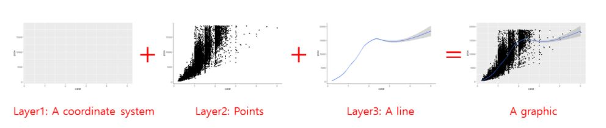                                                                       |

The **necessary** components of a `ggplot` graph are:

1.  Source object / `data`: The data that you would like to visualize.
2.  Geometries `geom_`: Geom options allow you to specify what geometric
    objects will represent the data (i.e. points, bars, lines, and many
    more).
3.  Aesthetics `aes()`: Aesthetics allows you to map variables to the x-
    and y-axis and to the aesthetics of those geometric objects (i.e.
    position, color, size, shape, linetype, and transparency).

The **complementary, but not necessary** components of a `ggplot` graph
are:

4.  Scales `scale_`: Scale options allow you to fine-tune the mapping
    from the variables to the aesthetics. You can fine-tune axis limits,
    tick breaks, grid lines, or any other axis/geometric object
    transformations that depend on the range of a specific scale.
5.  Statistical transformations `stat_`: Allows you to produce
    statistical summaries of the data for visualization (i.e. means and
    standard deviations, fitted curves, and many more).
6.  Coordinate system `coord_`: Allows you to change the appearance of
    your coordinate system (i.e. flip the coordinates to turn horizontal
    bar chart into a vertical one).
7.  Position: to adjust overlapping objects, e.g. jittering, stacking or
    dodging.
8.  Facets `facet_`: Allows you to divide your plot into multiple
    subplots.
9.  Visual themes `theme()`: Allows you to specify the visual basics of
    a plot, such as background, default typeface, sizes, and colors.
10. Axis labels `labs()`: Allows you to change the plot's main title and
    the axis labels.

## Installing & activating ggplot

You can always activate `ggplot2` by activating the meta-package
`tidyverse`:

```{r, eval = TRUE}
library(tidyverse)
```

If for some reason you do not want to activate the whole `tidyverse`,
you should install `ggplot2` and activate this package separately:

```{r, eval = FALSE}
install.packages("ggplot2") # install the package (only on the first time)
```

```{r, eval = TRUE}
library(ggplot2) # active the package
```

## Building your first plot

In the next sections, you will create your very first plot -- layer by
layer. We will look at some of the most important components that you
will regularly add to graphs and you will learn how to make use of them.

### Data

Obviously, you need data to perform data visualization. Therefore, our
first step is to load the *starwars data*, but let's keep only humans
and droids for now. To this end, assign your transformed data to a new
data frame called *human_droid_data*.

```{r, eval = TRUE}
human_droid_data <- dplyr::starwars %>%
  filter(species == "Human" | species == "Droid")
```

The function `ggplot()` can only create a plot if we explicitly tell the
function what data to use, so this graphical component is **necessary**.
Using our `dplyr` skills, let's use the *human_droid_data* as our source
object and apply the `ggplot()` function to it by using a pipe (i.e.
%\>%).

```{r, eval = TRUE}
human_droid_data %>%
  ggplot()
```

The `ggplot()` function creates a blank canvas (i.e. first layer). We
now have to draw on it.

### Aesthetics

To draw on this blank canvas, we must at least tell the `ggplot()`
function which variables to assign to the x- and y-axis by using the
`aes()` function. Thus, the Aesthetics graph component is also
**necessary** in every single plot.

```{r, eval = TRUE}
human_droid_data %>%
  ggplot(aes(x = height, y = mass))
```

The `aes()` function allows you to specify the following arguments (and
many more, as you will learn over time):

-   **x**: the variable that should be mapped to the x axis
-   **y**: the variable that should be mapped to the y
-   **size**: the variable that should be used for determining the
    *size* of a geometric object
-   **fill**: the variable that should be used for *filling* a geometric
    object with a specific color
-   **color**: the variable that should be used for *outlining* a
    geometric object with a specific color

### Geometrics

Finally, we can turn to the last **necessary** component of any ggplot
graph: the geometric objects that fill your canvas. The choice of these
geometric objects determines what kind of chart you create.

The `geom_` component of the `ggplot()` function allows you to create
the following chart types (and many more, as you will learn over time):

-   **geom_bar()**: to create a bar chart
-   **geom_histogram**: to create a histogram
-   **geom_line()**: to create a line graph
-   **geom_point()**: to create a scatter or bubble plot
-   **geom_boxplot()**: to create a box plot

Now let's add the data points (x,y) with *geom_point()* to our canvas to
make it a scatter plot:

```{r, eval = TRUE, include=TRUE, message=FALSE}
human_droid_data %>%
  ggplot(aes(x = height, y = mass)) +
  geom_point()
```

That's a scatter plot for sure! And you only needed three **necessary**
components to create it:

1.  data (i.e. a source object),
2.  aesthetics `aes()`,
3.  and geometric objects `geom_`.

### Scales

A scale is a mapping from data to the final values that computers can
use to actually show the aesthetics. In this sense, a scale
**regulates** the aesthetic mapping of variables to aesthetics.
Providing a `scale_` is not **necessary** to create a graph, but it
allows you to fine-tune aesthetic mappings to customize your graph.
`scale_` is very powerful and over time, you will learn about a lot of
things that you can customize with it. For now, we will only focus on a
few of these.

We will use `scale_` to :

-   change the limits and ticks of the x and y axis
-   change how a third variable (besides x and y) is mapped to the
    aesthetics of our geometric object

First, we will use `scale_` to modify the x and the y axis by providing
the graph with new axis limits.

```{r, eval = TRUE, include=TRUE, message=FALSE}
human_droid_data %>%
  ggplot(aes(x = height, y = mass)) +
  geom_point() +
  scale_y_continuous(limits = c(20, 140)) + # modify the y axis limits
  scale_x_continuous(limits = c(90, 210)) # modify the x axis limits
```

Second, we'll add more ticks to make the graph better readable.

```{r, eval = TRUE, include=TRUE, message=FALSE}
human_droid_data %>%
  ggplot(aes(x = height, y = mass)) +
  geom_point() +
  scale_y_continuous(limits = c(20, 140)) +
  scale_x_continuous(limits = c(90, 210)) +
  scale_y_continuous(breaks = c(40, 60, 80, 100, 120, 140, 160)) + # choose where the ticks of the y axis appear
  scale_x_continuous(breaks = c(100, 120, 140, 160, 180, 200)) # choose where the ticks of the x axis appear
```

Until now, we have used `scale_` to transform only the axes. But we can
also use it to change the mapping of variables to geometric objects. To
demonstrate this, we now add another variable to our graph, namely the
age (*birth_year*) of the humanoid and droid Star Wars characters. Let's
map age to our data points (i.e. `geom_point()`) so that larger bubbles
reflect older age.

```{r, eval = TRUE, include=TRUE, message=FALSE}
human_droid_data %>%
  ggplot(aes(x = height, y = mass, size = birth_year)) + # map birth_year (age) to the size of the following geometric objects
  geom_point() +
  scale_y_continuous(limits = c(20, 140)) +
  scale_x_continuous(limits = c(90, 210)) +
  scale_y_continuous(breaks = c(40, 60, 80, 100, 120, 140, 160)) +
  scale_x_continuous(breaks = c(100, 120, 140, 160, 180, 200))
```

Personally, I feel like these bubbles could use a little bit of
rescaling to make age differences stand out more. In addition, you could
get a nicer title for the size legend than "birth_year". Let's try that.

```{r, eval = TRUE, include=TRUE, message=FALSE}
human_droid_data %>%
  ggplot(aes(x = height, y = mass, size = birth_year)) +
  geom_point() +
  scale_y_continuous(limits = c(20, 140)) +
  scale_x_continuous(limits = c(90, 210)) +
  scale_y_continuous(breaks = c(40, 60, 80, 100, 120, 140, 160)) +
  scale_x_continuous(breaks = c(100, 120, 140, 160, 180, 200)) +
  scale_size(range = c(1, 11), name = "age") # sets the bubbles' size in a range between 1 and 11 and renames the respective legend title to "age"
```

Perfect! The legend spells "age" and age differences seem a bit more
obvious now. Unfortunately, some data points are now overlapping.

I think this is a good time to introduce you to the differences between
using `scale_` and adding aesthetics to the `geom_` objects directly.
While the former allows you to change the mapping from **variables** to
the aesthetics of geometric objects, the latter one allows you to
provide a **constant**. This means that the aesthetic mapping does not
depend on the values of a variable, but is set to a single default
value. To demonstrate this and fix the overlap of our bubbles, we change
the transparency value of the bubbles so that they become transparent.
Note that all the values given are constants, which means that they do
not depend on a third variable like *birth_year*.

```{r, eval = TRUE, include=TRUE, message=FALSE}
human_droid_data %>%
  ggplot(aes(x = height, y = mass, size = birth_year)) +
  geom_point(shape = 21, fill = "black", alpha = 0.25, color = "black") + # shape = 21 is creating bubbles that have a border (i.e. outline), fill = "black" fills the bubble with black ink, alpha = 0.25 to make the bubbles` black ink 25% transparent and color = "black" to make the border (i.e. outline) pitch black
  scale_y_continuous(limits = c(20, 140)) +
  scale_x_continuous(limits = c(90, 210)) +
  scale_y_continuous(breaks = c(40, 60, 80, 100, 120, 140, 160)) +
  scale_x_continuous(breaks = c(100, 120, 140, 160, 180, 200)) +
  scale_size(range = c(1, 11), name = "age")
```

This looks way more readable. I think we are ready to move on to
[Themes].

### Themes

Just like `scale_`, `theme_`is an optional ggplot component, i.e. **not
necessary**. Themes are visually appealing presets for charts, e.g.,
they influence whether grid lines are visible or whether certain color
palettes are applied to the data. By using themes you can make your
graphs more beautiful and give them a consistent style without any
effort, which is especially useful for longer texts like theses. To
familiarize yourself with the various options, take a look at this
[overview of all ggplot2
themes](https://ggplot2.tidyverse.org/reference/ggtheme.html).

If you don't like grid lines, for example, *theme_classic()* might be to
your taste:

```{r, eval = TRUE, include=TRUE, message=FALSE}
human_droid_data %>%
  ggplot(aes(x = height, y = mass, size = birth_year)) +
  geom_point(shape = 21, fill = "black", alpha = 0.25, color = "black") +
  scale_y_continuous(limits = c(20, 140)) +
  scale_x_continuous(limits = c(90, 210)) +
  scale_y_continuous(breaks = c(40, 60, 80, 100, 120, 140, 160)) +
  scale_x_continuous(breaks = c(100, 120, 140, 160, 180, 200)) +
  scale_size(range = c(1, 11), name = "age") +
  theme_classic()
```

Personally, I really enjoy the *theme_bw()* (black-and-white theme). So
let's apply it to our graph:

```{r, eval = TRUE, include=TRUE, message=FALSE}
human_droid_data %>%
  ggplot(aes(x = height, y = mass, size = birth_year)) +
  geom_point(shape = 21, fill = "black", alpha = 0.25, color = "black") +
  scale_y_continuous(limits = c(20, 140)) +
  scale_x_continuous(limits = c(90, 210)) +
  scale_y_continuous(breaks = c(40, 60, 80, 100, 120, 140, 160)) +
  scale_x_continuous(breaks = c(100, 120, 140, 160, 180, 200)) +
  scale_size(range = c(1, 11), name = "age") +
  theme_bw()
```

### Labs

Again, `labs()` is not a **necessary**, but an optional component of
your graph. Using the `labs()` function allows you to set a main title
for your plot and to change the labels of the x and y axis.

Let's try it:

```{r, eval = TRUE, include=TRUE, message=FALSE}
human_droid_data %>%
  ggplot(aes(x = height, y = mass, size = birth_year)) +
  geom_point(shape = 21, fill = "black", alpha = 0.25, color = "black") +
  scale_y_continuous(limits = c(20, 140)) +
  scale_x_continuous(limits = c(90, 210)) +
  scale_y_continuous(breaks = c(40, 60, 80, 100, 120, 140, 160)) +
  scale_x_continuous(breaks = c(100, 120, 140, 160, 180, 200)) +
  scale_size(range = c(1, 11), name = "age") +
  theme_bw() +
  labs(
    title = "Mass vs. height of humans and droids in Star Wars",
    x = "Height (cm)", y = "Weight (kg)"
  )
```

Now that we've added a main title, it becomes clear that we can't really
distinguish the data points that represent humans from those that
represent droids.

### Facets

Faceting divides plot into tiny subplots, which display different
subsets of your data. Facets are an effective way to explore your data
because they allow you to rapidly detect divergent patterns in these
subsets. Of course, faceting is optional, i.e. **not necessary**. You
don't need faceting if you don't want to compare different groups within
your data.

The two approaches to faceting are:

-   `facet_wrap()`: uses the levels of **one (or more) variable(s)** to
    create groups + panels for each group; useful if you have a single
    categorical variable with many levels
-   `facet_grid()`: produces a matrix of panels defined by **two
    variables** which form the rows and columns

|                                                                                                       |
|-------------------------------------------------------------------------------------------------------|
| *Image: The logic of faceting ([Source: Wickham et al., 2021](https://ggplot2-book.org/facet.html)):* |
| 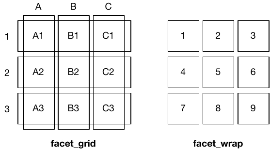           |

Let's use the `facet_wrap()` function to create two subplots for our two
different levels of the *species* variable: Droid and Human. You can
provide two arguments to `facet_wrap()`:

-   `~`, followed by the grouping variable
-   `nrow`: the number of rows in which panels should be placed

```{r, eval = TRUE, include=TRUE, message=FALSE}
human_droid_data %>%
  ggplot(aes(x = height, y = mass, size = birth_year)) +
  geom_point(shape = 21, fill = "black", alpha = 0.25, color = "black") +
  scale_y_continuous(limits = c(20, 140)) +
  scale_x_continuous(limits = c(90, 210)) +
  scale_y_continuous(breaks = c(40, 60, 80, 100, 120, 140, 160)) +
  scale_x_continuous(breaks = c(100, 120, 140, 160, 180, 200)) +
  scale_size(range = c(1, 11), name = "age") +
  theme_bw() +
  labs(
    title = "Mass vs. height of humans and droids in Star Wars",
    x = "Height (cm)", y = "Weight (kg)"
  ) +
  facet_wrap(~species, nrow = 2) # using ~grouping_variable and nrow = 2 shows the two panels on top of each other
```

Great, finally we can distinguish the data points representing humans
from those representing droids! On the left side, however, the panel
with the humans looks a bit empty. Maybe we should put them next to each
other.

```{r, eval = TRUE, include=TRUE, message=FALSE}
human_droid_data %>%
  ggplot(aes(x = height, y = mass, size = birth_year)) +
  geom_point(shape = 21, fill = "black", alpha = 0.25, color = "black") +
  scale_y_continuous(limits = c(20, 140)) +
  scale_x_continuous(limits = c(90, 210)) +
  scale_y_continuous(breaks = c(40, 60, 80, 100, 120, 140, 160)) +
  scale_x_continuous(breaks = c(100, 120, 140, 160, 180, 200)) +
  scale_size(range = c(1, 11), name = "age") +
  theme_bw() +
  labs(
    title = "Mass vs. height of humans and droids in Star Wars",
    x = "Height (cm)", y = "Weight (kg)"
  ) +
  facet_wrap(~species) # nrow=1 is the default, so you don´t have to call it explicitly
```

I like that!

### Saving graphs

I think it's time that we save this plot. To finish of this
"masterpiece" (and make it less triste), let's add some final colors
before saving. We'll fill our bubbles with colorful ink based on the
*species* variable, so we need to add `fill=species` to the `aes()` and
remove the default black ink provided in the `geom_point()` function.

```{r, eval = TRUE, include=TRUE, message=FALSE}
human_droid_data %>%
  ggplot(aes(x = height, y = mass, size = birth_year, fill = species)) +
  geom_point(shape = 21, alpha = 0.25, color = "black") +
  scale_y_continuous(limits = c(20, 140)) +
  scale_x_continuous(limits = c(90, 210)) +
  scale_y_continuous(breaks = c(40, 60, 80, 100, 120, 140, 160)) +
  scale_x_continuous(breaks = c(100, 120, 140, 160, 180, 200)) +
  scale_size(range = c(1, 11), name = "age") +
  theme_bw() +
  labs(
    title = "Mass vs. height of humans and droids in Star Wars",
    x = "Height (cm)", y = "Weight (kg)"
  ) +
  facet_wrap(~species)
```

Congratulations! You have just managed to recreate the plot from the
beginning of this tutorial! The only thing we haven't covered yet is the
labeling of all data points, because for that you'd need the `ggrepel`
package to not mess up the labels - and that's not part of `ggplot2`. So
let's skip that and save our graph.

To use your graph in another document, e.g. a theses written in Word,
you'll have to export the plot first. Therefore, you must assign your
plot to a new object and call the `ggsave()` function on that object.
The plot will be saved to your **working directory** and formatted
according to the **file extension** you specified (for example: .jpeg or
.png).

```{r, eval = TRUE, include=TRUE, message=FALSE}
plot <- human_droid_data %>%
  ggplot(aes(x = height, y = mass, size = birth_year, fill = species)) +
  geom_point(shape = 21, alpha = 0.25, color = "black") +
  scale_y_continuous(limits = c(20, 140)) +
  scale_x_continuous(limits = c(90, 210)) +
  scale_y_continuous(breaks = c(40, 60, 80, 100, 120, 140, 160)) +
  scale_x_continuous(breaks = c(100, 120, 140, 160, 180, 200)) +
  scale_size(range = c(1, 11), name = "age") +
  theme_bw() +
  labs(
    title = "Mass vs. height of humans and droids in Star Wars",
    x = "Height (cm)", y = "Weight (kg)"
  ) +
  facet_wrap(~species)

ggsave(filename = "mass_vs_height.jpeg", plot)
```

## Other common plot types

I can't give an overview of all possible types of plots, but I can at
least touch a bit on how other common types of `geom_` behave.

### bar plots

Bar plots are very common. They are either (1) used to display the
frequency with which a certain factor level of a categorical variable
occurs or (2) to display relationships between a categorical variable
and a metric variable.

So let's create a quick bar plot using the *sex* variable (categorical,
three factor levels) and get an overview on how many human and droidic
Star Wars characters are male, female, or do not have a sex.

```{r, eval = TRUE, include=TRUE, out.width="60%"}
human_droid_data %>%
  ggplot(aes(x = sex)) + # We only have to specify the variable that we want to get the count for (i.e. number of observations)
  geom_bar()
```

Next, let's look at the relationship between *sex* and the *height*
(metric) variable. We will produce a bar plot that displays the mean
height of each group:

```{r, eval = TRUE, include=TRUE, out.width="60%"}
human_droid_data %>%
  ggplot(aes(x = sex, y = height)) + # Now we need to specify the variable that we want to summarize with mean statistics
  geom_bar(stat = "summary", fun.y = "mean") # apply the summary statistic of y (mean) to the geom_bars
```

The above approach uses `geom_bar` but overrides its default behavior (which counts the number of cases) by specifying the `stat` argument as `"summary"`.
The function to summarize the y aesthetic is specified with `fun.y = "mean"`.
This syntax is very beginner-friendly in the sense that we are using a low-level concept like the "bar" geom and telling it to use summary statistics.

However, there is an alternative writing style for those bar plots that show mean
values. In this writing style, you use `stat_summary()` with the specification `geom = "bar"`. Therefore, this approach is more explicit about its intentions. When you see `stat_summary()`, it's clear that you're working with summarized data, whereas `geom_bar()` primarily implies counts. But the real advantage of the second method is its flexibility. With `stat_summary()`, you're not just restricted to bars. You could easily switch to points, error bars, or other geoms. This means that if you wanted to represent the mean height with a point and also show error bars representing the standard deviation, you can do so easily with `stat_summary()`. If you were using the first approach, adding such elements would require more significant changes to the code.

```{r, eval = TRUE, include=TRUE, out.width="60%"}
human_droid_data %>%
  ggplot(aes(x = sex, y = height)) +
  stat_summary(geom = "bar", fun = "mean")
```

In practice, if your main goal is to create a straightforward bar plot representing average values and you're not looking to add more complexity or additional layers to the plot, the first approach with `geom_bar()` might feel more natural. However, if you anticipate needing more flexibility in representation, or if you want your code to explicitly convey that you're working with summarized data, the second approach with `stat_summary()` is preferable.

Let's continue. Maybe we want to sort the bars according to their mean? Let's reorder the factor levels manually.

```{r, eval = TRUE, include=TRUE, out.width="60%"}
human_droid_data %>%
  mutate(sex = factor(sex, levels = c("male", "female", "none"))) %>% # This command reorders the factor levels, male = first level, female = second level, none = third level
  ggplot(aes(x = sex, y = height)) +
  stat_summary(geom = "bar", fun = "mean")
```

And if we would like to have a horizontal bar plot, we can use the
`coord_` component of `ggplot()` to flip the coordinates.

```{r, eval = TRUE, include=TRUE, out.width="60%"}
human_droid_data %>%
  mutate(sex = factor(sex, levels = c("male", "female", "none"))) %>%
  ggplot(aes(x = sex, y = height)) +
  stat_summary(geom = "bar", fun = "mean") +
  coord_flip()
```

### box plots

Box plots are a great option to summarize metric variables (by groups).
They provide you with the Five-number-summary:

-   the sample minimum (smallest observation) -- lower whisker
-   the lower quartile -- lower end of the box
-   the median (the middle value) -- thick black line
-   the upper quartile -- upper end of the box
-   the sample maximum (largest observation) -- upper whisker

Let's create box plots of the height for human and droidic Star Wars
characters who are male, female, or do not have a sex.

```{r, eval = TRUE, include=TRUE, out.width="60%"}
human_droid_data %>%
  ggplot(aes(x = sex, y = height)) +
  geom_boxplot()
```

While box plots are a very powerful tool of data visualization, they are
not understood by statistical laymen. Please don't use them in
non-scientific contexts.

## Take Aways

-   **graph creation**: `ggplot()`
-   **mapping variables to aesthetics**:
    `aes(x, y, color, fill, size, etc.)`
-   **chart type**: `geom_bar()`, `geom_line()`, `geom_point()`,
    `geom_boxplot()` (for example)
-   **titles**: `labs()`
-   **axis limits/ticks**: `scale_x_continuous()`,
    `scale_y_continuous()`
-   **mapping variables to geom size**: `scale_size()`
-   **themes**: `theme_classic()`, `theme_light()`, `theme_bw()` (for
    example)
-   **faceting**: `facet_wrap()` or `facet_grid`
-   **save images**: `ggsave()`

## Additional tutorials

You still have questions? The following tutorials & papers can help you
with that:

-   Chang, W. R (2021). *R Graphics Codebook. Practical Recipes for
    Visualizing Data.* [Link](https://r-graphics.org/)
-   Wickham, H., Navarro, D., & Pedersen, T. L. (2021). *ggplot2:
    elegant graphics for data analysis.* Online, work-in-progress
    version of the 3rd edition. [Link](https://ggplot2-book.org/)
-   Hehman, E., & Xie, S. Y. (2021). *Doing Better Data Visualization.
    Advances in Methods and Practices in Psychological Science*. DOI:
    10.1177/25152459211045334
    [Link](https://doi.org/10.1177/25152459211045334)
-   [R Codebook by J.D. Long and P. Teetor, Tutorial
    10](https://rc2e.com/graphics)

Now let's see what you've learned so far: [Exercise 4: ggplot].

# Exercise 4: ggplot {.unnumbered}

**After working through Exercise 4, you'll...**

-   be able to see a problem and customize a scatter plot with `dplyr` &
    `ggplot2` to solve it

First, load the %>% (World of Journalism) dataset from the `tidycomm`
package. Install `tidycomm` if you haven't already and then assign the
WoJ dataset in its own R object:

```{r, eval = FALSE, include=TRUE}
# install.packages("tidycomm") # run only the first time
```

```{r, eval = TRUE, include=TRUE}
WoJ <- tidycomm::WoJ
```

If you want help to solve this exercise, here's a step-by-step tutorial that I've once created for my students:

```{r, eval=TRUE,echo=FALSE}
knitr::include_url("https://www.youtube.com/embed/VgNimnC4syE")
```

## Task 1 {.unnumbered}

Try creating your own scatter plot. First, load `tidyverse` to access
`ggplot2` for data visualization:

```{r, eval = TRUE, include=TRUE}
library(tidyverse)
```

Show how journalists' work experience (`work_experience`) is associated
with their trust in politicians (`trust_politicians`). To do this,
create a very basic scatter plot using `ggplot2` and the respective
`ggplot()` function. Use the `aes()` function inside `ggplot()` to map
variables to the visual properties. Use `geom_point()` to add points to
the plot.

## Task 2 {.unnumbered}

Do more experienced journalists become less trusting in politicians? Add
this code to your plot to create a regression line:
`+ geom_smooth(method = lm, se = FALSE)`.

What can you conclude from the regression line?

## Task 3 {.unnumbered}

Does the relationship between work experience and trust in politicians
remain stable across different countries? Alternatively, does work
experience influence trust in politicians differently depending on the
specific country context?

Try to create a visualization to answer this question using
`facet_wrap()`.

## Task 4 {.unnumbered}

In your current visualization, it may be challenging to discern
cross-country differences. Let's aim to create a visualization that
illustrates these differences across countries more distinctly.

Remove the `facet_wrap()` and the `geom_point()` code line. This leaves
you with this graph:

```{r, eval = TRUE, echo = TRUE}
WoJ %>% ggplot(aes(x = work_experience, y = trust_politicians)) +
  geom_smooth(method = lm, se = FALSE)
```

Now, display every country in a separate color by using the `color`
argument inside the `aes()` function.

## Task 5 {.unnumbered}

Add fitting labels to your plot. For example, set the main title to
display: "Impact of Work Experience on Trust in Politicians". The x-axis
label should read "Years of Work Experience in Journalism", and the
y-axis label should read "Trust in Politicians on a 5-point Likert
Scale". The label for the color legend should be "Country".

## Task 6 {.unnumbered}

Add a nice theme that you like, e.g. `theme_minimal()`,
`theme_classic()` or `theme_bw()`.

# Exercise 5: ggplot {.unnumbered}

**After working through Exercise 5, you'll...**

- be able to see a graph and recreate it with `ggplot2`
- be able to see a problem and customize any type of plot with `dplyr` & `ggplot2` to solve it

## Task 1 {.unnumbered}

Please set your working directory and load the WoJ_names.csv.

```{r import-woj-names, eval = TRUE, echo = FALSE}
data <- read.csv2("data/WoJ_names.csv", header = TRUE)
```

```{r set-working-directory-forWoJ-names-example, eval = FALSE, echo = TRUE}
setwd("C:/Users/YourName/Documents/GESIS_R/")
data <- read.csv2("WoJ_names.csv", header = TRUE)
```

```{r echo=TRUE, include=FALSE}
install.packages("ggplot2")
```

You need to load the `ggplot2` package:

```{r echo=TRUE}
library(ggplot2)
```

Now, create a box plot to visualize the distribution of work experience
in years for each country in the dataset:

- Assign country to the x-axis and work_experience to the y-axis.
- Use the `geom_boxplot()` function to generate a box plot.
- Choose an appropriate theme.
- Label the axes and the title appropriately using `labs()`.

```{r echo=FALSE}
data %>% ggplot(aes(x = country, y = work_experience)) +
  geom_boxplot() +
  theme_bw() +
  labs(x = "Country", y = "Work Experience (Years)", title = "Distribution of Work Experience by Country")
```

## Task 2 {.unnumbered}

Look at this graph and try to recreate it.

```{r echo=FALSE}
data %>%
  ggplot(aes(x = work_experience, y = trust_government, color = country)) +
  geom_point() +
  theme_bw() +
  labs(x = "Work Experience (Years)", y = "Trust in Government", color = "Country", title = "Trust in Government by Work Experience and Country")
```

## Task 3 {.unnumbered}

Try to create an advanced version of your graph from Task 2 that shows
the names of the journalists. You can use the geom_text function for the
labels, like this:

```{r echo=TRUE, eval=FALSE}
geom_text(aes(label = name), check_overlap = TRUE)
```

If you'd like to adjust the position of the labels, you can add the
argument `, hjust = 0, vjust = 0` to this command, like this:

```{r echo=TRUE, eval=FALSE}
geom_text(aes(label = name), check_overlap = TRUE, hjust = 0, vjust = 0)
```

## Task 4 {.unnumbered}

Next, try to recreate this bar plot. Use `geom_bar(position = "dodge")` to create it. `dodge`produces the graph below whereas `geom_bar(position = "stack")` will create a stacked bar chart.

```{r echo=FALSE, eval = TRUE}
data %>%
  ggplot(aes(x = country, fill = employment)) +
  geom_bar(position = "dodge") +
  theme_bw() +
  labs(x = "Country", y = "Count", fill = "Employment Type", title = "Employment Types by Country")
```

## Task 5 {.unnumbered}

Try to create an advanced version of the graph from Task 4.

First, create a new variable 'experience_level' that categorizes the
'work_experience' into three groups:

- "Junior" for work_experience \<= 10
- "Mid-Level" for work_experience \> 10 & \<= 20
- "Senior" for work_experience \> 20

Next, use the new variable 'experience_level' to create separate graphs for juniors, mid-level staff, and seniors.

**Note:** To make the graph look better, you should rotate the x-axis labels
and move the labels a bit more to the bottom of the graph. You can use
the `theme()` function and adjust the `axis.text.x` argument. In this
case, you'd use `theme(element_text(angle = 45, hjust = 1))` at the end
of your code.

# Tutorial: Data management with tidycomm

**After working through Tutorial 7, you'll...**

-   learn how to use the `tidycomm` package to perform descriptive
    analyses.
-   learn how to use tidycomm to transform / rescale variables.

If you haven’t installed the package on this machine yet, install it:

```{r, eval = FALSE, include=TRUE}
install.packages("tidycomm")
```

After installation, load the package:

```{r, eval = TRUE, include=TRUE}
library(tidycomm)
```


## Index generation

The `tidycomm` package provides a workflow to quickly add mean/sum
indices of variables to the dataset and compute reliability estimates
for those added indices. The package offers two key functions:

1.  `add_index()` and
2.  `get_reliability()`

### add_index():

The `add_index()` function adds a mean or sum index of the specified
variables to the data. The second argument (or first, if used in a pipe)
is the name of the index variable to be created. For example, if you
want to create a mean index named 'ethical_concerns' using variables
'ethics_1' to 'ethics_4', you can use the following code:

```{r, eval = TRUE, include=TRUE}
WoJ %>%
  add_index(ethical_concerns, ethics_1, ethics_2, ethics_3, ethics_4) %>%
  dplyr::select(ethical_concerns,
                ethics_1,
                ethics_2,
                ethics_3,
                ethics_4)
```

To create a sum index instead, set `type = "sum"`:

```{r, eval = TRUE, include=TRUE}
WoJ %>%
  add_index(ethical_flexibility, ethics_1, ethics_2, ethics_3, ethics_4, type = "sum") %>%
  dplyr::select(ethical_flexibility,
                ethics_1,
                ethics_2,
                ethics_3,
                ethics_4)
```

Make sure to save your index back into your original data set if you
want to keep it for later use:

```{r, eval = TRUE, include=TRUE}
WoJ <- WoJ %>%
  add_index(ethical_concerns, ethics_1, ethics_2, ethics_3, ethics_4)
```

### get_reliability()

The `get_reliability()` function computes reliability/internal
consistency estimates for indices created with `add_index()`. The
function outputs Cronbach's α along with descriptives and index
information.

```{r, eval = TRUE, include=TRUE}
WoJ %>%
  get_reliability(ethical_concerns)
```

By default, if you pass no further arguments to the function, it will
automatically compute reliability estimates for all indices created with
`add_index()` found in the data.

```{r, eval = TRUE, include=TRUE}
WoJ %>%
  get_reliability()
```

## Rescaling of continuous scales
Tidycomm provides five functions to easily handle missing values (NAs), to transform continuous scales, and to standardize them:

- `setna_scale()` allows you to set specific values to `NA` in selected variables or the entire data frame
- `reverse_scale()` simply turns a scale upside down
- `minmax_scale()` down- or upsizes a scale to new minimum/maximum while retaining distances
- `center_scale()` subtracts the mean from each individual data point to center a scale at a mean of 0
- `z_scale()` works just like `center_scale()` but also divides the result by the standard deviation to also obtain a standard deviation of 1 and make it comparable to other z-standardized distributions

### setna_scale()

`setna_scale()` allows you to set specific values to `NA` in selected variables or the entire data frame. It is a more readable alternative to `dplyr::mutate(na_if())`

It works for numeric, character, and factor variables.

```{r}
WoJ %>%
  dplyr::select(autonomy_emphasis) %>%
  setna_scale(autonomy_emphasis, value = 5)
```

#### Equivalent with `mutate(na_if())`

```{r}
WoJ %>%
  select(autonomy_emphasis) %>%
  mutate(autonomy_emphasis = na_if(autonomy_emphasis, 5))
```

To create a new variable instead of overwriting:

```{r}
WoJ %>%
  dplyr::select(autonomy_emphasis) %>%
  setna_scale(autonomy_emphasis,
              value = 5,
              name = "new_na_autonomy")
```

Multiple values can be replaced at once:

```{r}
WoJ %>%
  setna_scale(value = c(2, 3, 4), overwrite = TRUE)
```

It also works for categorical data:

```{r}
WoJ %>%
  dplyr::select(country) %>%
  setna_scale(country,
              value = c("Germany", "Switzerland"))
```

### reverse_scale()
The easiest one is to reverse your scale. You can just specify the scale and define the scale's lower and upper end. Take `autonomy_emphasis` as an example that originally ranges from 1 to 5. We will reverse it to range from 5 to 1.

The function adds a new column named `autonomy_emphasis_rev`:

```{r}
WoJ %>%
  reverse_scale(autonomy_emphasis,
                lower_end = 1,
                upper_end = 5) %>%
  dplyr::select(autonomy_emphasis,
                autonomy_emphasis_rev)
```

Alternatively, you can also specify the new column name manually:

```{r}
WoJ %>%
  reverse_scale(autonomy_emphasis,
                name = "new_emphasis",
                lower_end = 1,
                upper_end = 5) %>%
  dplyr::select(autonomy_emphasis,
                new_emphasis)
```


### minmax_scale()
`minmax_scale()` just takes your continuous scale to a new range. For example, convert the 1-5 scale of `autonomy_emphasis` to a 1-10 scale while keeping the distances:

```{r}
WoJ %>%
  minmax_scale(autonomy_emphasis,
               change_to_min = 1,
               change_to_max = 10) %>%
  dplyr::select(autonomy_emphasis,
                autonomy_emphasis_1to10)
```

### center_scale()
`center_scale()` moves your continuous scale around a mean of 0:

```{r}
WoJ %>%
  center_scale(autonomy_selection) %>%
  dplyr::select(autonomy_selection,
                autonomy_selection_centered)
```


### z_scale()
Finally, `z_scale()` does more or less the same but standardizes the outcome. To visualize this, we look at it with a visualized `tab_frequencies()`:

```{r}
WoJ %>%
  z_scale(autonomy_selection) %>%
  tab_frequencies(autonomy_selection,
                  autonomy_selection_z) %>%
  visualize()
```

## Categorizing and recoding categorical scales

Beyond rescaling continuous variables, **tidycomm** also provides functions for handling categorical data: categorizing continuous variables, recoding categorical scales, and transforming them into dummy variables.

### categorize_scale()

`categorize_scale()` converts numeric variables into categorical ones based on specified breaks and labels. The breaks are always included in the lowest category. For example, breaks = c(2, 3) with lower_end = 1 and upper_end = 5 creates intervals from 1 to <= 2, >2 to <= 3, and >3 to <= 5.

This is useful for grouping continuous data into categories (e.g., *Low*, *Medium*, *High*).

```{r}
WoJ %>%
  dplyr::select(trust_parliament, trust_politicians) %>%
  categorize_scale(trust_parliament, trust_politicians,
                   lower_end = 1,
                   upper_end = 5,
                   breaks = c(2, 3),
                   labels = c("Low", "Medium", "High"))
```

You can also give the resulting variable a custom name:

```{r}
WoJ %>%
  dplyr::select(autonomy_selection) %>%
  categorize_scale(autonomy_selection,
                   lower_end = 1,
                   upper_end = 5,
                   breaks = c(2, 3, 4),
                   labels = c("Low", "Medium", "High", "Very High"),
                   name = "autonomy_in_categories")
```

### recode_cat_scale()

`recode_cat_scale()` transforms one or more categorical variables into new categories based on a mapping you define.
It’s a simpler alternative to `dplyr::mutate(case_when())`, especially when recoding multiple variables.

You can specify:
- `assign`: a named vector mapping old values to new ones
- `other`: a value for all unmatched categories (defaults to `NA`)
- `overwrite`: whether to overwrite the original variable
- `name`: an optional name for the new variable

Example:

```{r}
WoJ %>%
  recode_cat_scale(country,
                   assign = c("Germany" = "german",
                              "Switzerland" = "swiss"),
                   other = "other",
                   overwrite = TRUE)
```

#### Equivalent with `mutate(case_when())`

To achieve the same result manually using `dplyr::mutate(case_when())`:

```{r}
WoJ %>%
  dplyr::mutate(
    country = dplyr::case_when(
      country == "Germany"     ~ "german",
      country == "Switzerland" ~ "swiss",
      is.na(country)           ~ NA_character_,  # keep missing as NA
      TRUE                     ~ "other"         # everything else → "other"
    )
  )
```

If you want to create a **new column** instead of overwriting:

```{r}
WoJ %>%
  dplyr::mutate(
    country_rec = dplyr::case_when(
      country == "Germany"     ~ "german",
      country == "Switzerland" ~ "swiss",
      is.na(country)           ~ NA_character_,
      TRUE                     ~ "other"
    )
  )
```

#### Reverse ordinal categories

You can also reverse ordinal items easily:

```{r}
WoJ %>%
  recode_cat_scale(ethics_1,
                   assign = c(`1` = 5, `2` = 4, `3` = 3, `4` = 2, `5` = 1),
                   overwrite = FALSE)
```

Equivalent in `case_when()`:

```{r}
WoJ %>%
  dplyr::mutate(
    ethics_1_rev = dplyr::case_when(
      ethics_1 == 1 ~ 5,
      ethics_1 == 2 ~ 4,
      ethics_1 == 3 ~ 3,
      ethics_1 == 4 ~ 2,
      ethics_1 == 5 ~ 1,
      is.na(ethics_1) ~ NA_real_
    )
  )
```


#### dummify_scale()

`dummify_scale()` converts categorical variables into **dummy variables** (0/1 indicators).
Each category becomes its own column.

```{r}
WoJ %>%
  dplyr::select(temp_contract) %>%
  dummify_scale(temp_contract)
```

You can also first categorize a numeric variable and then create dummy variables from the categories:

```{r}
WoJ %>%
  categorize_scale(autonomy_emphasis,
                   breaks = c(2, 3),
                   labels = c('low', 'medium', 'high')) %>%
  dummify_scale(autonomy_emphasis_cat) %>%
  dplyr::select(starts_with('autonomy_emphasis'))
```

---

### Summary of all scaling functions

| Function | Purpose | Typical Use |
|-----------|----------|-------------|
| `setna_scale()` | Replace values with `NA` | Clean invalid data |
| `reverse_scale()` | Flip numeric scales | Reverse items |
| `minmax_scale()` | Rescale numeric ranges | Convert 1–5 to 0–100 |
| `center_scale()` | Center around mean = 0 | Prepare for regression |
| `z_scale()` | Center & standardize | Compare across variables, prepare for regression |
| `categorize_scale()` | Turn continuous into categories | Group into Low/Med/High, etc. |
| `recode_cat_scale()` | Recode categories | Reorganize categorical data |
| `dummify_scale()` | Create dummy variables | E.g., for Regression / modeling |

## Univariate analysis

Univariate, descriptive analysis is usually the first step in data
exploration. `Tidycomm` offers four basic functions to quickly output
relevant statistics:

1.  `describe()`: For continuous variables
2.  `tab_percentiles()`: For continuous variables
3.  `describe_cat()`: For categorical variables
4.  `tab_frequencies()`: For categorical variables

### Describe continuous variables

There are two options two describe continuous variables in `tidycomm`:

1.  `describe()` and
2.  `tab_percentiles()`

First, the `describe()` function outputs several measures of central
tendency and variability for all variables named in the function call
(i.e., **mean, standard deviation, min, max, range, and quartiles**).
Here's how you use it:

```{r, eval = TRUE, include=TRUE}
WoJ %>% describe(autonomy_emphasis, ethics_1, work_experience)
```

If no variables are passed to `describe()`, all numeric variables in the
data are described:

```{r, eval = TRUE, include=TRUE}
WoJ %>% describe()
```

You can also group data (using `dplyr`) before describing:

```{r, eval = TRUE, include=TRUE}
WoJ %>%
  dplyr::group_by(country) %>%
  describe(autonomy_emphasis)
```

Finally, you can create visualizations of your variables by applying the
`visualize()` function to your data:

```{r, eval = TRUE, include=TRUE}
WoJ %>%
  describe(autonomy_emphasis) %>%
  visualize()
```

Second, the `tab_percentiles` function tabulates percentiles for at
least one continuous variable:

```{r, eval = TRUE, include=TRUE}
WoJ %>%
  tab_percentiles(autonomy_emphasis)
```

You can use it to tabulate percentiles for more than one variable:

```{r, eval = TRUE, include=TRUE}
WoJ %>%
  tab_percentiles(autonomy_emphasis, ethics_1)
```

You can also specify your own percentiles:

```{r, eval = TRUE, include=TRUE}
WoJ %>%
  tab_percentiles(autonomy_emphasis, ethics_1, levels = c(0.16, 0.50, 0.84, 1.0))
```

And you can visualize your percentiles:

```{r, eval = TRUE, include=TRUE}
WoJ %>%
  tab_percentiles(autonomy_emphasis) %>%
  visualize()
```

### Describe categorical variables
There are two options two describe categorical variables in `tidycomm`:

3.  `describe_cat()`: This function gives you a **quick overview** of one or more categorical variables.  
4.  `tab_frequencies()`: The `tab_frequencies()` function creates a **frequency table** for one or more categorical variables.

This function gives you a **quick overview** of one or more categorical variables.  
   It reports, for each variable:
   - `N`: the number of valid observations  
   - `Missing`: the number of missing values  
   - `Unique`: the number of different categories  
   - `Mode`: the most common category  
   - `Mode_N`: the frequency of that most common category 
   
In the example below using `describe_cat()`, `country` has 1200 valid observations, no missing values, 5 unique categories, and *Denmark* is the most frequent category with 376 cases:

```{r, eval = TRUE, include=TRUE}
WoJ %>%
  describe_cat(country)
```

Adding `visualize()` to the script plots the quantities, giving you a quick and intuitive bar chart:

```{r, eval = TRUE, include=TRUE}
WoJ %>%
  describe_cat(country) %>% 
  visualize()
```

The `tab_frequencies()` function creates a **frequency table** for one or more categorical variables.

For each category, it reports:
- `n`: the absolute frequency  
- `percent`: the relative frequency  
- `cum_n`: the cumulative frequency  
- `cum_percent`: the cumulative relative frequency  

In the example below, you can see how the 5 countries in the WoJ sample are distributed, including their proportions and cumulative shares:

```{r, eval = TRUE, include=TRUE}
WoJ %>%
  tab_frequencies(country)
```

Adding `visualize()` to the script plots the frequencies, giving you a quick and intuitive histogram:

```{r, eval = TRUE, include=TRUE}
WoJ %>%
  tab_frequencies(country) %>% 
  visualize()
```

## How to easily copy-paste tidycomm commands

A simple way to explore and reuse tidycomm functions is to let `RStudio` help you.  Here’s how you can quickly access ready-to-copy code examples:

1. **Start typing `tidycomm::` in the console.**  
   `RStudio` will automatically show a list of all available functions in the *tidycomm* package.

2. **Choose the function you want to use**, for example:  
   `tidycomm::recode_cat_scale()`.

3. **Open the help page** for this function by adding a `?` in front of it:  

```r
?tidycomm::recode_cat_scale()
```
This opens the documentation pane in `RStudio`. Scroll to the bottom of the help page.  This is where the **Examples** section lives: a goldmine of ready-to-use code snippets.

These examples show you exactly how each function works and give you clean code you can copy and paste into your own script.

Honestly, because I’m terrible at memorizing even the functions I wrote myself, I use this trick *all the time*. :)

Now let's see what you've learned so far: [Exercise 6: tidycomm].

# Exercise 6: tidycomm {.unnumbered}

**After working through Exercise 6, you'll...**

-   have practiced the most important functions of `tidycomm`
-   have decided whether you prefer `tidycomm` or `dplyr` to solve some problems in R

First, you'll need to load the statwars_data:

```{r, eval = TRUE, include=TRUE}
library(dplyr)

starwars_data <- dplyr::starwars
```

Please, also activate the `tidycomm` package:

```{r, eval = TRUE, include=TRUE}
library(tidycomm)
```

## Task 1  {.unnumbered}
How many characters are contained in the *starwars_data* that have no *hair_color*, i.e. *hair_color* that are equal to "none"?
Solve this task using `tidycomm::tab_frequencies()` and then keeping only the row that you are interested in by combining it with `dplyr::filter()`. 

## Task 2  {.unnumbered}
Replace all values of *hair_color* that are equal to "none" with `NA`, i.e., define them as missings. Remember to check the `overwrite` argument. :)

## Task 3  {.unnumbered}
Reverse the variable *mass*, and call the new variable "*skinnyness*".
Reverse the variable *height*, and call the new variable "*tinyness*".

## Task 4  {.unnumbered}
Scale *skinnyness* to a new range from 0 to 1. The function should automatically create a variable called *skinnyness_0to1*.
Display only the variables *name*, *skinnyness*, and *skinnyness_0to1*.

## Task 5  {.unnumbered}
Create two new variables: *skinnyness_centered* with `center_scale()` and *skinnyness_z* with `z_scale()`.
Display all the variables *name*, *skinnyness*, *skinnyness_0to1*, *skinnyness_centered*, *skinnyness_z*.

## Task 6  {.unnumbered}
Visualize the variables *skinnyness*, *skinnyness_0to1*, *skinnyness_centered*, *skinnyness_z* using `tidycomm::tab_frequencies)` and `tidycomm::visualize()`.

## Task 7  {.unnumbered}
Categorize *skinnyness* into three groups:
- **"Heavy"** for values **≤ 1200**  
- **"Slim"** for values **> 1200 and ≤ 1300**  
- **"Skinny"** for values **> 1300**

Use `tidycomm::categorize_scale()`. The function should automatically create a variable called *skinnyness_cat*. Display the variables *name*, *skinnyness*, and *skinnyness_cat*.

## Task 8  {.unnumbered}
Use `tidycomm::recode_cat_scale()` to recode *skinnyness_cat* like this:

- `"Heavy"` → `"high_mass"`  
- `"Slim"` → `"medium_mass"`  
- `"Skinny"` → `"low_mass"`  

Do **not** overwrite the original variable. Instead, let `recode_cat_scale()` create a new variable automatically.  
Display the variables *name*, *skinnyness*, *skinnyness_cat*, and the recoded variable.

## Task 9  {.unnumbered}
Create a mean index called *smallness_index* using the variables *skinnyness* and *tinyness*.
Then display only the mean index and the original variables that were used to create it.

## Task 10  {.unnumbered}
Now create a sum index with the same variables and call it *smallness_sum_index*.
Then display only the mean AND sum index and the original variables that were used to create it.

## Task 11  {.unnumbered}
Compute reliability estimates for the mean index *smallness_index*.

# Tutorial: Inferential statistics with tidycomm

**After working through this tutorial, you'll...**

- run a chi-squared test and inspect Cramer's V with `crosstab()`;
- run independent-samples and one-sample t-tests with `t_test()`;
- conduct one-way ANOVAs and post-hoc comparisons with `unianova()`;
- calculate bivariate and partial correlations with `correlate()`;
- estimate and inspect linear regression models with `regress()`;
- use `visualize()` and R's help system to inspect and communicate results.

The GESIS workshop assumes basic familiarity with the ideas behind common descriptive and inferential statistics. The focus here is therefore on **how to run these analyses reproducibly in R with `tidycomm`**, inspect their output, and connect them to the tidy workflow used throughout this tutorial.

We will again use the `Worlds of Journalism` example data included in `tidycomm`:

```{r, eval = TRUE, include=TRUE}
library(tidyverse)
library(tidycomm)
WoJ <- tidycomm::WoJ
```

## How to run significance tests

### crosstab()

The 'crosstab()' function also offers a `chi_square` argument that, when
set to `TRUE`, will calculate the chi-square test and Cramer's V.

```{r, eval = TRUE, include=TRUE}
WoJ %>% crosstab(reach, employment, chi_square = TRUE)
```

Remember that you can access the full documentation of this function
using the `help()` function, which will give you access to additional
arguments / parameters and run examples of the function:

```{r, eval = FALSE, include=TRUE}
?crosstab()
```

### t_test()

The `t_test()` function is used either to calculate a one-sample t-test
or to compute t-tests for one group variable and specified test
variables. If no variables are specified, all numeric (integer or
double) variables are used. `t_test()` by default tests for equal
variance (using a Levene test) to decide whether to use pooled variance
or to use the Welch approximation to the degrees of freedom.

You can provide an independent (group) variable and a dependent variable
and the t-values, p-values and Cohen's d will be calculated.

```{r, eval = TRUE, include=TRUE}
WoJ %>% t_test(temp_contract, autonomy_emphasis)
```

Remember that you can always save your analysis into an R object and
inspect it with `View()`. This is very helpful if the resulting output
is larger than your screen:

```{r, eval = TRUE, include=TRUE}
model1 <- WoJ %>% t_test(temp_contract, autonomy_emphasis)
View(model1)
```

You can also specify more than one dependent variable:

```{r, eval = TRUE, include=TRUE}
WoJ %>% t_test(temp_contract, autonomy_emphasis, ethics_1)
```

If you do not specify a dependent variable, all suitable variables in
your data set will be used:

```{r, eval = TRUE, include=TRUE}
WoJ %>% t_test(temp_contract)
```

If you have an independent (group) variable with more than two levels,
you can also specify the levels that you want to use for your
`t_test()`:

```{r, eval = TRUE, include=TRUE}
WoJ %>% t_test(employment, autonomy_emphasis, levels = c("Full-time", "Freelancer"))
```

Finally, `t_test()` by default tests for equal variance (using a Levene
test) to decide whether to use pooled variance or to use the Welch
approximation to the degrees of freedom. This is an example for the use
of Welch's approximation to account for unequal variances between
groups:

```{r, eval = TRUE, include=TRUE}
WoJ %>% t_test(temp_contract, autonomy_selection)
```

You can also run a one-sample t-test (also called: location test) by
providing a variable and checking whether the mean of this variable is
equal to a provided population mean `mu`:

```{r, eval = TRUE, include=TRUE}
WoJ %>% t_test(autonomy_selection, mu = 3)
```

Finally, you can visualize your test results by calling the
`visualize()` function:

```{r, eval = TRUE, include=TRUE}
WoJ %>%
  t_test(temp_contract, autonomy_selection) %>%
  visualize()
```

To access the full documentation / help:

```{r, eval = FALSE, include=TRUE}
?t_test()
```

### unianova()

The `unianova()` function is used to compute one-way ANOVAs for one
group variable and specified test variables. If no variables are
specified, all numeric (integer or double) variables are used.
Additionally, `unianova()` also conducts a Levene test just like the
`t_test()` function to check the assumption of equal variances. If the
data doesn't meet this assumption, the function will switch to using
Welch's test.

For PostHoc tests, Tukey's HSD is the default choice. However, if the
assumption of equal variances isn't met, the function will instead
automatically use the Games-Howell test.

`unianova` works similarly to `t_test()`, i.e., you specify an
independent (group) variable followed by one or more dependent
variables.

```{r, eval = TRUE, include=TRUE}
WoJ %>% unianova(employment, autonomy_emphasis)
```

Provide only an independent variable to use all suitable variables in
your data set as dependent variables:

```{r, eval = TRUE, include=TRUE}
WoJ %>% unianova(employment)
```

You can obtain the descriptives (mean and standard deviation for all
group levels) by providing the additional argument
`descriptives = TRUE`.

```{r, eval = TRUE, include=TRUE}
WoJ %>% unianova(employment, autonomy_emphasis, descriptives = TRUE)
```

Similarly, you can retrieve PostHoc tests by providing the additional
argument `post_hoc = TRUE` (default: Tukey's HSD, otherwise:
Games-Howell). Please note that the post-hoc test results are best
inspected by saving your analysis in a separate model and then using
`View()`. Once `View()` has opened your model, you can navigate to the
rightmost part and click on the 1 variable cell under the post hoc
column. This will display your post hoc test results.

```{r, eval = TRUE, include=TRUE}
WoJ %>% unianova(employment, autonomy_emphasis, post_hoc = TRUE)
# model2 <- WoJ %>% unianova(employment, autonomy_emphasis, post_hoc = TRUE)
# View(model2)
```

Alternatively, you can extract the PostHoc test results with this code:

```{r, eval = TRUE, include=TRUE}
WoJ %>%
  unianova(employment, autonomy_selection, post_hoc = TRUE) %>%
  dplyr::select(Variable, post_hoc) %>%
  tidyr::unnest(post_hoc)
```

If the variances are not equal, a Welch test (as an adaptation of the one-way ANOVA test) and a post hoc Games-Howell test will be performed automatically, replacing the classic ANOVA method:

```{r, eval = TRUE, include=TRUE}
WoJ %>% unianova(employment, autonomy_selection, descriptives = TRUE)

WoJ %>%
  unianova(employment, autonomy_selection, post_hoc = TRUE) %>%
  dplyr::select(Variable, post_hoc) %>%
  tidyr::unnest(post_hoc)
```

Finally, you can visualize your test results by calling the
`visualize()` function:

```{r, eval = TRUE, include=TRUE}
WoJ %>%
  unianova(employment, autonomy_emphasis) %>%
  visualize()
```

For full documentation / help:

```{r, eval = FALSE, include=TRUE}
?unianova()
```


### correlate()

The `correlate()` function computes correlation coefficients for all
combinations of the specified variables. If no variables are specified,
all numeric (integer or double) variables are used.

```{r, eval = TRUE, include=TRUE}
WoJ %>% correlate(ethics_1, autonomy_selection)
```

Once again, you can specify more than two variables:

```{r, eval = TRUE, include=TRUE}
WoJ %>% correlate(ethics_1, autonomy_selection, work_experience)
```

Three variables? That screams "partial correlation" to me! If you'd like
to calculate the partial correlation coefficient of three variables,
just add the optional parameter `partial = `.

```{r, eval = TRUE, include=TRUE}
WoJ %>% correlate(ethics_1, autonomy_selection, partial = work_experience)
```

And you can get the correlation for all suitable variables in your data
set:

```{r, eval = TRUE, include=TRUE}
WoJ %>% correlate()
```

Specify a focus variable using the `with` parameter to correlate all other variables with this focus variable. 

```{r}
WoJ %>% 
  correlate(autonomy_selection, autonomy_emphasis, with = work_experience)
```

You might want to turn these correlations into an advanced correlation
matrix, just like you find them in SPSS. You can do that using an
additional function `to_correlation_matrix` after your `correlate()`
function:

```{r, eval = TRUE, include=TRUE}
WoJ %>%
  correlate() %>%
  to_correlation_matrix()
```

Of course, you can change the correlation method:

1.  Using Pearson's r (default):

```{r, eval = TRUE, include=TRUE}
WoJ %>% correlate(ethics_1, autonomy_selection, method = "pearson")
```

2.  Using Spearman's rho:

```{r, eval = TRUE, include=TRUE}
WoJ %>% correlate(ethics_1, autonomy_selection, method = "spearman")
```

3.  Using Kendall's tau:

```{r, eval = TRUE, include=TRUE}
WoJ %>% correlate(ethics_1, autonomy_selection, method = "kendall")
```

Finally, you can visualize your test results by calling the visualize()
function. Based on your input variables and whether you want to
visualize a partial correlation, the choice of graph might vary:

1.  Visualize a bivariate correlation:

```{r, eval = TRUE, include=TRUE}
WoJ %>%
  correlate(ethics_1, autonomy_selection) %>%
  visualize()

# Pro tip: use parameters which = jitter and which = alpha to change layout of the geom_points
```

2.  Visualize with multiple variables:

```{r, eval = TRUE, include=TRUE}
WoJ %>%
  correlate(ethics_1, autonomy_selection, work_experience) %>%
  visualize()
```

3.  Visualize a partial correlation:

```{r, eval = TRUE, include=TRUE}
WoJ %>%
  correlate(ethics_1, autonomy_selection, partial = work_experience) %>%
  visualize()
```

Of course, you can always get help:

```{r, eval = FALSE, include=TRUE}
?correlate()
```

### regress()

Finally, you can also run linear regressions. The `regress()` function
will compute a linear regression for all independent variables on the
specified dependent variable.

```{r, eval = TRUE, include=TRUE}
WoJ %>% regress(ethics_1, autonomy_selection, work_experience)
```

You can also perform a linear modeling of multiple independent variables
(this will use stepwise regression modeling):

```{r, eval = TRUE, include=TRUE}
WoJ %>% regress(ethics_1, autonomy_selection, work_experience)
```

You can even check the preconditions of a linear regression (e.g.,
multicollinearity and homoscedasticity) by providing optional arguments
/ parameters:

```{r, eval = TRUE, include=TRUE}
WoJ %>% regress(ethics_1, autonomy_selection, work_experience,
  check_independenterrors = TRUE,
  check_multicollinearity = TRUE,
  check_homoscedasticity = TRUE
)
```

Or you can make visual inspections to check the preconditions using
several different visualizations:

1.  Base visualization:

```{r, eval = TRUE, include=TRUE}
WoJ %>%
  regress(ethics_1, autonomy_selection, work_experience) %>%
  visualize()
# Pro tip: use parameters which = jitter and which = alpha to change layout of the geom_points
```

2.  Correlograms among independent variables:

```{r, eval = TRUE, include=TRUE}
WoJ %>%
  regress(ethics_1, autonomy_selection, work_experience) %>%
  visualize(which = "correlogram")
```

3.  Residuals-versus-fitted plot to determine distributions:

```{r, eval = TRUE, include=TRUE}
WoJ %>%
  regress(ethics_1, autonomy_selection, work_experience) %>%
  visualize(which = "resfit")
```

4.  Normal probability-probability plot to check for multicollinearity:

```{r, eval = TRUE, include=TRUE}
WoJ %>%
  regress(ethics_1, autonomy_selection, work_experience) %>%
  visualize(which = "pp")
```

5.  Scale-location (sometimes also called spread-location) plot to check
    whether residuals are spread equally (to help check for
    homoscedasticity):

```{r, eval = TRUE, include=TRUE}
WoJ %>%
  regress(ethics_1, autonomy_selection, work_experience) %>%
  visualize(which = "scaloc")
```

6.  Residuals-versus-leverage plot to check for influential outliers
    affecting the final model more than the rest of the data:

```{r, eval = TRUE, include=TRUE}
WoJ %>%
  regress(ethics_1, autonomy_selection, work_experience) %>%
  visualize(which = "reslev")
```

Again, you can always get help:

```{r, eval = FALSE, include=TRUE}
?regress()
```

And if you need help to interpret the regression plots, you can look up the help of `visualize()` and scroll down until you reach `regress()`:

```{r, eval = FALSE, include=TRUE}
?tidycomm::visualize()
```

You now have the main building blocks for common inferential analyses in a tidy, reproducible workflow. The cumulative exercise in the next section lets you combine data management, visualization, and analysis skills.

# Exercise 7: dplyr, ggplot, tidycomm {.unnumbered}

**After working through Exercise 7, you'll...**

-   have repeated the most important functions of `dplyr` and `ggplot2`
-   alternatively, you'll have repeated some helpful function from `tidycomm`

In this exercise, we will work with the `mtcars` data that comes pre-installed with `dplyr`.

```{r, eval = TRUE, include=TRUE}
library(tidyverse)

data <- as_tibble(mtcars)
```

To make the data somewhat more interesting and challenging, let's set a few values to missing values with our newly-learned `tidycomm` skills:

```{r, eval = TRUE, include=TRUE}
library(tidycomm)

data <- data %>%
  setna_scale(wt, value = 4.070,
              overwrite = TRUE)

data <- data %>%
  setna_scale(mpg, value = 22.8,
              overwrite = TRUE)
```

Let's first get to know this data. We can get some information about the variables that are included in the dataset by using `R`s `help()`
function:

```{r, eval = FALSE, include=TRUE}
help(mtcars)
```

|                                                                                                   |
|:--------------------------------------------------------------------------------------------------|
| *Image: Output of the help(mtcars) function:*                                                     |
| 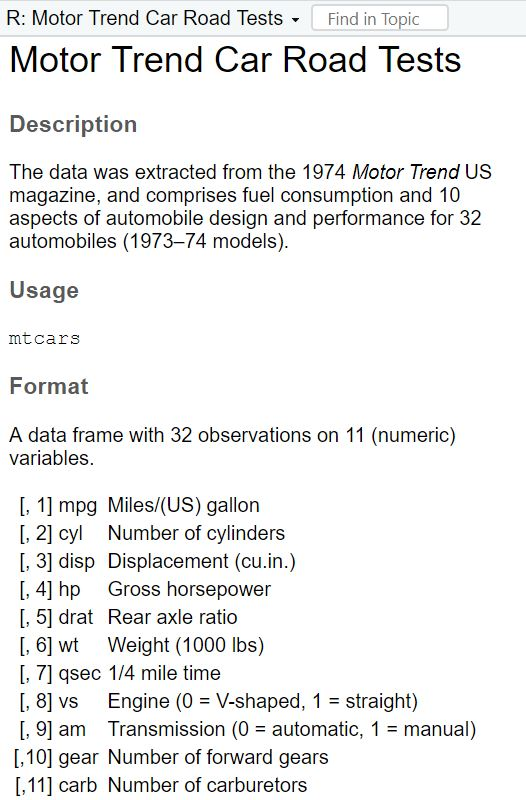{width="30%"} |

We get to know that this is a data set was created from the *1974 Motor Trend US magazine*, and that it comprises fuel consumption (*mpg*) and 10 other aspects (*cyl*, *wt*) of automobile design and performance for 32 different cars.

## Task 1 {.unnumbered}

Check the dataset for missing values (*NA*s) and delete all observations that have missing values.

## Task 2 {.unnumbered}

Let's transform the weight *wt* of the cars. Currently, it's given as
*Weight in 1000 lbs*. I guess you are not used to lbs, so try to mutate *wt* to represent *Weight in 1000 kg*. 1000 lbs = 453.59 kg, so we will need to divide by 2.20.

Similarly, I think that you are not very familiar with the unit *Miles per gallon* of the *mpg* variable. Let's transform it into *Kilometer per liter*. 1 m/g = 0.425144 km/l, so again divide by 2.20.

## Task 3 {.unnumbered}

Now we want to group the weight of the cars in three categories: light, medium, heavy. But how to define light, medium, and heavy cars, i.e., at what kg should you put the threshold? A reasonable approach is to use quantiles (see Tutorial: [summarize() [+
group_by()]](#summarize-group_by)). Quantiles divide data. For example, the 75% quantile states that exactly 75% of the data values are equal or below the quantile value. The rest of the values are equal or above it.

Use the lower quantile (0.25) and the upper quantile (0.75) to estimate two values that divide the weight of the cars in three groups. What are these values?

## Task 4 {.unnumbered}

Use the values from Task 3 to create a new variable *wt_cat* that
divides the cars in three groups: light, medium, and heavy cars.

## Task 5 {.unnumbered}

How many light, medium, and heavy cars are part of the data?

## Task 6 {.unnumbered}

Now sort this count of the car weight classes from highest to lowest.

## Task 7 {.unnumbered}

Make a scatter plot to indicate how many km per liter (*mpg*) a car can drive depending on its weight (*wt*). Facet the plot by weight class (*wt_cat*).

## Task 8 {.unnumbered}

Recreate the diagram from Task 7, but exclude all cars that weigh
between 1.4613636 and 1.5636364 \*1000kg from it.

When you're ready to look at the solutions, you can find them here:
[Solutions for Exercise 7].

# Optional tutorial: Text manipulation with stringr

**After working through Tutorial 8, you'll...**

-   understand the concept of string patterns and regular expressions
-   know how to search for string patterns

## What's stringr?

The `stringr` package is another package of the `tidyverse` family,
i.e., it comes pre-installed with the tidyverse. The package offers a
neat set of functions that makes working with strings really simple for beginners. Therefore, `stringr` is a good place to start getting into text data management. A string is *a data type that is used to represent text rather than numbers*.

## Working with strings

Let's create a vector containing some email addresses and print them to the console.

```{r, eval = TRUE, include=TRUE}
emails <- c("mark@example.com", "john@example.com", "lisa@example.org", "peter@example.net", "jane@example.co.uk", "tim@example.edu", "emmajay@example.gov")

emails
```

We can use the `str_length()` function to find out how many characters each email address contains.

```{r, eval = TRUE, include=TRUE}
str_length(emails)
```

That was easy. Next, we want to join multiple strings into a single
string. We will use the `str_c()` function.

```{r, eval = TRUE, include=TRUE}
str_c(emails, collapse = " and ")
# If collapse is not NULL, it will be inserted between elements of the result, here: and
```

You can also change the order of the `str_c` function:

```{r, eval = TRUE, include=TRUE}
str_c("My favourite correspondent is: ", emails, collapse = NULL) 
```

If we want to extract substrings from a character vector, for example, keeping only the user part of each email address, we can use the `str_sub()` function.

```{r, eval = TRUE, include=TRUE}
str_sub(emails, start = 1, end = str_locate(emails, "@") - 1) 
```

## Working with string patterns

Often we want to search for certain string patterns in a text document.
**String patterns** are character sequences (for instance, letter,
numbers, or special characters). Suppose we have some email addresses where '@' was wrongly replaced with '#'.

```{r, eval = TRUE, include=TRUE}
wrong_emails <- c("mark#example.com", "john@example.com", "lisa@example.org", "peter@example.net", "jane@example.co.uk", "tim@example.edu", "emmajay@example.gov")

```

We can search for the string pattern "#" and replace it with "@" automatically. Let's first identify the emails that contain '#' using `str_detect()`.

```{r, eval = TRUE, include=TRUE}
str_detect(wrong_emails, "#")
```

We can extract the email addresses that contain '#' using `str_subset()`.

```{r, eval = TRUE, include=TRUE}
str_subset(wrong_emails, "#")
```

We can fix the wrong email addresses using the `str_replace()` function.

```{r, eval = TRUE, include=TRUE}
corrected_emails <- str_replace(wrong_emails, "#", "@")

corrected_emails
```

As a final step, we can split an email address into user and domain parts based on the '@' character using the `str_split()` function:

```{r, eval = TRUE, include=TRUE}
str_split(corrected_emails, "@")
```

## Working with regular expressions

Often, we want to match more complicated string patterns than a simple
"#". For example, we might wish to detect all strings in our mail list that do start with "L", because we want to email those people.

To search and match complex string patterns, we need regular
expressions. **Regular expressions** (short: *regex*) are a concise
language for describing patterns of text. Regex should not be taken
literally, but have a non-literal meaning.

### Anchors, alternates, and quantifiers

#### Anchors

Let's search for all email addresses that start with the letter 'j'. To do this, we will first learn what "anchors" are. Anchors are used to match the beginning or end of a string, i.e., they denote the start or end of a pattern and are usually used in combination with other patterns. First, let's look for all strings that start with the
letter *j* using the `^` (start of string) anchor.

```{r, eval = TRUE, include=TRUE}
str_detect(emails, "^j") # ^ stands for "start of string", i.e. we are matching for strings that start with the letter j
```

To find all emails that end with ".com":

```{r, eval = TRUE, include=TRUE}
str_detect(emails, "com$") # $ stands for "end of string", i.e. we are matching for strings that end with the letters com
```

Please, note the difference to not matching these two regexes (`^` and `$`), but the simple string pattern "*j*":

```{r, eval = TRUE, include=TRUE}
str_detect(emails, "j") # matches all strings that contain the letter j at any position
```

Finally, you should also not confuse "*\^j*" with "*[\^j]*", because `[^]` stands for "anything but" in regex language.

```{r, eval = TRUE, include=TRUE}
str_detect(emails, "[^j]") # matches all strings that contain any letters different from j(s)
```

#### Alternates
Next, let's look at "alternates" in regex. Alternates are used to match multiple characters in a single position. They are specified in square brackets, with a list of characters that could be matched. For example, the regular expression "[mj]ohn" will match any string that starts with m, or j, followed by ohn. This means it will match both *mohn* and *john.*

Let's look at our fruits again and learn about the **very** powerful "match any one of" regex `[]`. We will now try to find all the emails that contain the letter m or the letter j at any position of the string.

```{r, eval = TRUE, include=TRUE}
str_detect(emails, "[mj]") # matches all strings that contain either the letter m or the letter j
```

Next, we can match all emails that contain letters that range between p to z in the ABC. We will need to use the range operator `[-]`:

```{r, eval = TRUE, include=TRUE}
str_detect(emails, "[j-m]") # matches all strings that contain either the letter j, k, l, m
```

#### Quantifiers
The `?` operator (zero or one) `*` operator (zero or more), the `+` operator (one or more), and the `{n}` operator (exactly n) are also handy. These regex are called "quantifiers" and are used to specify how many of the preceding characters should be matched in a string.

```{r, eval = TRUE, include=TRUE}
str_detect(emails, "a?") # matches all strings that contain zero or one a
```

```{r, eval = TRUE, include=TRUE}
str_detect(emails, "a*") # matches all strings that contain zero or more a
```

```{r, eval = TRUE, include=TRUE}
str_detect(emails, "r+") # matches all strings that contain one or more as --> this grabs pear as well, not there yet!
```

Lastly, let's find all emails that contain exactly two a's:

```{r, eval = TRUE, include=TRUE}
str_detect(emails, "a{2}") # matches all strings that contain exactly two as
```

This looks great! We now know what what anchors, alternates, and quantifiers in regex are!

### Look arounds and groups

Another useful type of regex are "look arounds" and "groups". Look arounds are used to match patterns before or after a certain character or pattern, and groups are used to group elements of a pattern and specify the order in which they should be evaluated.

We can leverage look arounds to find certain characters or patterns in our emails. For example, let's say we want to find all emails where the letter 'a' is immediately followed by the letter 'c'. This is where the "followed by" regex (`?=`) comes in.


```{r, eval = TRUE, include=TRUE}
str_detect(emails, "a(?=c)") # matches all strings that contain an 'a' followed by a 'c'
```

Alternatively, we can use a "not followed by" look around (?!). For instance, let's find all emails where 'a' is not followed by 'c':

```{r, eval = TRUE, include=TRUE}
str_detect(emails, "a(?!c)") # matches all strings that contain an 'a' not followed by a 'c'
```

Another useful look around is "preceded by" (?<=). This look around finds patterns that are preceded by a specific string or character. As an example, we can find all emails where 'r' is preceded by 'e':

```{r, eval = TRUE, include=TRUE}
str_detect(emails, "(?<=e)r") # matches all strings that contain an 'r' preceeded by an 'e'
```

We can also negate this into "not preceeded by" with the help of !:

```{r, eval = TRUE, include=TRUE}
str_detect(emails, "(?<!e)r") # matches all strings that contain an 'r' that is not preceeded by an 'e'
```

Next, let's discuss "groups". These are used to group elements of a pattern and specify the order in which they should be evaluated.

```{r, eval = TRUE, include=TRUE}
str_detect(emails, "(e|a)r") # matches all strings that contain an 'e' or an 'a' followed by an 'r'
```

Remember the "alternates" regex we discussed above? We can also use it here:

```{r, eval = TRUE, include=TRUE}
str_detect(emails, "[ea]r") # matches all strings that contain an 'e' or an 'a' which are followed by an 'r'
```

However, groups can become handy if you need to chain multiple groups for complex patterns. This is more advanced, but it's worth knowing about.

This was a lot, so here comes an overview / summary of all the regex (screenshot of the `stringr` cheat sheet):

|                                                                                                 |
|:------------------------------------------------------------------------------------------------|
| *Screenshot of anchors, alternates, quantifiers, look arounds, and groups (stringr cheat sheet):*                                                                        |
| 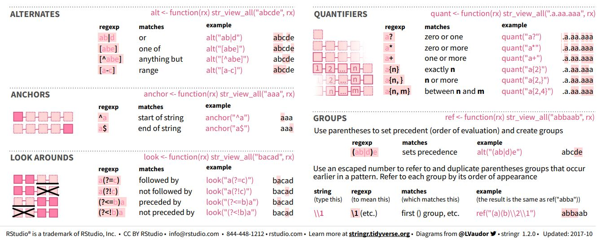 |


### Match specific types of characters

There is one last thing I would like to teach you. It's how to match specific types of characters (e.g., numbers, space symbols, etc.):

```{r, eval = TRUE, include=TRUE}
str_detect(emails, "[:digit:]") # matches all strings that contain a number
```

We can also detect email addresses that falsely contain a space symbol:

```{r, eval = TRUE, include=TRUE}
str_detect(emails, "[:space:]") # matches all strings that contain a space
```

|                                                                                                 |
|:------------------------------------------------------------------------------------------------|
| *Screenshot of types of characters that can be matched in stringr (stringr cheat sheet):*                                                                        |
| 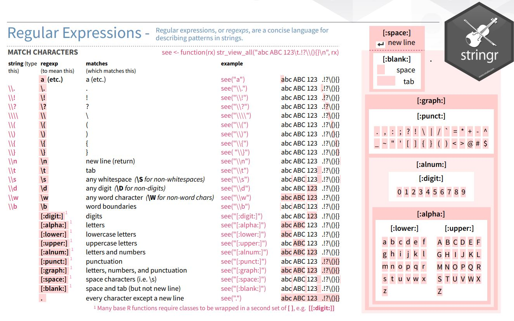 |

Finished! Repeat and practice these commands and you will become a real expert on regular expressions! This tutorial provided an in-depth overview of regular expressions, with only a very few aspects left to explore. If you feel like you need to look up some regular expressions, you can find them in this awesome [stringr cheat sheet](https://github.com/rstudio/cheatsheets/blob/main/strings.pdf).

## Take-Aways

-   **String patterns & RegEx**: String patterns are sequences of
    characters; regular expressions are a type of abstract, generalized string pattern used
    to match or detect other string patterns in texts.
-   **Important regular expressions**: Anchors, alternates, quantifiers, look arounds and groups.
    The best overview of all regex options can be found in the [stringr cheat sheet](https://github.com/rstudio/cheatsheets/blob/main/strings.pdf).

## Additional tutorials

You still have questions? The following tutorials, books, & tools may
help you:

-   [Regexr - Learn, build, and test RegEx](https://regexr.com/)
-   [Text as Data by V. Hase, Tutorial 9](https://bookdown.org/valerie_hase/TextasData_HS2021/tutorial-9-searching-manipulating-string-patterns.html)
    
    
# Exercise 8: stringr {.unnumbered}
First, load the library `stringr` (or the entire `tidyverse`).

```{r, eval = TRUE, include=TRUE}
library(tidyverse) # loads stringr + dplyr and pipe operator
```

We will work on real data in this exercise. But before that, we will test our regex on a simple "test" vector that contains hyperlinks of media outlets and webpages. So run this code and create a vector called "seitenURL" in your environment:

```{r, eval = TRUE, include=TRUE}
seitenURL <- c("https://www.bild.de", "https://www.kicker.at/sport", "http://www.mycoffee.net/fresh", "http://www1.neuegedanken.blog", "https://home.1und1.info/magazine/unterhaltung", "https://de.sputniknews.com/technik", "https://rp-online.de/nrw/staedte/geldern", "https://www.bzbasel.ch/limmattal/region-limmattal", "http://sportdeutschland.tv/wm-maenner-2019")
```

## Task 1  {.unnumbered}
Let's get rid of the first part of the URL strings in our "seitenURL" vector, i.e., everything that comes before the name of the outlet (You will need to work with `str_replace`). Usually, this is some kind of version of "https://www." or "http://www." Try to make your pattern as versatile as possible! In a big data set, there will always be exceptions to the rule (e.g., "http://sportdeutschland.tv"), so try to match regex--i.e., types of characters instead of real characters--as often as you can!

## Task 2  {.unnumbered}
Using the seitenURL vector, try to get rid of the characters that follow the media outlet (e.g., ".de" or ".com").

## Task 3  {.unnumbered}
Now download our newest dataset 'seitenURL.csv' from [LRZ Sync and Share](https://syncandshare.lrz.de/getlink/fiVXUkKnZzQLJZJwiznMVF/) and load it into `R` as an object called "data". It is a very reduced version of the original data set that I've worked with for a project. The data set investigates what kind of outlets and webpages are most often shared and engaged with on Twitter and Facebook. We have tracked every webpage, from big players like *BILD* to small, private blogs. However, this is a reduced version of my **raw data**. The outlets are still hidden in the URLs, so we need to extract them first using the regex patterns that you've just created.

Use this command and adapt it with your patterns (it uses str_replace in combination with mutate):

```{r, eval = FALSE, include=TRUE}
data2 <- data %>%
  mutate(seitenURL = str_replace_all(seitenURL, "your https pattern here", "")) %>% 
  mutate(seitenURL = str_replace_all(seitenURL, "your .de/.com pattern here", "")) 
```

## Task 4  {.unnumbered}
The data set provides two additional, highly informative columns: "SeitenAnzahlTwitter" and "SeitenAnzahlFacebook". These columns show the number of reactions (shares, likes, comments) for each URL. Having extracted the media outlets, let us examine which media outlet got the most engagement on Twitter and Facebook from all their URLs. Utilize your `dplyr` abilities to create an R object named "overview" that stores the summary statistic (remmeber *group_by* and *summarize*!) of the engagement on Twitter and Facebook per media outlet.

Next, arrange your "overview" data to reveal which media outlet creates the most engagement on Twitter. Do the same for Facebook.

## Final Note  {.unnumbered}
You have now completed the core data-management, visualization, and analysis workflow for the GESIS workshop. The remaining pages contain exercise solutions and can be used as a reference during the course and afterwards. :)

# Solutions {.unnumbered}

This is where you'll find solutions for all of the tutorials.

## Solutions for Exercise 1 {.unnumbered}

### Task 1 {.unnumbered}

Below you will see multiple choice questions. Please try to identify the
correct answers. 1, 2, 3 and 4 correct answers are possible for each
question.

**1. What panels are part of RStudio?**

*Solution:*

-   source (x)
-   console (x)
-   packages, files & plots (x)

**2. How do you activate R packages after you have installed them?**

*Solution:*

-   library() (x)

**3. How do you create a vector in R with elements 1, 2, 3?**

*Solution:*

-   c(1,2,3) (x)

**4. Imagine you have a vector called 'vector' with 10 numeric elements.
How do you retrieve the 8th element?**

*Solution:*

-   vector[8] (x)

**5. Imagine you have a vector called 'hair' with 5 elements: brown,
black, red, blond, other. How do you retrieve the color 'blond'?**

*Solution:*

-   hair[4] (x)

### Task 2 {.unnumbered}

Create a numeric vector with 8 values and assign the name *age* to the
vector. First, display all elements of the vector. Then print only the
5th element. After that, display all elements except the 5th. Finally,
display the elements at the positions 6 to 8.

*Solution:*

```{r, eval = TRUE, echo = TRUE}
age <- c(65, 52, 73, 71, 80, 62, 68, 87)
age
age[5]
age[-5]
age[6:8]
```

### Task 3 {.unnumbered}

Create a non-numeric, i.e. character, vector with 4 elements and assign
the name *eye_color* to the vector. First, print all elements of this
vector to the console. Then have only the value in the 2nd element
displayed, then all values except the 2nd element. At the end, display
the elements at the positions 2 to 4.

*Solution:*

```{r,task3_sol, eval = TRUE, echo = TRUE}
eye_color <- c("blue", "green", "brown", "grey")
eye_color
eye_color[2]
eye_color[-2]
eye_color[2:4]

# Alternatively, you could also use this approach:
eye_color[c(2)]
eye_color[c(-2)]
eye_color[c(2, 3, 4)]
```

## Solutions for Exercise 2 {.unnumbered}

### Task 1 {.unnumbered}

Download the *"WoJ_names.csv"* from LRZ Sync & Share ([click
here](https://syncandshare.lrz.de/getlink/fiVXUkKnZzQLJZJwiznMVF/)) and
put it into the folder that you want to use as working directory.

Set your working directory and load the data into R by saving it into a
source object called *data*. **Note:** This time, it's a csv that is
separated by semicolons, not by commas.

*Solution:*

```{r exercise2-task1-import-hidden, eval = TRUE, echo = FALSE}
data <- read.csv2("data/WoJ_names.csv", header = TRUE)
```

```{r exercise2-task1-import-solution, eval = FALSE, echo = TRUE}
# Note: you may need to set your working directory first
data <- read.csv2("WoJ_names.csv", header = TRUE)
```

### Task 2 {.unnumbered}

Now, print only the column to the console that shows the *trust in
government*. Use the `$` operator first. Then try to achieve the same
result using the subsetting operators, i.e. `[]`.

*Solution:*

```{r, eval = TRUE, echo = TRUE}
data$trust_government # first version
data[, 8] # second version
```

### Task 3 {.unnumbered}

Print only the first 6 *trust in government* numbers to the console. Use
the `$` operator first. Then try to achieve the same result using the
subsetting operators, i.e. `[]`.

*Solution:*

```{r, eval = TRUE, echo = TRUE}
data$trust_government[1:6] # first version
data[1:6, 8] # second version
```

### Task 4 {.unnumbered}

Repeat Task 1, but use an R project this time to set your working directory.

*Solution:*

Easiest way: convert an existing folder into a project via **File → New Project… → Existing Directory**.

## Solutions for Exercise 3 {.unnumbered}

### Task 1 {.unnumbered}

Below you will see multiple choice questions. Please try to identify the
correct answers. 1, 2, 3 and 4 correct answers are possible for each
question.

**1. What are the main characteristics of tidy data?**

*Solution:*

-   Every observation is a row. (x)

**2. What are `dplyr` functions?**

*Solution:*

-   `mutate()` (x)

**3. How can you sort the eye_color of Star Wars characters from Z to
A?**

*Solution:*

-   `starwars_data %>% arrange(desc(eye_color))` (x)
-   `starwars_data %>% select(eye_color) %>% arrange(desc(eye_color))`
    (x) 

**4. Imagine you want to recode the height of the these characters. You
want to have three categories from small and medium to tall. What is a
valid approach?**

*Solution:*

-   `starwars_data %>% mutate(height = case_when(height<=150~"small",height<=190~"medium",height>190~"tall"))`
    (x) 

**5. Imagine you want to provide a systematic overview over all hair
colors and what species wear these hair colors frequently (not
accounting for the skewed sampling of species)? What is a valid
approach?**

*Solution:*

-   `starwars_data %>% group_by(hair_color, species) %>% summarize(count = n()) %>% arrange(hair_color)`
    (x) 

### Task 2 {.unnumbered}

It's your turn now. Load the starwars data like this:

```{r, eval = TRUE, echo = TRUE}
library(dplyr) # to activate the dplyr package
starwars_data <- starwars # to assign the pre-installed starwars data set (dplyr) into a source object in our environment
```

*Solution:*

How many humans are contained in the starwars dataset overall?
First, solve this task using `filter()` only.

```{r, eval = TRUE, include=TRUE}
starwars_data %>%
  filter(species == "Human")
```

Next, solve it by combining `filter()` with `summarize(count = n())`.

```{r, eval = TRUE, include=TRUE}
starwars_data %>%
  filter(species == "Human") %>%
  summarize(count = n())
```

Finally, try to solve it with `count()`.

```{r, eval = TRUE, include=TRUE}
starwars_data %>%
  count(species == "Human")
```

### Task 3 {.unnumbered}
Use `mutate()` and `case_when()` to create a new column height_group with:

* "short" if height < 140
* "medium" if height < 180
* "tall" otherwise.

*Solution:*

```{r, eval = TRUE, include=TRUE}
starwars_data <- starwars_data %>%
  mutate(height_group = case_when(
    height < 140 ~ "short",
    height < 180 ~ "medium",
    height >= 180 ~ "tall"
  ))
```

### Task 4 {.unnumbered}

How many humans are contained in starwars by height_group? (Hint: You'll need to chain multiple functions. Remember that `summarize()` has a best friend that will help you solve this task. :))

*Solution:*

```{r, eval = TRUE, include=TRUE}
starwars_data %>%
  filter(species == "Human") %>%
  group_by(height_group) %>%
  summarize(count = n())
```

### Task 5 {.unnumbered}

What is the most common height_group among Star Wars characters? (Hint: You'll need to chain multiple functions, but one of them should be `arrange()`)\_\_

*Solution:*

```{r, eval = TRUE, echo = TRUE}
starwars_data %>%
  group_by(height_group) %>%
  summarize(count = n()) %>%
  arrange(desc(count))
```

Alternatively, you could use the `count()` function:

```{r, eval = TRUE, echo = TRUE}
starwars_data %>%
  count(height_group) %>%
  arrange(desc(n))
```

### Task 6 {.unnumbered}

What is the average mass of Star Wars characters that are not human and
have yellow eyes? (Hint: You'll need to calculate descriptive statistics and remove all `NAs`.)

*Solution:*

```{r, eval = TRUE, echo = TRUE}
starwars_data %>%
  filter(species != "Human" & eye_color == "yellow") %>%
  summarize(mean_mass = mean(mass, na.rm = TRUE))
```

### Task 7 {.unnumbered}

Compare the mean, median, and standard deviation of mass for all humans
and droids. (Hint: You'll need to calculate descriptive statistics and remove all `NAs`.)

*Solution:*

```{r, eval = TRUE, echo = TRUE}
starwars_data %>%
  filter(species == "Human" | species == "Droid") %>%
  group_by(species) %>%
  summarize(
    M = mean(mass, na.rm = TRUE),
    Med = median(mass, na.rm = TRUE),
    SD = sd(mass, na.rm = TRUE)
  )
```

### Task 8 {.unnumbered}

Create a new variable in which you store the mass in gram. Add it to the
dataframe.

*Solution:*

```{r, eval = TRUE, echo = TRUE}
starwars_data <- starwars_data %>%
  mutate(gr_mass = mass * 1000)

starwars_data %>%
  select(name, species, mass, gr_mass)
```

## Solutions for Exercise 4 {.unnumbered}

### Task 1 {.unnumbered}

Show how journalists' work experience (`work_experience`) is associated
with their trust in politicians (`trust_politicians`). To do this,
create a very basic scatter plot using `ggplot2` and the respective
`ggplot()` function. Use the `aes()` function inside `ggplot()` to map
variables to the visual properties. Use `geom_point()` to add points to
the plot.

*Solution:*

```{r, eval = TRUE, echo = TRUE}
WoJ %>%
  ggplot(aes(x = work_experience, y = trust_politicians)) +
  geom_point()
```

### Task 2 {.unnumbered}

Do more experienced journalists become less trusting in politicians? Add
this code to your plot to create a regression line:
`+ geom_smooth(method = lm, se = FALSE)`.

What can you conclude from the regression line?

*Solution:*

```{r, eval = TRUE, echo = TRUE}
WoJ %>%
  ggplot(aes(x = work_experience, y = trust_politicians)) +
  geom_point() +
  geom_smooth(method = lm, se = FALSE)
```

The regression line shows us that there is no relationship between work
experience and trust in politicians. In other words, more experienced
journalists **do not** become less trusting in politicians.

### Task 3 {.unnumbered}

Does the relationship between work experience and trust in politicians
remain stable across different countries? Alternatively, does work
experience influence trust in politicians differently depending on the
specific country context?

Try to create a visualization to answer this question using
`facet_wrap()`.

*Solution:*

```{r, eval = TRUE, echo = TRUE}
WoJ %>%
  ggplot(aes(x = work_experience, y = trust_politicians)) +
  geom_point() +
  geom_smooth(method = lm, se = FALSE) +
  facet_wrap(~country)
```

### Task 4 {.unnumbered}

In your current visualization, it may be challenging to discern
cross-country differences. Let's aim to create a visualization that
illustrates these differences across countries more distinctly.

Remove the `facet_wrap()` and the `geom_point()` code line. This leaves
you with this graph:

```{r, eval = TRUE, echo = TRUE}
WoJ %>%
  ggplot(aes(x = work_experience, y = trust_politicians)) +
  geom_smooth(method = lm, se = FALSE)
```

Now, display every country in a separate color by using the `color`
argument inside the `aes()` function.

*Solution:*

```{r, eval = TRUE, echo = TRUE}
WoJ %>%
  ggplot(aes(x = work_experience, y = trust_politicians, color = country)) +
  geom_smooth(method = lm, se = FALSE)
```

### Task 5 {.unnumbered}

Add fitting labels to your plot. For example, set the main title to
display: "Impact of Work Experience on Trust in Politicians". The x-axis
label should read "Years of Work Experience in Journalism", and the
y-axis label should read "Trust in Politicians on a 5-point Likert
Scale". The label for the color legend should be "Country".

*Solution:*

```{r, eval = TRUE, echo = TRUE}
WoJ %>%
  ggplot(aes(x = work_experience, y = trust_politicians, color = country)) +
  geom_smooth(method = lm, se = FALSE) +
  labs(
    title = "Impact of Work Experience on Trust in Politicians",
    x = "Trust in Politicians on a 5-point Likert Scale",
    y = "Years of Work Experience in Journalism",
    color = "Country"
  )
```

### Task 6 {.unnumbered}

Add a nice theme that you like, e.g. `theme_minimal()`,
`theme_classic()` or `theme_bw()`.

*Solution:*

```{r, eval = TRUE, echo = TRUE}
WoJ %>% ggplot(aes(x = work_experience, y = trust_politicians, color = country)) +
  geom_smooth(method = lm, se = FALSE) +
  labs(
    title = "Impact of Work Experience on Trust in Politicians",
    x = "Trust in Politicians on a 5-point Likert Scale",
    y = "Years of Work Experience",
    color = "Country"
  ) +
  theme_bw()
```

## Solutions for Exercise 5 {.unnumbered}

```{r exercise5-import-hidden, eval = TRUE, echo = FALSE}
data <- read.csv2("data/WoJ_names.csv", header = TRUE)
```

```{r exercise5-import-solution, eval = FALSE, echo = TRUE}
# Note: you may need to set your working directory first
data <- read.csv2("WoJ_names.csv", header = TRUE)
```

### Task 1 {.unnumbered}

*Solution:*

```{r, eval = TRUE, echo = TRUE}
data %>%
  ggplot(aes(x = country, y = work_experience)) +
  geom_boxplot() +
  theme_bw() +
  labs(x = "Country", y = "Work Experience (Years)", title = "Distribution of Work Experience by Country")
```

### Task 2 {.unnumbered}

*Solution:*

```{r, eval = TRUE, echo = TRUE}
data %>%
  ggplot(aes(x = work_experience, y = trust_government, color = country)) +
  geom_point() +
  theme_bw() +
  labs(x = "Work Experience (Years)", y = "Trust in Government", color = "Country", title = "Trust in Government by Work Experience and Country")
```

### Task 3 {.unnumbered}

*Solution:*

```{r, eval = TRUE, echo = TRUE}
data %>%
  ggplot(aes(x = work_experience, y = trust_government, color = country)) +
  geom_point() +
  geom_text(aes(label = name), check_overlap = TRUE, max.overlaps = Inf, hjust = 0, vjust = 0) +
  theme_bw() +
  labs(x = "Work Experience (Years)", y = "Trust in Government", color = "Country", title = "Trust in Government by Work Experience and Country")
```

### Task 4 {.unnumbered}

*Solution:*

```{r, eval = TRUE, echo = TRUE}
data %>%
  ggplot(aes(x = country, fill = employment)) +
  geom_bar(position = "dodge") +
  theme_bw() +
  labs(x = "Country", y = "Count", fill = "Employment Type", title = "Employment Types by Country")
```

*Alternative Solution:* Those who prefer the width of the bars to be
aligned can use this code:

```{r, eval = TRUE, echo = TRUE}
data %>%
  ggplot(aes(x = country, fill = employment)) +
  geom_bar(position = position_dodge(preserve = "single")) +
  theme_bw() +
  labs(x = "Country", y = "Count", fill = "Employment Type", title = "Employment Types by Country")
```

### Task 5 {.unnumbered}

You can solve this exercise using two approaches. The first approach is
to create a new variable called *experience_level* and save it in your
original data set to be used for data visualization in the next,
separate step:

*Solution:*

```{r, eval = TRUE, echo = TRUE}
data <- data %>%
  mutate(experience_level = case_when(
    work_experience <= 10 ~ "Junior",
    work_experience > 10 & work_experience <= 20 ~ "Mid-Level",
    work_experience > 20 ~ "Senior"
  ))

data %>%
  ggplot(aes(x = country, fill = employment)) +
  geom_bar(position = "dodge") +
  theme_bw() +
  labs(x = "Country", y = "Count", fill = "Employment Type", title = "Employment Types by Country and Level of Experience") +
  facet_wrap(~experience_level) +
  theme(axis.text.x = element_text(angle = 45, hjust = 1))
```

The more elegant solution is to perform your data management in one go
without saving the variable experience_level back into your original
data set. Using this approach will help declutter your data because you
won't need to create and save a new variable that is only required for a
single visualization:

```{r, eval = TRUE, echo = TRUE}
data %>%
  mutate(experience_level = case_when(
    work_experience <= 10 ~ "Junior",
    work_experience > 10 & work_experience <= 20 ~ "Mid-Level",
    work_experience > 20 ~ "Senior"
  )) %>%
  ggplot(aes(x = country, fill = employment)) +
  geom_bar(position = "dodge") +
  theme_bw() +
  labs(x = "Country", y = "Count", fill = "Employment Type", title = "Employment Types by Country and Level of Experience") +
  facet_wrap(~experience_level) +
  theme(axis.text.x = element_text(angle = 45, hjust = 1))
```

## Solutions for Exercise 6 {.unnumbered}

### Task 1 {.unnumbered}
How many characters are contained in the *starwars_data* that have no *hair_color*, i.e. *hair_color* that are equal to "none"?
Solve this task using `tidycomm::tab_frequencies()` and then keeping only the row that you are interested in by combining it with `dplyr::filter()`. 

*Solution:*

```{r, eval = TRUE, include=TRUE}
starwars_data %>%
  tab_frequencies(hair_color) %>% 
  filter(hair_color == "none")
```

### Task 2 {.unnumbered}
Replace all values of *hair_color* that are equal to "none" with `NA`, i.e., define them as missings. Remember to check the `overwrite` argument. :)

*Solution:*

```{r, eval = TRUE, include=TRUE}
starwars_data <- starwars_data %>%
  setna_scale(hair_color, value = "none", overwrite = TRUE)
```

### Task 3 {.unnumbered}
Reverse the variable *mass*, and call the new variable "*skinnyness*".
Reverse the variable *height*, and call the new variable "*tinyness*".

*Solution:*

```{r, eval = TRUE, include=TRUE}
starwars_data <- starwars_data %>%
  reverse_scale(mass, name = "skinnyness") %>%
  reverse_scale(height, name = "tinyness")
```

### Task 4 {.unnumbered}
Scale *skinnyness* to a new range from 0 to 1. The function should automatically create a variable called *skinnyness_0to1*.
Display only the variables *name*, *skinnyness*, and *skinnyness_0to1*.

*Solution:*

```{r, eval = TRUE, include=TRUE}
starwars_data <- starwars_data %>%
  minmax_scale(skinnyness,
               change_to_min = 0,
               change_to_max = 1)

starwars_data %>% 
  dplyr::select(name, skinnyness, skinnyness_0to1)
```


### Task 5 {.unnumbered}
Create two new variables: *skinnyness_centered* with `center_scale()` and *skinnyness_z* with `z_scale()`.
Display all the variables *name*, *skinnyness*, *skinnyness_0to1*, *skinnyness_centered*, *skinnyness_z*.

*Solution:*

```{r, eval = TRUE, include=TRUE}
starwars_data <- starwars_data %>%
  center_scale(skinnyness) %>%
  z_scale(skinnyness)

starwars_data %>% 
  dplyr::select(name, skinnyness, skinnyness_0to1, skinnyness_centered, skinnyness_z)
```

### Task 6 {.unnumbered}
Visualize the variables *skinnyness*, *skinnyness_0to1*, *skinnyness_centered*, *skinnyness_z* using `tidycomm::tab_frequencies)` and `tidycomm::visualize()`.

*Solution:*

```{r, eval = TRUE, include=TRUE}
starwars_data %>%
  tab_frequencies(skinnyness, skinnyness_0to1, skinnyness_centered, skinnyness_z) %>% 
  visualize()
```

### Task 7 {.unnumbered}
Categorize *skinnyness* into three groups:
- **"Heavy"** for values **≤ 1200**  
- **"Slim"** for values **> 1200 and ≤ 1300**  
- **"Skinny"** for values **> 1300**

Use `tidycomm::categorize_scale()`. The function should automatically create a variable called *skinnyness_cat*. Display the variables *name*, *skinnyness*, and *skinnyness_cat*.

*Solution:*

```{r, eval = TRUE, include=TRUE}
starwars_data <- starwars_data %>%
  categorize_scale(skinnyness,
                   lower_end = 0,
                   upper_end = 1400,
                   breaks = c(1200, 1300),
                   labels = c("Heavy", "Slim", "Skinny"))

starwars_data %>% 
  dplyr::select(name, skinnyness, skinnyness_cat)
```

### Task 8 {.unnumbered}
Use `tidycomm::recode_cat_scale()` to recode *skinnyness_cat* like this:

- `"Heavy"` → `"high_mass"`  
- `"Slim"` → `"medium_mass"`  
- `"Skinny"` → `"low_mass"`  

Do **not** overwrite the original variable. Instead, let `recode_cat_scale()` create a new variable automatically.  
Display the variables *name*, *skinnyness*, *skinnyness_cat*, and the recoded variable.

*Solution:*

```{r, eval = TRUE, include=TRUE}
starwars_data <- starwars_data %>%
  recode_cat_scale(skinnyness_cat,
                   assign = c("Heavy"  = "high_mass",
                              "Slim"   = "medium_mass",
                              "Skinny" = "low_mass"),
                   overwrite = FALSE)

starwars_data %>%
  dplyr::select(name, skinnyness, skinnyness_cat, skinnyness_cat_rec)
```

### Task 9 {.unnumbered}
Create a mean index called *smallness_index* using the variables *skinnyness* and *tinyness*.
Then display only the mean index and the original variables that were used to create it.

*Solution:*

```{r, eval = TRUE, include=TRUE}
starwars_data <- starwars_data %>%
  add_index(smallness_index,
                      skinnyness,
                      tinyness)

starwars_data %>%
  dplyr::select(smallness_index,
                skinnyness,
                tinyness)
```

### Task 10 {.unnumbered}
Now create a sum index with the same variables and call it *smallness_sum_index*.
Then display only the mean AND sum index and the original variables that were used to create it.

*Solution:*

```{r, eval = TRUE, include=TRUE}
starwars_data <- starwars_data %>%
  add_index(smallness_sum_index,
            skinnyness,
            tinyness,
            type = "sum")

starwars_data %>%
  dplyr::select(smallness_index,
                smallness_sum_index,
                skinnyness,
                tinyness)
```

### Task 11 {.unnumbered}
Compute reliability estimates for the mean index *smallness_index*.

```{r, eval = TRUE, include=TRUE}
starwars_data %>%
  get_reliability(smallness_index)
```


## Solutions for Exercise 7 {.unnumbered}

### Task 1 {.unnumbered}

Check the data set for missing values (*NA*s) and delete all
observations that have missing values.

*Solution:*

You can solve this by excluding NAs in every single column:

```{r, eval = TRUE, include=TRUE}
library(dplyr)
data <- as_tibble(mtcars)

# we'll now only keep observations that are NOT NAs in the following variables (remember that & = AND)

data <- data %>% 
  filter(!is.na(mpg) & 
         !is.na(cyl) & 
         !is.na(disp) & 
         !is.na(hp) & 
         !is.na(drat) & 
         !is.na(wt) & 
         !is.na(qsec) & 
         !is.na(vs) & 
         !is.na(am) & 
         !is.na(gear) & 
         !is.na(carb))
```

Alternatively, excluding NAs from the entire data set works, too, but
you have not learned the `drop_na()`function in the tutorials:

```{r, eval = TRUE, include=TRUE}
data <- data %>%
  drop_na()
```

### Task 2 {.unnumbered}

Let's transform the weight *wt* of the cars. Currently, it's given as
*Weight in 1000 lbs*. I guess you are not used to lbs, so try to mutate *wt* to represent *Weight in 1000 kg*. 1000 lbs = 453.59 kg, so we will need to divide by 2.20.

Similarly, I think that you are not very familiar with the unit *Miles per gallon* of the *mpg* variable. Let's transform it into *Kilometer per liter*. 1 m/g = 0.425144 km/l, so again divide by 2.20.

*Solution:*

```{r, eval = TRUE, include=TRUE}
data <- data %>%
  mutate(wt = wt / 2.20)
```

```{r, eval = TRUE, include=TRUE}
data <- data %>%
  mutate(mpg = mpg / 2.20)
```

### Task 3 {.unnumbered}

Now we want to group the weight of the cars in three categories: light, medium, heavy. But how to define light, medium, and heavy cars, i.e., at what kg should you put the threshold? A reasonable approach is to use quantiles (see Tutorial: [summarize() [+ group_by()]](#summarize-group_by)). Quantiles divide data. For example, the 75% quantile states that exactly 75% of the data values are equal or below the quantile value. The rest of the values are equal or above it.

Use the lower quantile (0.25) and the upper quantile (0.75) to estimate two values that divide the weight of the cars in three groups. What are these values?

*Solution:*

You can use `dplyr`for this job:

```{r, eval = TRUE, include=TRUE}
data %>%
  summarize(
    LQ_wt = quantile(wt, 0.25),
    UQ_wt = quantile(wt, 0.75)
  )
```

Or you can use the `tidycomm` package:

```{r, eval = TRUE, include=TRUE}
data %>%
  tidycomm::tab_percentiles(wt, levels = c(0.25, 0.75))
```

75% of all cars weigh 1.622727\* 1000kg or less and 25% of all cars
weigh 1.190909\* 1000kg or less.

### Task 4 {.unnumbered}

Use the values from Task 3 to create a new variable *wt_cat* that
divides the cars in three groups: light, medium, and heavy cars.

*Solution:*

```{r, eval = TRUE, include=TRUE}
data <- data %>%
  mutate(wt_cat = case_when(
    wt <= 1.190909 ~ "light car",
    wt < 1.622727 ~ "medium car",
    wt >= 1.622727 ~ "heavy car"
  ))
```

Alternatively, you can use the `tidycomm` package:

```{r, eval = TRUE, include=TRUE}
data <- data %>%
  tidycomm::categorize_scale(wt,
                             lower_end = 0,
                             upper_end = 6,
                             breaks = c(1.190909, 1.622727),
                             labels = c("light car",
                                        "medium car",
                                        "heavy car"))

data %>%
  dplyr::select(wt, wt_cat)
```

### Task 5 {.unnumbered}

How many light, medium, and heavy cars are part of the data?

*Solution:*

You can solve this with the `summarize(count = n()` function:

```{r, eval = TRUE, include=TRUE}
data %>%
  group_by(wt_cat) %>%
  summarize(count = n())
```

9 heavy cars, 13 medium cars, and 7 light cars.

Alternatively, you can also use the `count()` function:

```{r, eval = TRUE, include=TRUE}
data %>%
  count(wt_cat)
```

Alternatively, you can use the `tab_frequencies()` fucntion of the
`tidycomm`:

```{r, eval = TRUE, include=TRUE}
data %>%
  tidycomm::tab_frequencies(wt_cat)
```

### Task 6 {.unnumbered}

Now sort this count of the car weight classes from highest to lowest.

*Solution:*

```{r, eval = TRUE, include=TRUE}
data %>%
  group_by(wt_cat) %>%
  summarize(count = n()) %>%
  arrange(desc(count))
```

Alternatively, use `tidycomm`:

```{r, eval = TRUE, include=TRUE}
data %>%
  tidycomm::tab_frequencies(wt_cat) %>%
  arrange(desc(n))
```

### Task 7 {.unnumbered}

Make a scatter plot to indicate how many km per liter (*mpg*) a car can drive depending on its weight (*wt*). Facet the plot by weight class (*wt_cat*).

*Solution:*

```{r, eval = TRUE, include=TRUE}
data %>%
  mutate(wt_cat = factor(wt_cat, levels = c("light car", "medium car", "heavy car"))) %>%
  ggplot(aes(x = wt, y = mpg)) +
  geom_point() +
  theme_bw() +
  labs(title = "Relationship between car weight and achieved kilometers per liter", x = "Weight in 1000kg", y = "km/l") +
  facet_wrap(~wt_cat)
```

Alternatively, you can use `tidycomm`:

```{r, eval = TRUE, include=TRUE}
data %>%
  mutate(wt_cat = factor(wt_cat, levels = c("light car", "medium car", "heavy car"))) %>%
  tidycomm::correlate(wt, mpg) %>%
  tidycomm::visualize() +
  labs(title = "Relationship between car weight and\n achieved kilometers per liter", x = "Weight in 1000kg", y = "km/l") +
  theme_bw() +
  facet_wrap(~wt_cat)
```

### Task 8 {.unnumbered}

Recreate the diagram from Task 7, but exclude all cars that weigh
between 1.4613636 and 1.5636364 \*1000kg from it.

*Solution:*

```{r, eval = TRUE, include=TRUE}
data %>%
  filter(wt < 1.4613636 | wt > 1.5636364) %>%
  mutate(wt_cat = factor(wt_cat, levels = c("light car", "medium car", "heavy car"))) %>%
  ggplot(aes(x = wt, y = mpg)) +
  geom_point() +
  theme_bw() +
  theme(legend.position = "none") +
  labs(title = "Relationship between car weight and achieved kilometers per liter", x = "Weight in 1000kg", y = "km/l") +
  facet_wrap(~wt_cat)
```

With `tidycomm`:

```{r, eval = TRUE, include=TRUE}
data %>%
  filter(wt < 1.4613636 | wt > 1.5636364) %>%
  mutate(wt_cat = factor(wt_cat, levels = c("light car", "medium car", "heavy car"))) %>%
  tidycomm::correlate(wt, mpg) %>%
  tidycomm::visualize() +
  labs(title = "Relationship between car weight and achieved kilometers per liter", x = "Weight in 1000kg", y = "km/l") +
  theme_bw() +
  facet_wrap(~wt_cat)
```

**Why would we use `data %>% filter(wt < 1.4613636 | wt > 1.5636364)`
instead of `data %>% filter(wt > 1.4613636 | wt < 1.5636364)`?**

Let's look at the resulting data sets when you apply those filters to
compare them:

```{r, eval = TRUE, include=TRUE}
data %>%
  select(wt) %>%
  filter(wt < 1.4613636 | wt > 1.5636364)
```

The resulting table does not include any cars that weigh between
1.4613636 and 1.5636364. But if you use
`data %>% filter(wt > 1.4613636 | wt < 1.5636364)`...

```{r, eval = TRUE, include=TRUE}
data %>%
  select(wt) %>%
  filter(wt > 1.4613636 | wt < 1.5636364)
```

... cars that weigh between 1.4613636 and 1.5636364 are still included!

**But why?** The `filter()`function always *keeps* cases based on the
criteria that you provide.

In plain English, my solution code says the following: Take my dataset
"data" and keep only those cases where the weight variable *wt* is less
than 1.4613636 OR larger than 1.5636364. Put differently, the solution
code says: Delete all cases that are greater than 1.4613636 but are also less than 1.5636364.

The wrong code, on the other hand, says: Take my dataset "data" and keep only those cases where the weight variable *wt* is greater than
1.4613636 OR smaller than 1.5636364. This is ALL the data because all
your cases will be greater than 1.4613636 OR smaller than 1.5636364. You are not excluding any cars.

## Solutions for Exercise 8 {.unnumbered}

First, load the library `stringr` (or the entire `tidyverse`).

```{r, eval = TRUE, include=TRUE}
library(tidyverse) # loads stringr + dplyr and pipe operator
```

We will work on real data in this exercise. But before that, we will test our regex on a simple "test" vector that contains hyperlinks of media outlets and webpages. So run this code and create a vector called "seitenURL" in your environment:

```{r, eval = TRUE, include=TRUE}
seitenURL <- c("https://www.bild.de", "https://www.kicker.at/sport", "http://www.mycoffee.net/fresh", "http://www1.neuegedanken.blog", "https://home.1und1.info/magazine/unterhaltung", "https://de.sputniknews.com/technik", "https://rp-online.de/nrw/staedte/geldern", "https://www.bzbasel.ch/limmattal/region-limmattal", "http://sportdeutschland.tv/wm-maenner-2019")
```


### Task 1 {.unnumbered}
Let's get rid of the first part of the URL strings in our "seitenURL" vector, i.e., everything that comes before the name of the outlet (You will need to work with `str_replace`). Usually, this is some kind of version of "https://www." or "http://www." Try to make your pattern as versatile as possible! In a big data set, there will always be exceptions to the rule (e.g., "http://sportdeutschland.tv"), so try to match regex--i.e., types of characters instead of real characters--as often as you can!


```{r, eval = TRUE, include=TRUE}
seitenURL <-str_replace(seitenURL, "^(http)(s?)[:punct:]{3}(www[:punct:]|www1[:punct:]|w?)", "")
# this matches all strings that start with http: '^(http)'
# this matches all strings that are either http or https: (s?) -> because '?' means "zero or more"
# followed by exactly one dot and two forwardslashes: '[:punct:]{3}'
# followed by either a www.: '(www[:punct:]'
# or followed by a www1.: '|www1[:punct:])'
# or followed by zero or one w (this is necessary for the rp-online-URL): 'w?'
# and replaces the match with nothing, i.e., an empty string: ', ""'
```

### Task 2 {.unnumbered}
Using the seitenURL vector, try to get rid of the characters that follow the media outlet (e.g., ".de" or ".com").

```{r, eval = TRUE, include=TRUE}
seitenURL <- str_replace(seitenURL, "[:punct:]{1}(com|de|blog|net|tv|at|ch|info).*", "")
# this matches all strings that have exactly one dot: "[:punct:]{1}"
# this matches either com, de, blog and many more: "(com|de|blog|net|tv|at|ch)"
# this matches any character zero or multiple times: ".*"
```

### Task 3 {.unnumbered}

Use this command and adapt it with your patterns (it uses str_replace in combination with mutate):

```{r, eval = FALSE, include=TRUE}
data2 <- data %>%
  mutate(seitenURL = str_replace_all(seitenURL, "^(http)(s?)[:punct:]{3}(www[:punct:]|www1[:punct:]|w?)", "")) %>%
  mutate(seitenURL = str_replace_all(seitenURL, "[:punct:]{1}(com|de|blog|net|tv|at|ch|info).*", ""))
```

### Task 4 {.unnumbered}
The data set provides two additional, highly informative columns: "SeitenAnzahlTwitter" and "SeitenAnzahlFacebook". These columns show the number of reactions (shares, likes, comments) for each URL. Having extracted the media outlets, let us examine which media outlet got the most engagement on Twitter and Facebook from all their URLs. Utilize your `dplyr` abilities to create an R object named "overview" that stores the summary statistic (remember *group_by* and *summarize*!) of the engagement on Twitter and Facebook per media outlet.

Next, arrange your "overview" data to reveal which media outlet creates the most engagement on Twitter. Do the same for Facebook.

```{r, eval = FALSE, include=TRUE}
overview <- data2 %>%
  group_by(seitenURL) %>%
  summarize(twitter = sum(seitenAnzahlTwitter),
            facebook = sum(seitenAnzahlFacebook))

overview %>%
  arrange(desc(twitter))

overview %>%
  arrange(desc(facebook))
```
